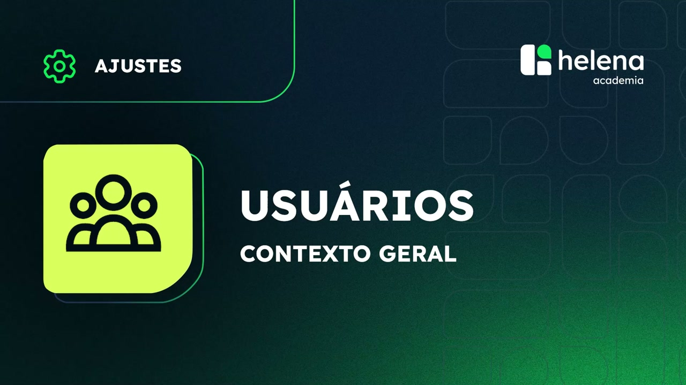
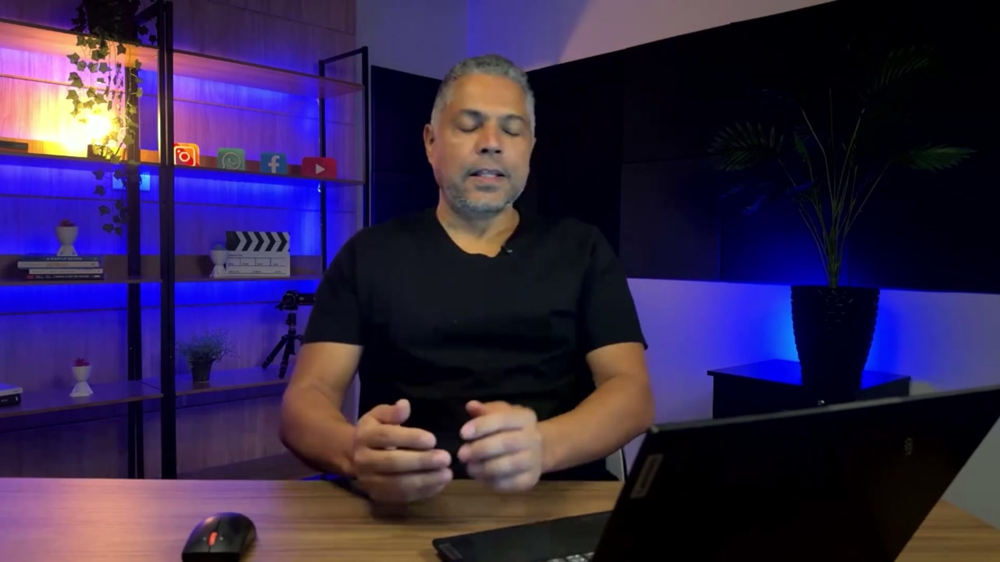
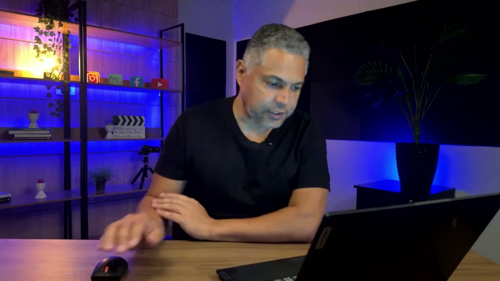
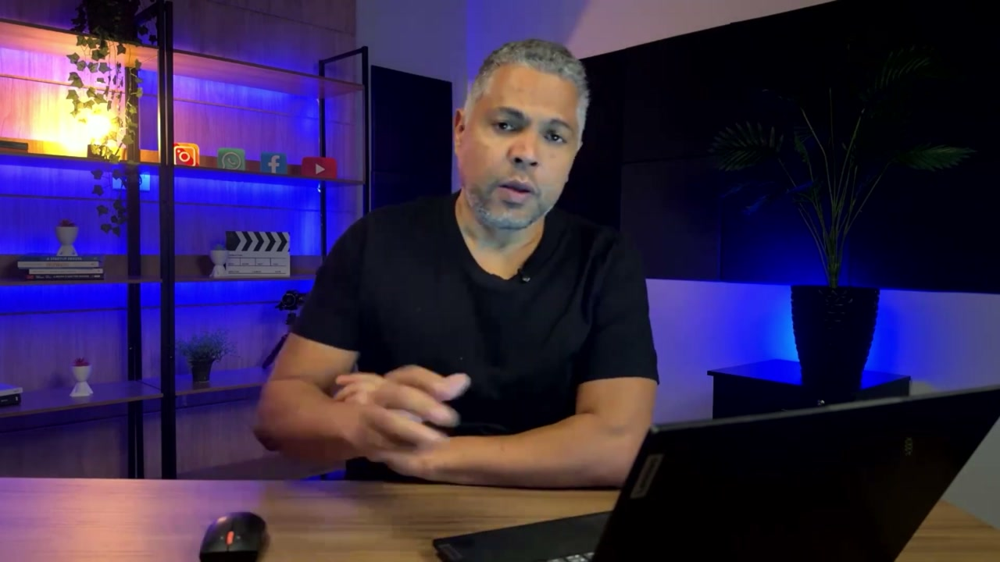
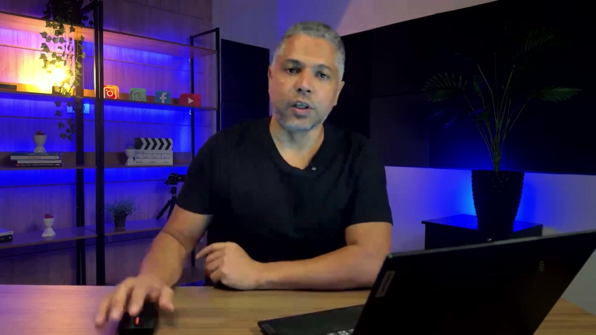
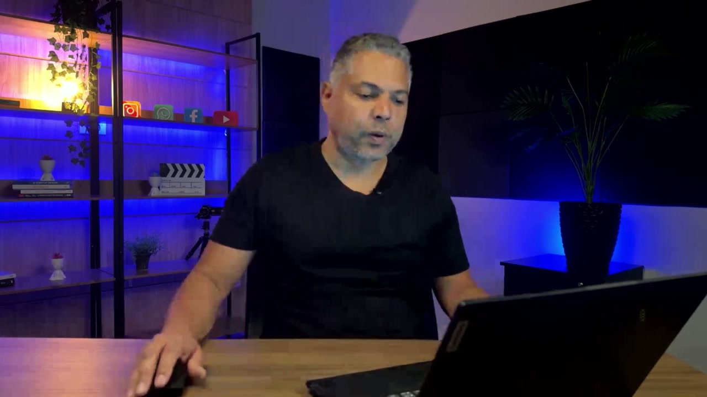
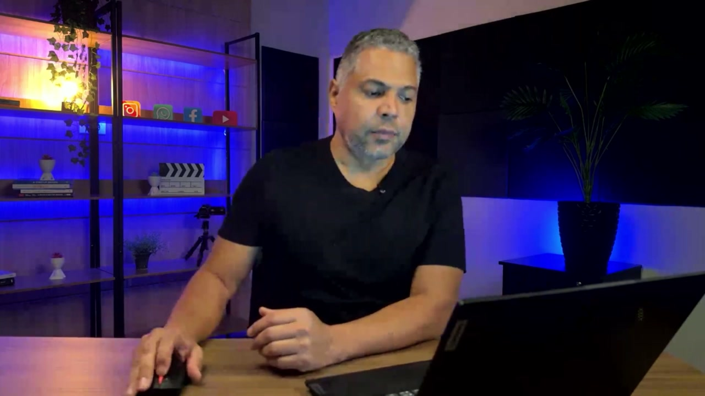
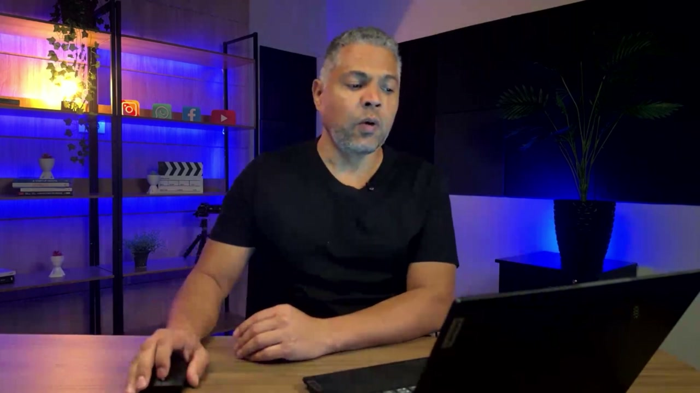
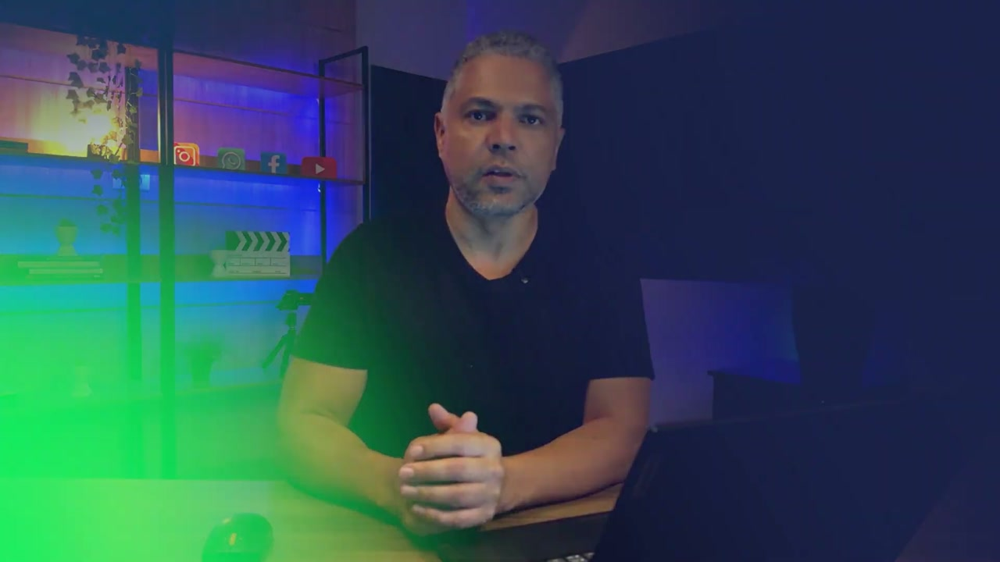

# Contexto Geral de Usuários na plataforma helenaCRM

**URL:** https://www.youtube.com/watch?v=-LctSvm1Mzo  
**Canal:** HelenaCRM  
**Data:** 2025-11-05  
**Objetivo:** Levantamento da plataforma Nexvy/DKW whitelabel para replicação de UI  
**Total de frames:** 10

---

## `00:00` — Título do vídeo: "USUÁRIOS CONTEXTO GERAL".

## `00:05` — Instrutor explicando o tema do vídeo.

## `00:12` — Instrutor explica o objetivo do vídeo.

## `00:29` — Instrutor explica a função do usuário administrador.

## `00:43` — Instrutor explica a importância de gerenciar perfis.

## `00:52` — Instrutor explica os benefícios de gerenciar perfis.

## `01:10` — Instrutor explica as características do perfil de administrador.

## `01:40` — Instrutor explica as características do perfil de atendente.

## `02:23` — Instrutor explica as características do perfil de atendente restrito.

## `03:11` — Logotipo da empresa: "Helena Academia".

