# [Parceiros] Particularidades do Canal de demonstração

**URL:** https://www.youtube.com/watch?v=-X2jMXU_zos  
**Canal:** HelenaCRM  
**Data:** 2025-10-06  
**Objetivo:** Levantamento da plataforma Nexvy/DKW whitelabel para replicação de UI  
**Total de frames:** 16

---

## `00:00` — Início do vídeo, a tela mostra um painel de "Atendimentos" com a opção de selecionar um atendimento para iniciar uma conversa.

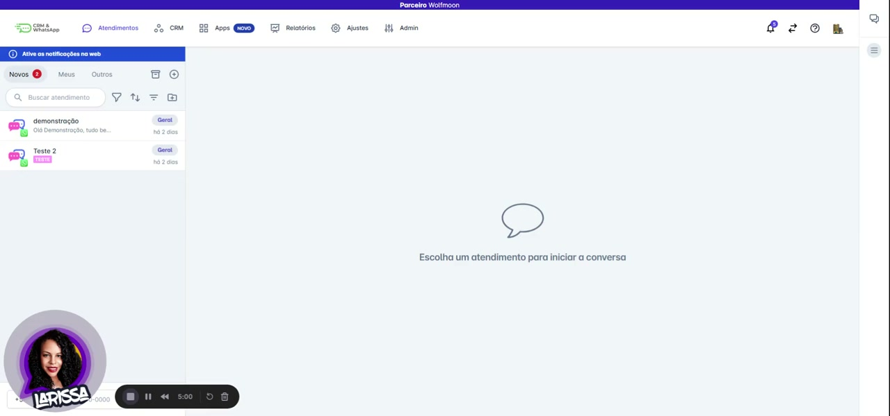

## `00:09` — O vídeo explica a necessidade de colocar um número na API oficial.

## `00:27` — O vídeo explica que o canal de demonstração não permite disparos de campanha nem de modelos de mensagem.

## `00:37` — Instruções para fazer testes na plataforma usando o canal de demonstração.

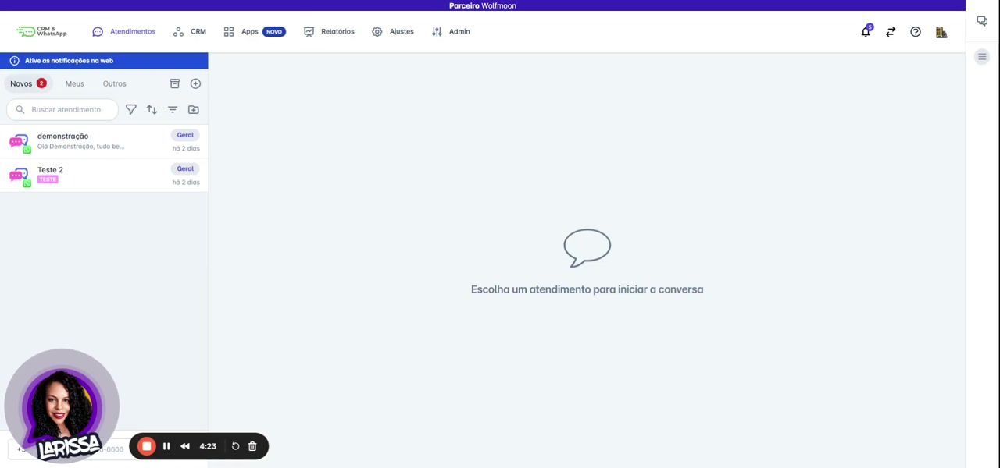

## `00:43` — O usuário clica em "CRM" no menu superior e seleciona "Contatos".

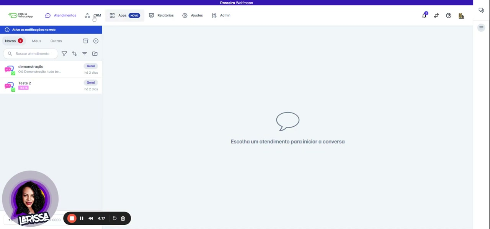

## `00:46` — A tela "Contatos" é exibida, mostrando uma lista de contatos. O usuário clica no botão "+" para adicionar um novo contato.

## `00:49` — Um pop-up "Novo contato" aparece, solicitando informações como nome, e-mail, telefone, Instagram, data do consulta e notas internas.

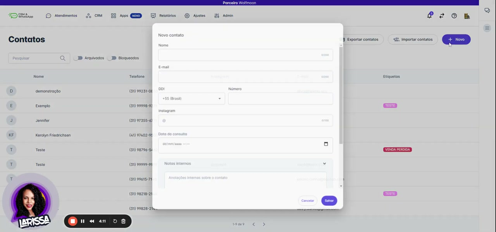

## `00:52` — O usuário clica em "Cancelar" no pop-up de novo contato, retornando à tela de "Contatos".

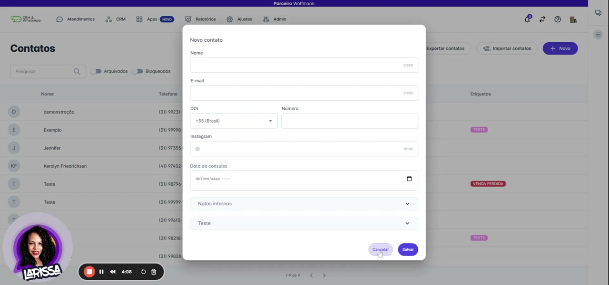

## `00:57` — O vídeo explica que a pessoa deve chamar o número cadastrado.

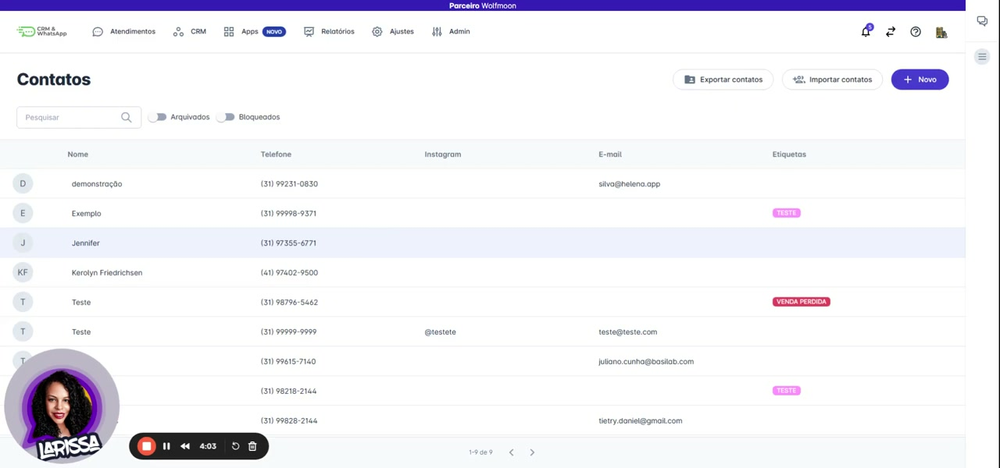

## `01:00` — O usuário clica em "Atendimentos" novamente.

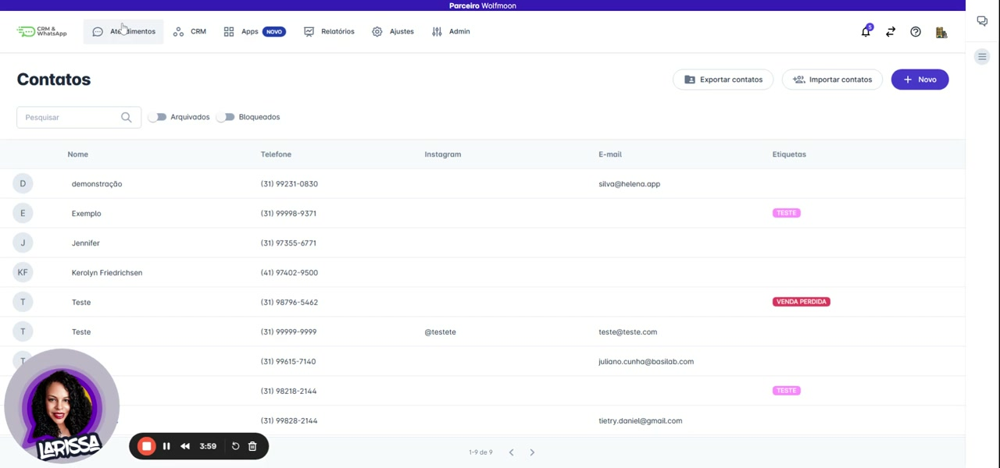

## `01:01` — A tela de "Atendimentos" é atualizada e um atendimento com o contato "demonstração" é exibido, mostrando mensagens pré-definidas.

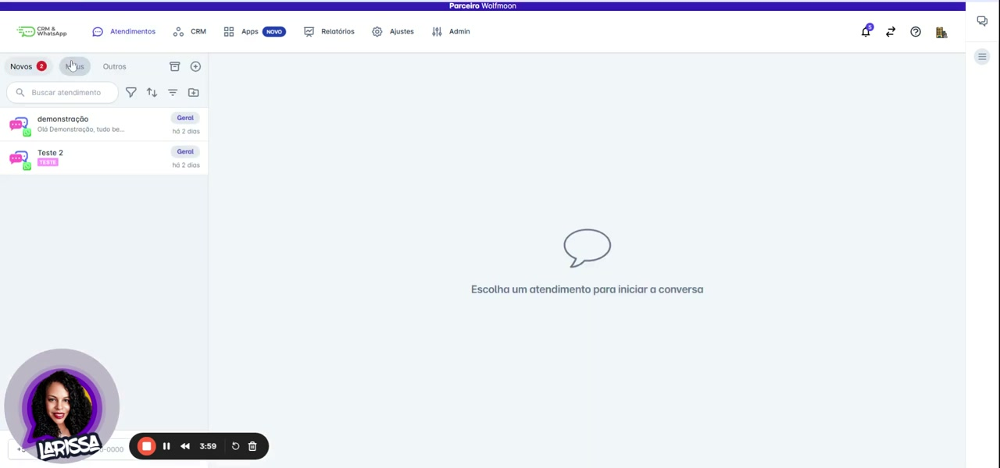

## `01:06` — A tela mostra que é possível iniciar conversas, fazer testes e cadastrar chatbots e modelos de mensagens, mas não é possível disparar mensagens.

## `01:10` — O usuário clica em "Apps" no menu superior.

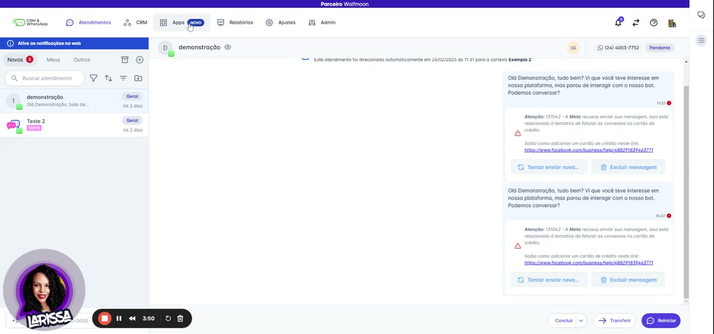

## `01:11` — Um menu suspenso aparece com opções como "Campanhas", "Chatbot" e "Sequências".

## `01:13` — O vídeo reforça que, após os testes, basta mudar para a conta de produção para começar a usar o canal.

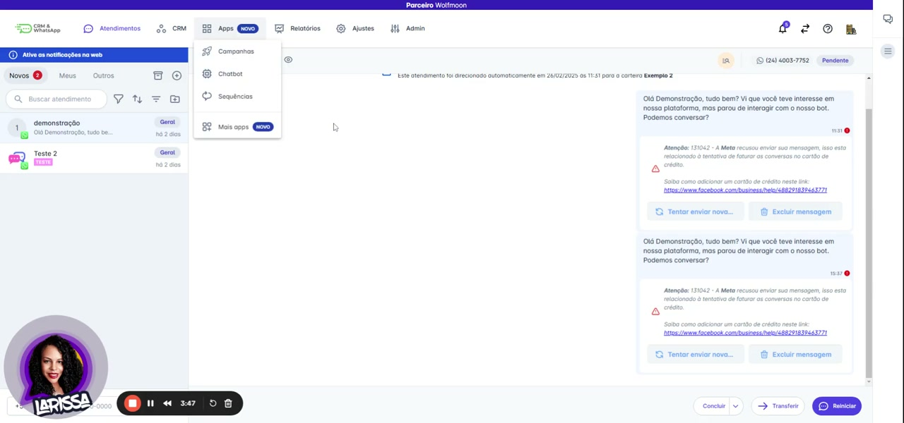

## `01:35` — Fim do vídeo.

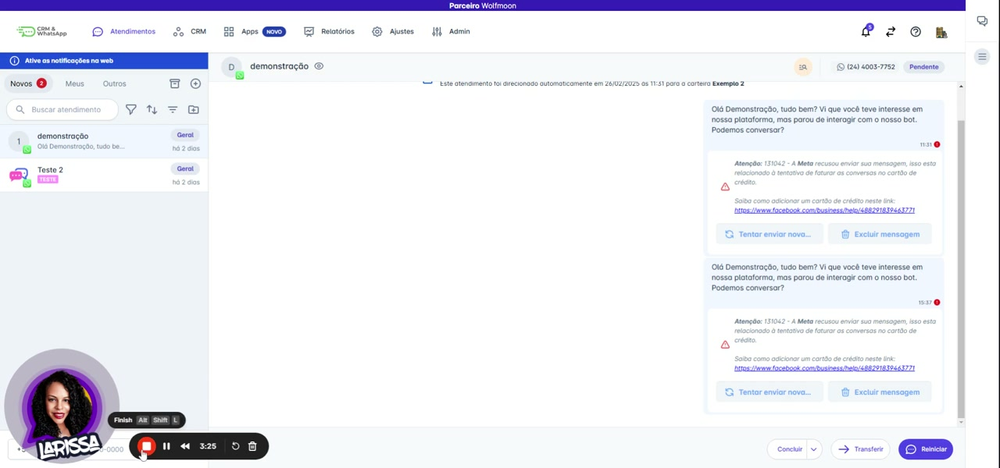
