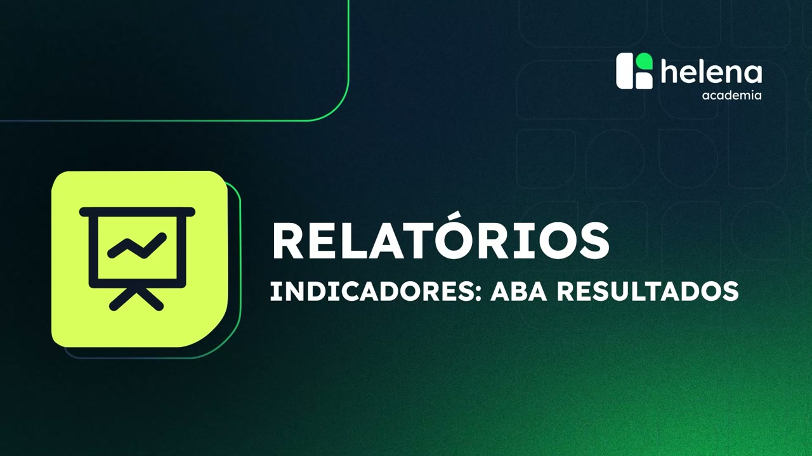
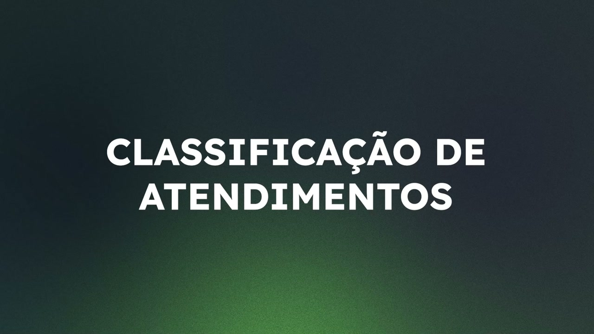

# Indicadores: Aba Resultados

**URL:** https://www.youtube.com/watch?v=0_0i72W2s68  
**Canal:** HelenaCRM  
**Data:** 2025-10-21  
**Objetivo:** Levantamento da plataforma Nexvy/DKW whitelabel para replicação de UI  
**Total de frames:** 9

---

## `00:00` — Título do vídeo

## `00:06` — Início da explicação da aba “Resultados”

## `00:07` — Mostra a localização da aba “Resultados”

## `00:20` — Título da seção “Classificação de Atendimentos”

## `00:32` — Visualização da tabela “Classificação de atendimentos”

## `00:58` — Título da seção “Anúncios”

## `01:10` — Visualização da tabela “Anúncios”

## `01:30` — Logotipo da Helena Academia

## `01:34` — Fim do vídeo

