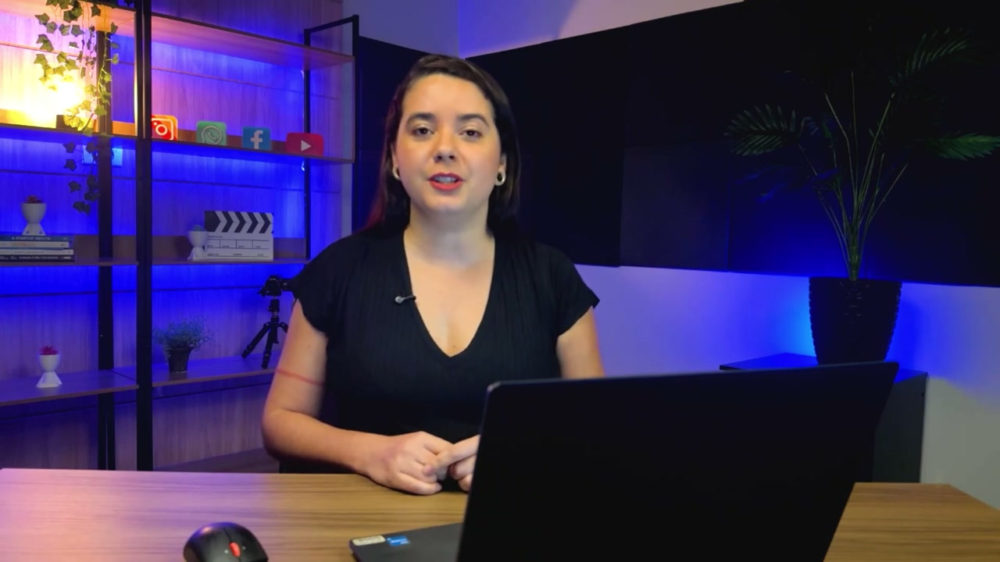
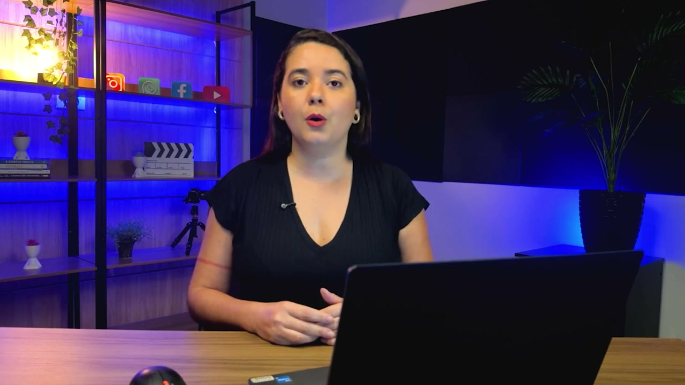
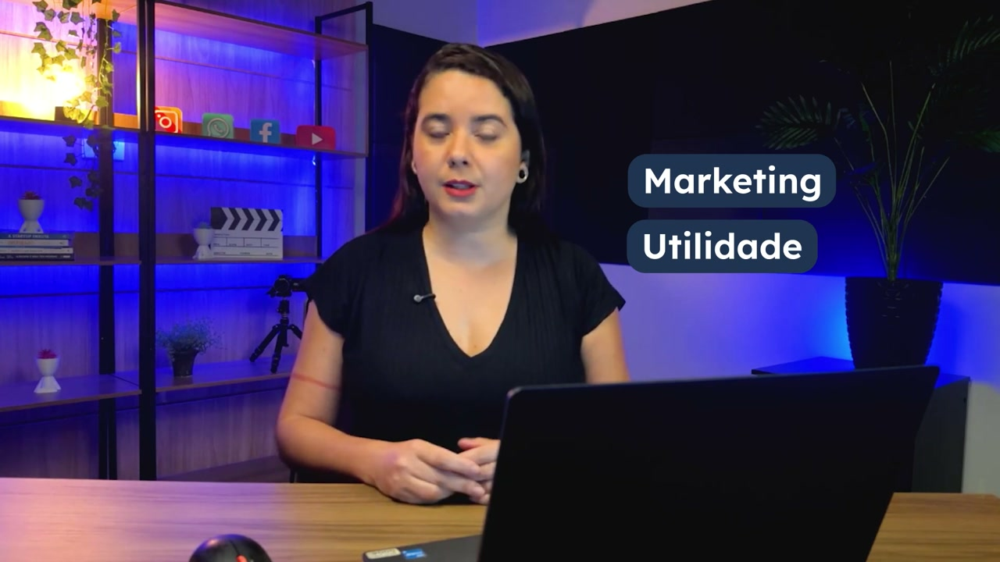
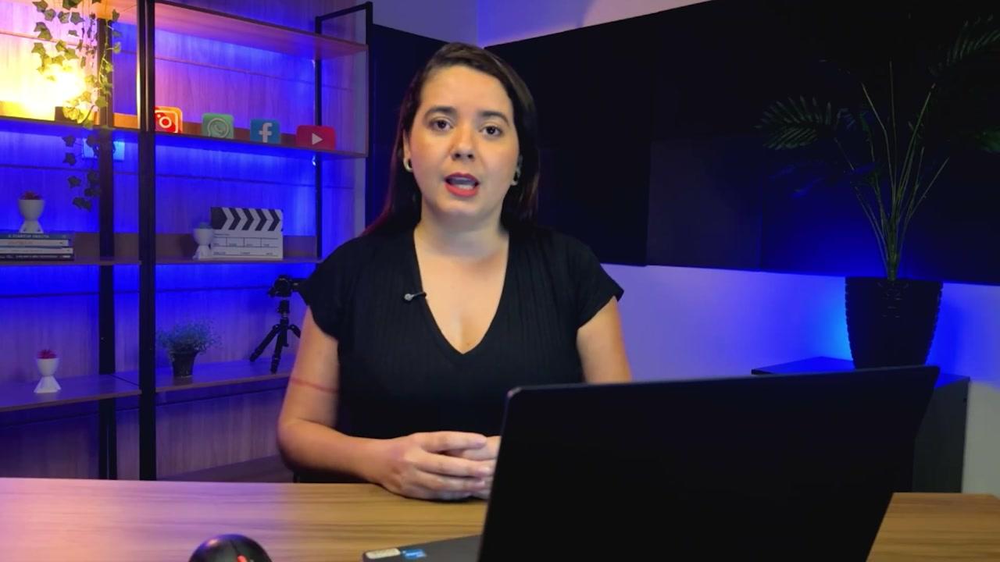
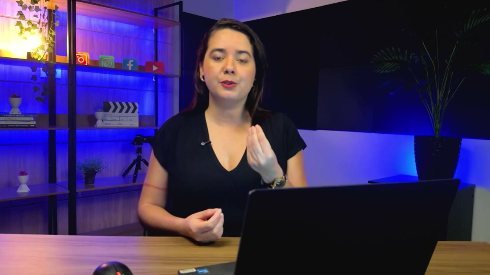
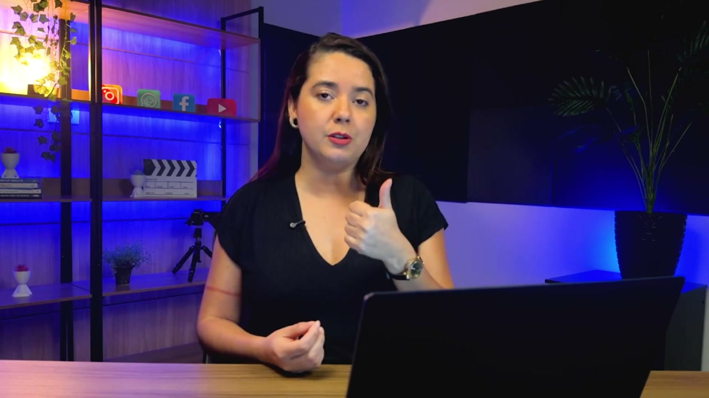
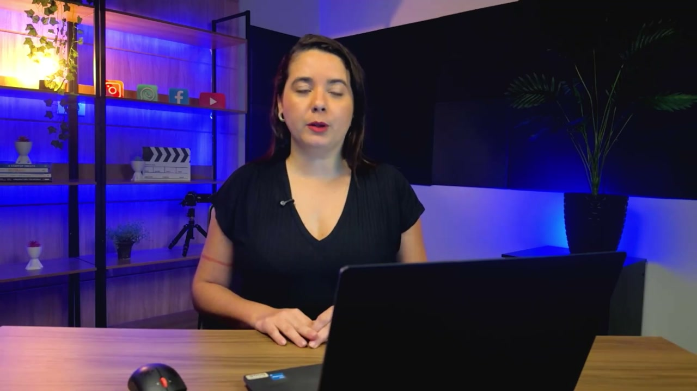
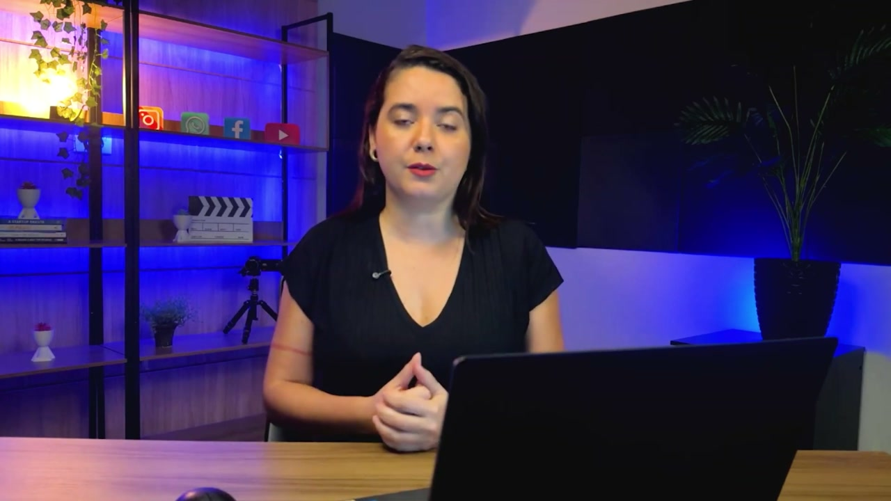

# Contexto Geral de Modelo Mensagem na plataforma helenaCRM

**URL:** https://www.youtube.com/watch?v=1lrBXAnV31I  
**Canal:** HelenaCRM  
**Data:** 2025-11-05  
**Objetivo:** Levantamento da plataforma Nexvy/DKW whitelabel para replicação de UI  
**Total de frames:** 12

---

## `00:00` — Título do vídeo "Modelo de Mensagem - Contexto Geral".

## `00:05` — Rafaela Mariano, Analista de Sucesso do Cliente, se apresenta.

## `00:12` — Rafaela começa a explicar sobre o uso de modelos de mensagem.

## `00:27` — Rafaela apresenta as duas categorias de modelos de mensagem: Marketing e Utilidade.

## `00:33` — Rafaela explica a diferença entre as categorias Marketing e Utilidade.

## `00:53` — Rafaela menciona que os dois tipos de modelos de mensagem têm custos diferentes.

## `01:05` — Rafaela explica os motivos para usar o modelo de mensagem dentro da API oficial.

## `01:10` — Rafaela destaca que o primeiro benefício é a cadência de atendimento.

## `01:34` — Rafaela explica o segundo benefício, que é criar uma cadência de atendimento.

## `01:52` — Rafaela conclui a explicação sobre o modelo de mensagem.

## `02:00` — Rafaela indica onde encontrar mais informações sobre o assunto.

## `02:04` — Logo da Helena Academia.

