# Tempo de Segurança por dentro do contexto e configuração na helenaCRM

**URL:** https://www.youtube.com/watch?v=580FqSbP0vY  
**Canal:** HelenaCRM  
**Data:** 2025-11-05  
**Objetivo:** Levantamento da plataforma Nexvy/DKW whitelabel para replicação de UI  
**Total de frames:** 12

---

## `00:00` — Título do vídeo "Tempo de Segurança: Contexto e Configuração".

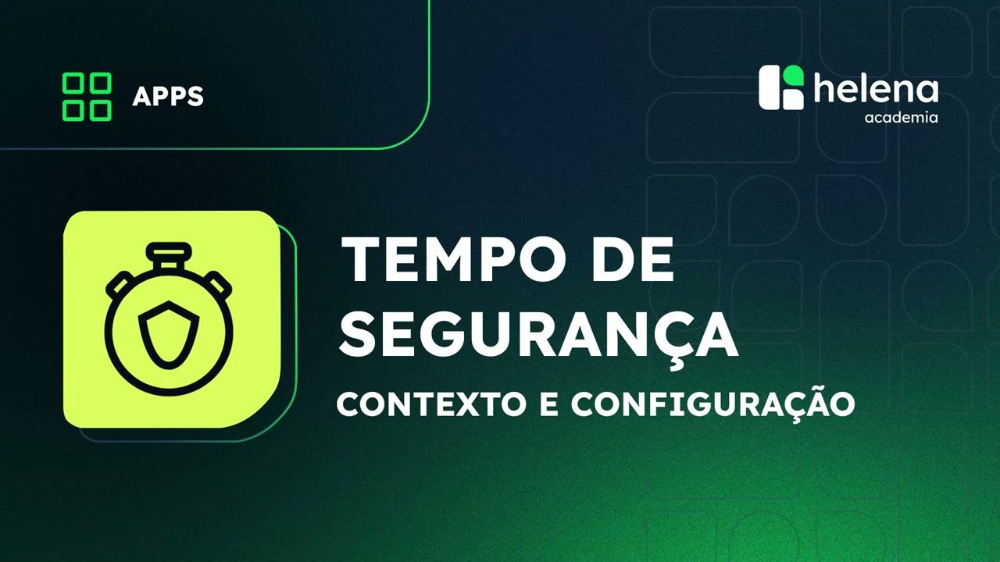

## `00:05` — A apresentadora se apresenta e começa a explicar sobre o tempo de segurança de mensagem.

## `00:13` — A apresentadora explica o que é o tempo de segurança e qual a sua finalidade.

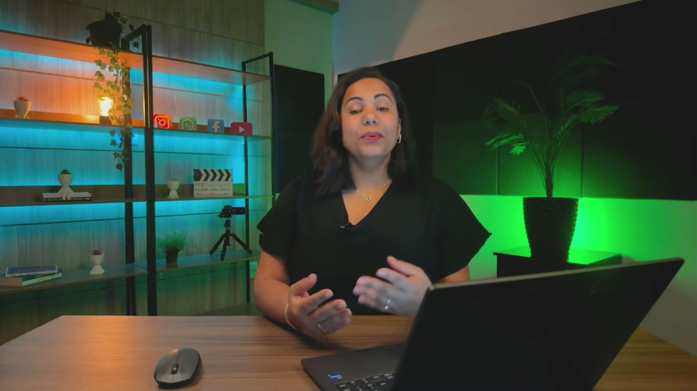

## `00:50` — A apresentadora mostra como liberar essa funcionalidade.

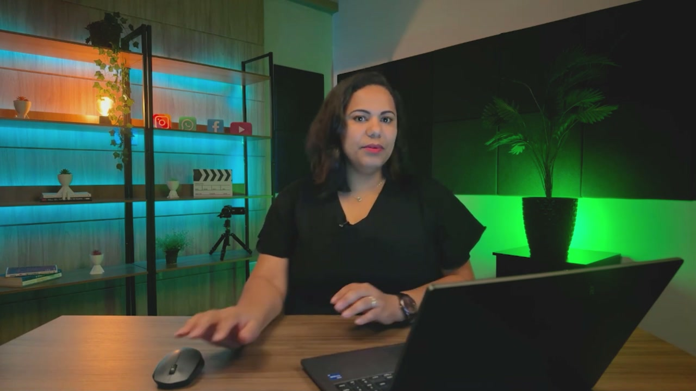

## `00:54` — Navega até "Admin" no menu superior.

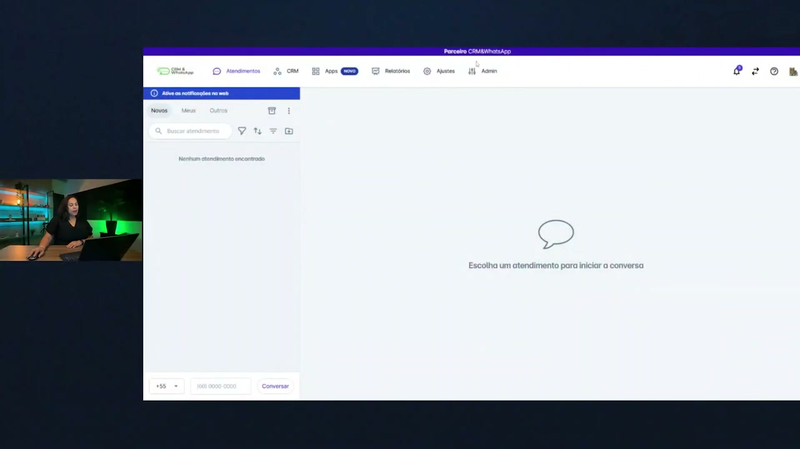

## `00:58` — Clica em "Contas".

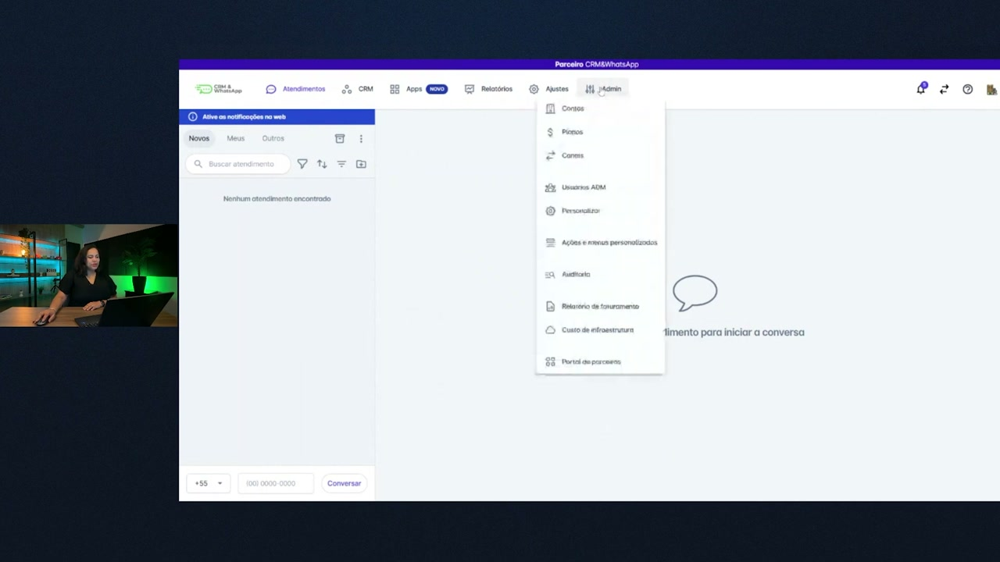

## `01:04` — Busca pela conta "Exemplo".

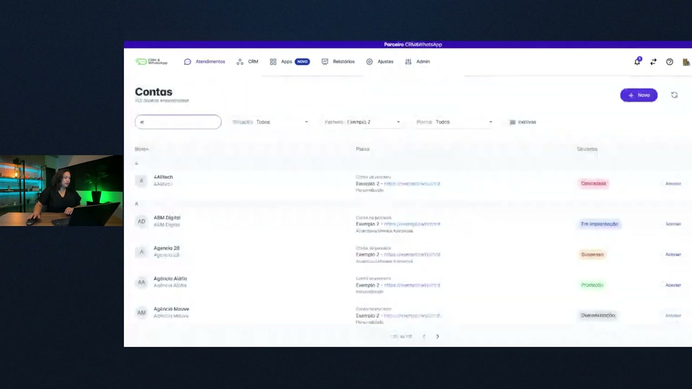

## `01:08` — Clica em "Alterar" no canto superior direito.

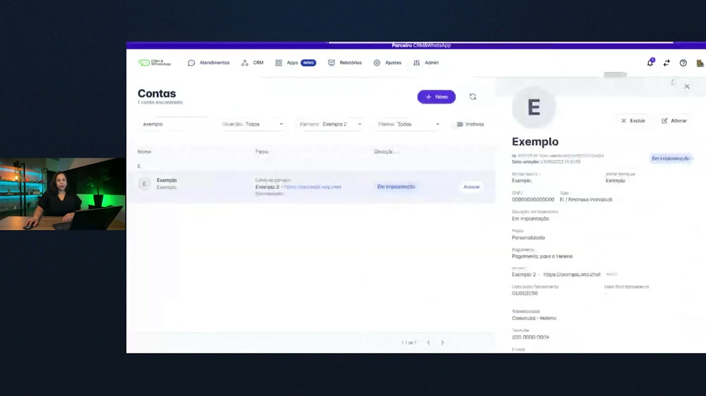

## `01:14` — Desce a tela até a seção "Apps".

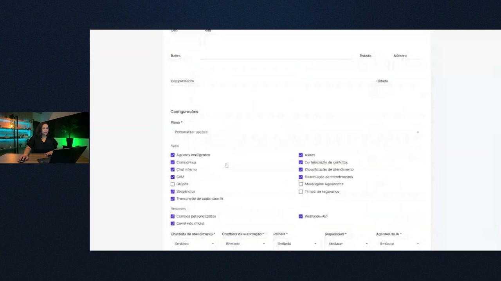

## `01:18` — Marca a caixa de seleção "Tempo de segurança".

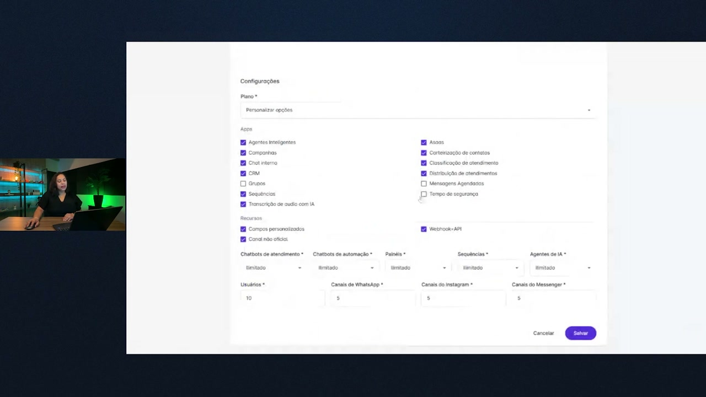

## `01:23` — Clica em "Salvar".

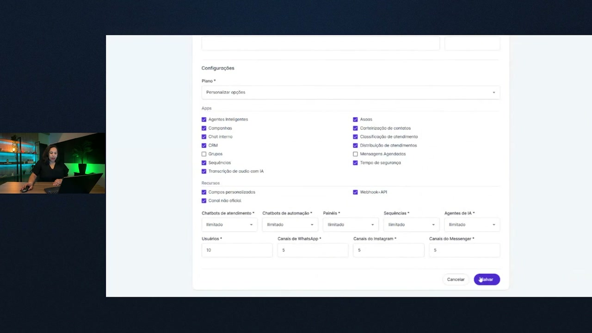

## `01:26` — A apresentadora finaliza a explicação.

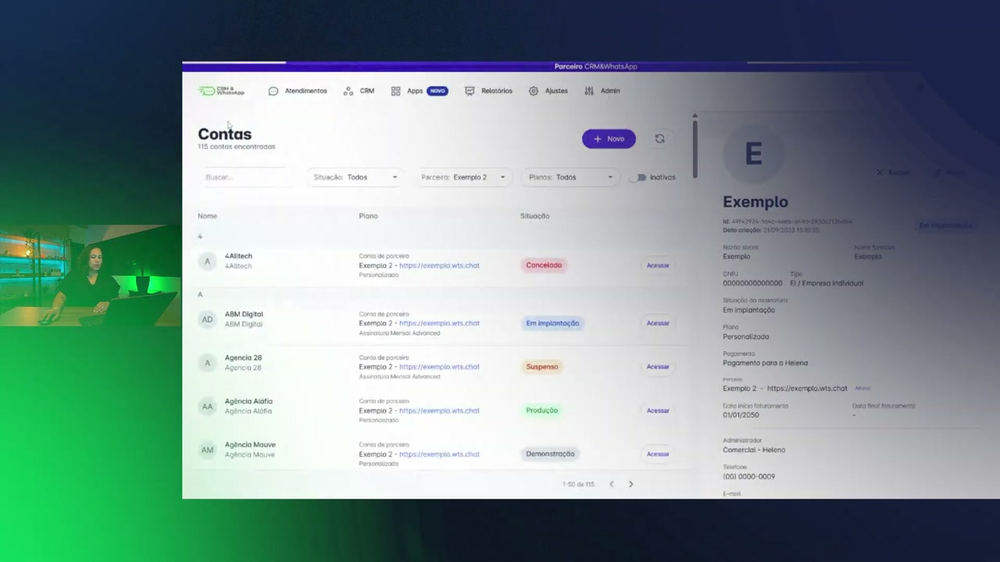
