# Ações De Atendimento no Chatbot da plataforma helenaCRM

**URL:** https://www.youtube.com/watch?v=AMDg3hbrui0  
**Canal:** HelenaCRM  
**Data:** 2026-01-02  
**Objetivo:** Levantamento da plataforma Nexvy/DKW whitelabel para replicação de UI  
**Total de frames:** 17

---

## `00:00` — Título do vídeo: "CHATBOT: AÇÕES DE ATENDIMENTO".

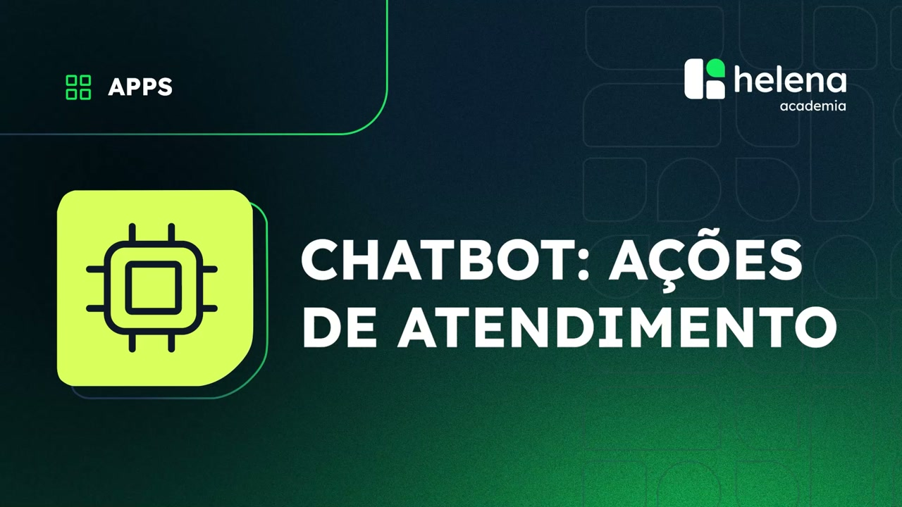

## `00:05` — Apresentadora inicia o vídeo sentada em frente a um laptop, em um ambiente de escritório.

## `00:06` — Nome e cargo da apresentadora: Alessandra Souza, Analista de Sucesso do Cliente.

## `00:08` — Apresentadora falando sobre as opções de atendimento dentro do chatbot.

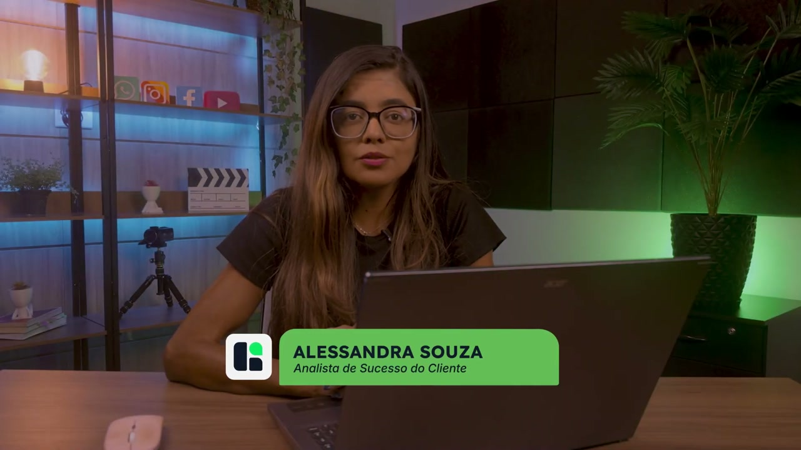

## `00:26` — Apresentadora falando sobre transferir atendimento para uma equipe.

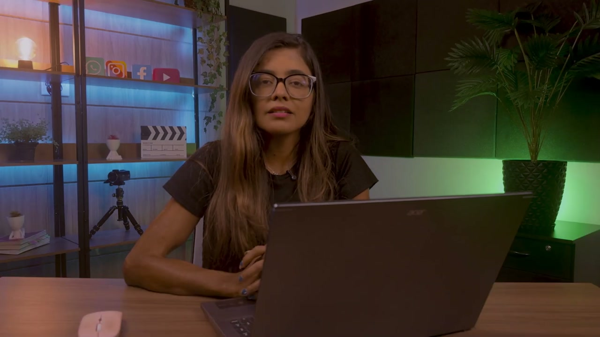

## `00:29` — Tela mostrando o fluxo do chatbot. Um bloco "Início" está conectado a um menu de "Ações disponíveis".

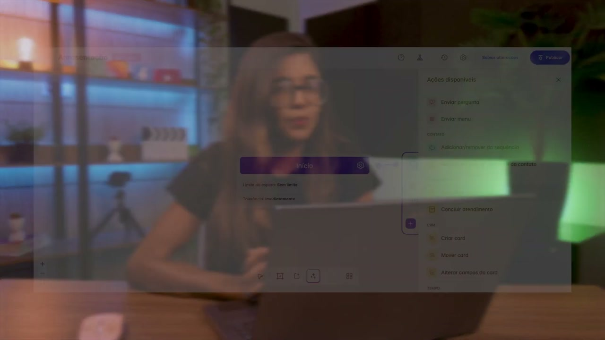

## `00:30` — O item "Transferir atendimento" no menu "Ações disponíveis" é destacado.

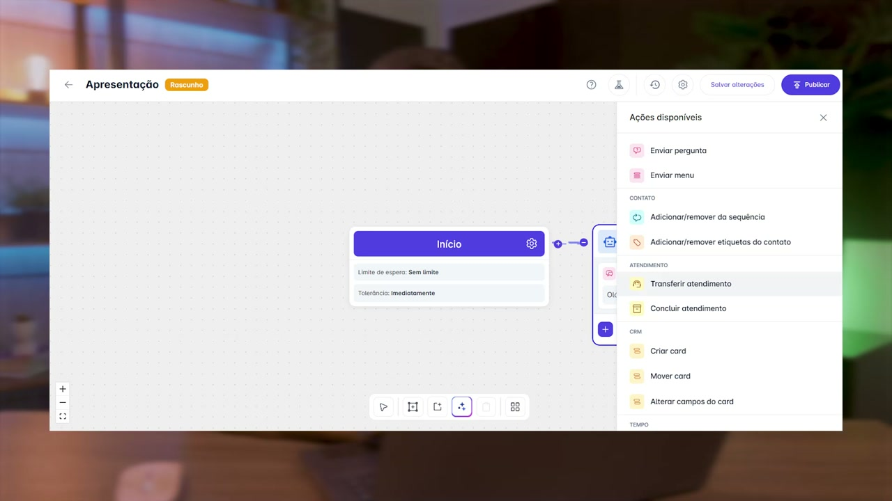

## `00:32` — Um clique na opção "Transferir atendimento" é mostrado.

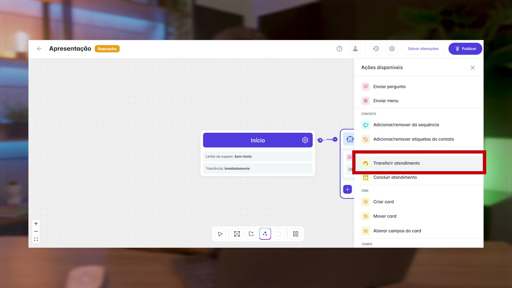

## `00:36` — Um painel lateral "Transferir atendimento" aparece. Ele possui um campo "Equipe" com a opção "Geral" selecionada e uma caixa de seleção "Enviar mensagem de horário indisponível".

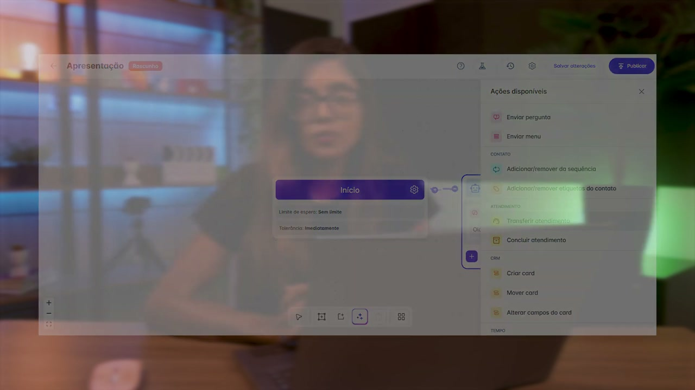

## `00:44` — Apresentadora falando sobre as mensagens automáticas.

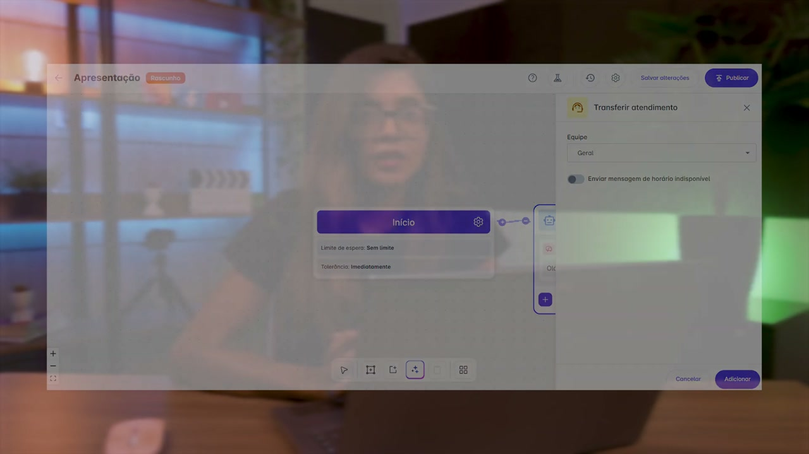

## `00:50` — Apresentadora falando sobre concluir atendimento.

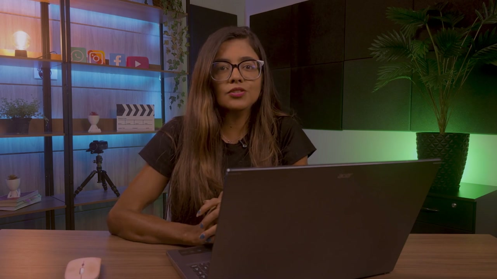

## `00:52` — Tela mostrando o fluxo do chatbot. O item "Concluir atendimento" no menu "Ações disponíveis" é destacado.

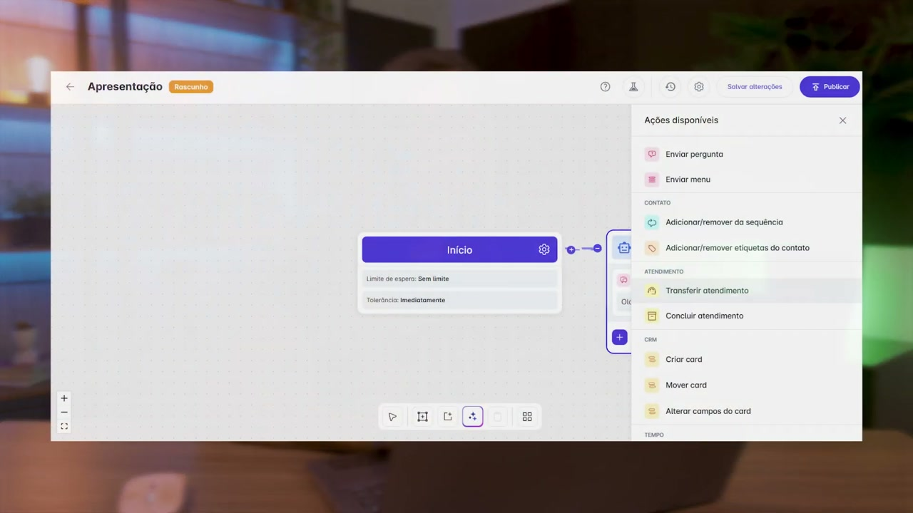

## `00:55` — Um clique na opção "Concluir atendimento" é mostrado.

## `00:56` — Um painel lateral "Concluir atendimento" aparece, exibindo informações sobre o encerramento do atendimento pelo chatbot.

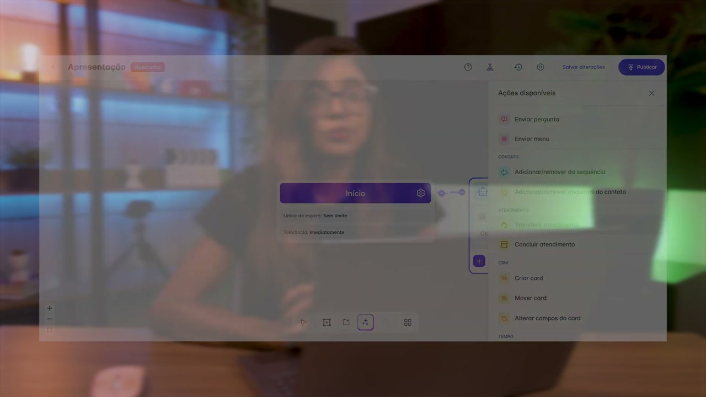

## `01:02` — Apresentadora explicando quando essa automação é útil.

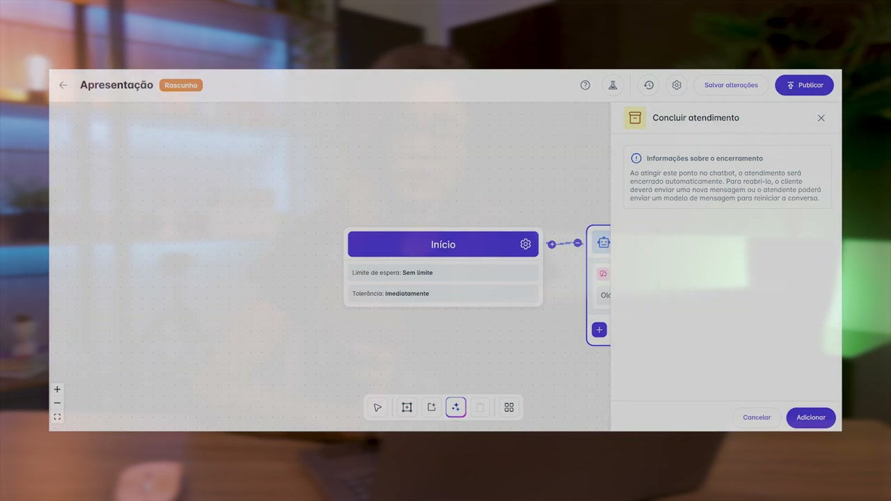

## `01:07` — Apresentadora conclui o treinamento.

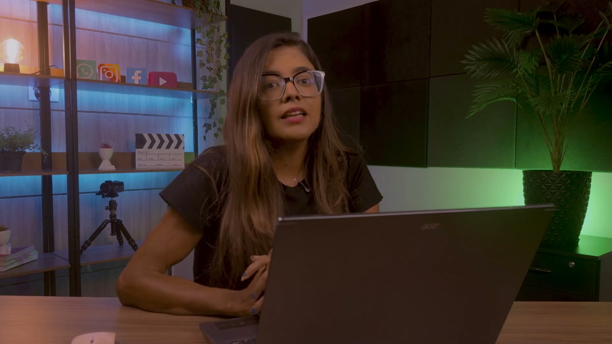

## `01:19` — Tela final com o logo da Helena Academia.

