# Mensagens agendadas como funciona na prática na helenaCRM

**URL:** https://www.youtube.com/watch?v=Bm9r57cOqMM  
**Canal:** HelenaCRM  
**Data:** 2025-09-24  
**Objetivo:** Levantamento da plataforma Nexvy/DKW whitelabel para replicação de UI  
**Total de frames:** 24

---

## `00:00` — Slide de introdução: "Mensagens agendadas: como funciona na prática"

## `00:05` — Slide de texto: "Onde Agendar suas Mensagens"

## `00:05` — Tela da plataforma com um painel de "Mensagens Agendadas"

## `00:50` — Slide de texto: "Na Tela de Atendimento: Clique no ícone de anexo"

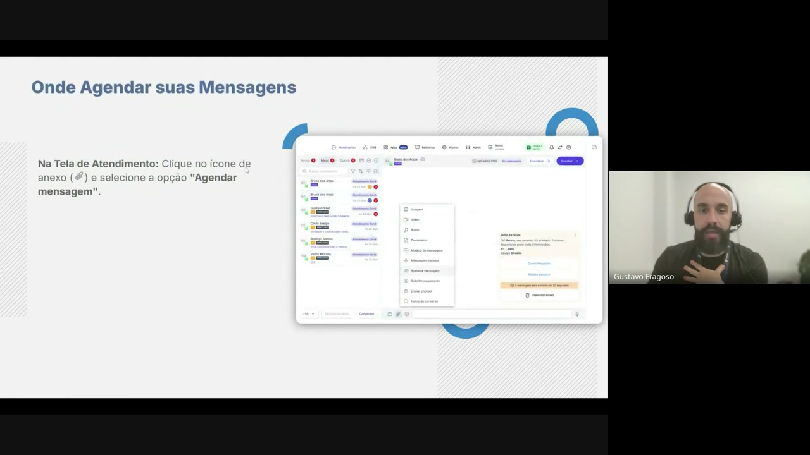

## `00:50` — Tela da plataforma mostrando o anexo dentro da tela de atendimento

## `00:59` — Slide de texto: "Dentro de um Card do CRM: Acesse o card de um contato específico em CRM"

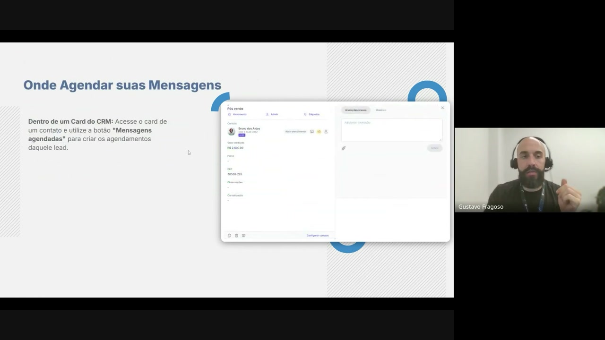

## `00:59` — Tela da plataforma mostrando a aba de "Mensagens Agendadas" dentro de um Card do CRM

## `01:13` — Slide de texto: "Na Tela de Contatos: Acesse a página de um contato específico em CRM"

## `01:13` — Tela da plataforma mostrando a aba de "Mensagens Agendadas" dentro da página de um contato

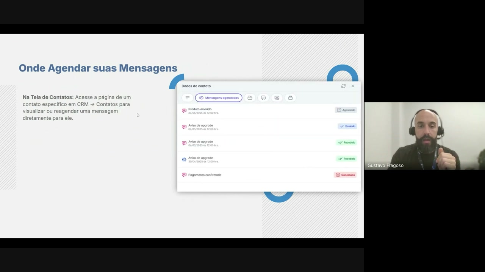

## `01:21` — Visualização ao vivo do recurso de mensagens agendadas

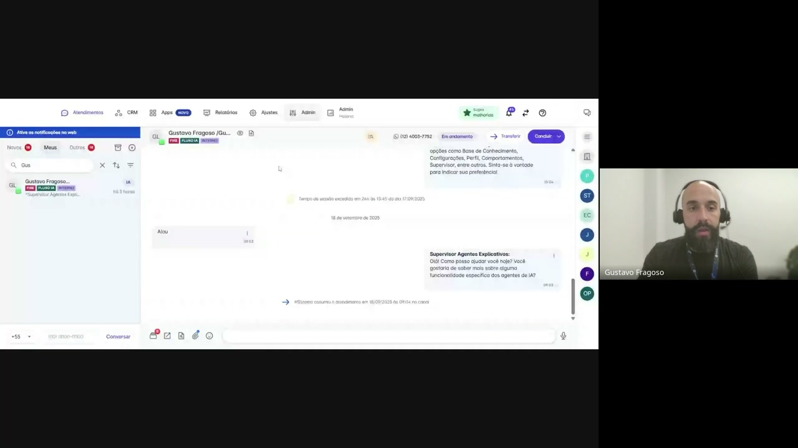

## `01:26` — Criação de um novo agendamento de mensagem

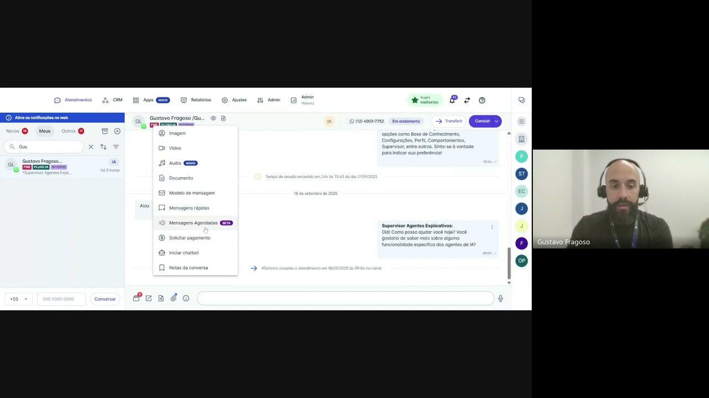

## `02:13` — Visualização das opções de mensagem agendada

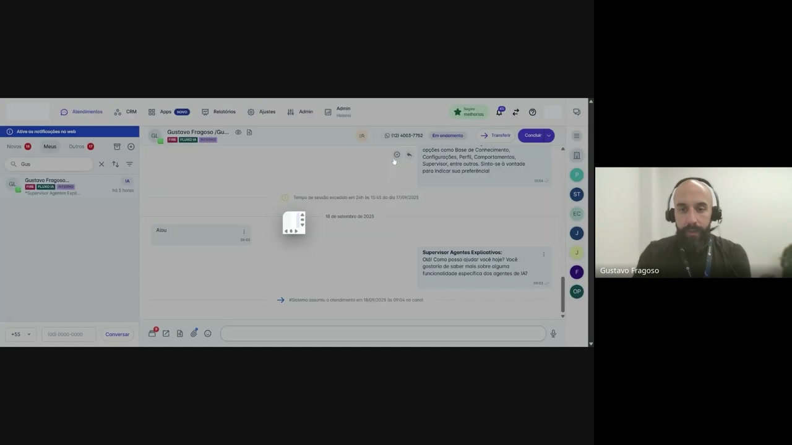

## `02:47` — Visualização de todas as mensagens agendadas

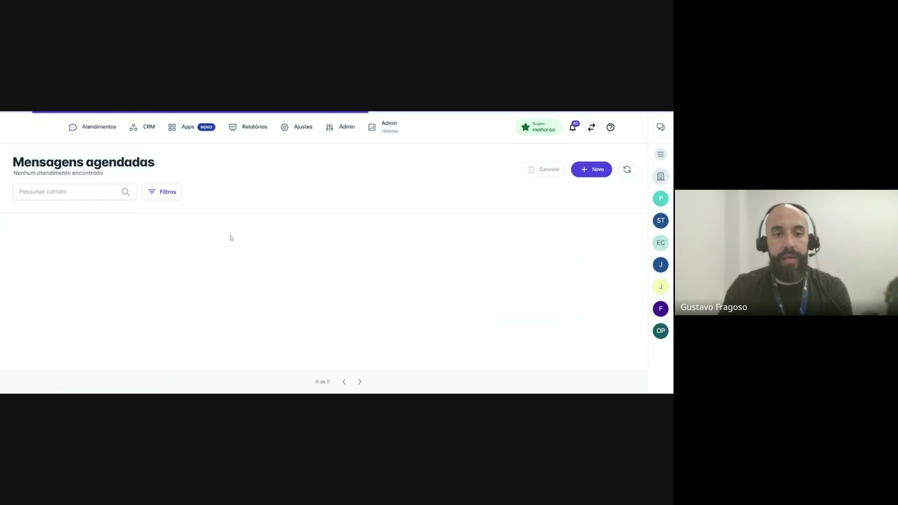

## `03:12` — Criação de um novo agendamento a partir da tela de "Mensagens Agendadas"

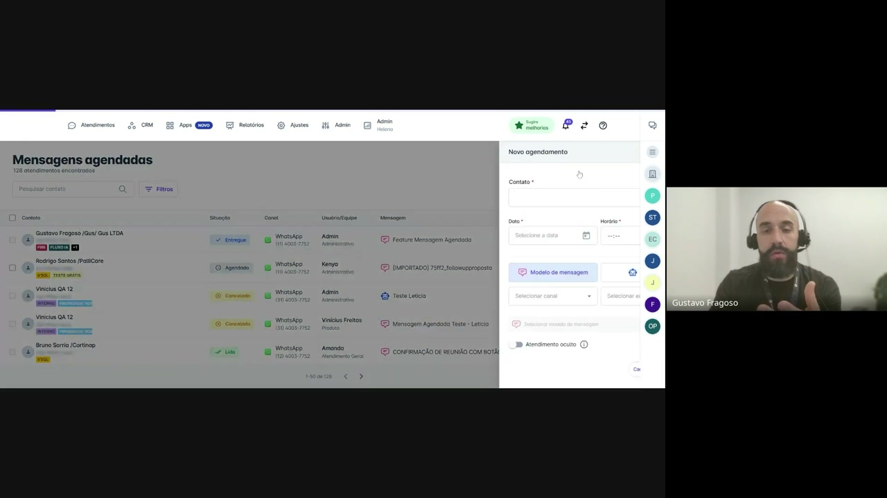

## `03:41` — Preenchimento dos parâmetros da mensagem

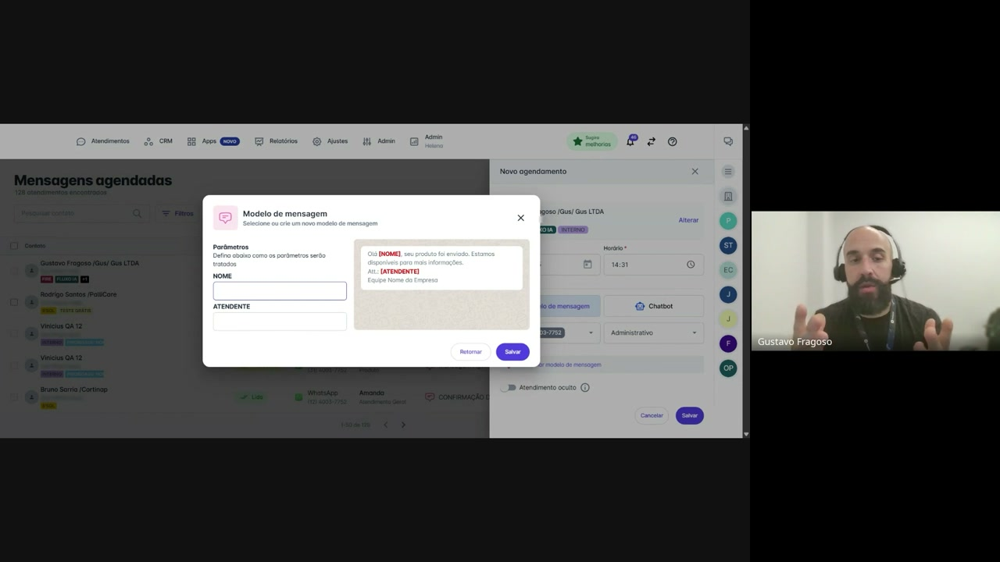

## `04:05` — Finalização da criação da mensagem agendada

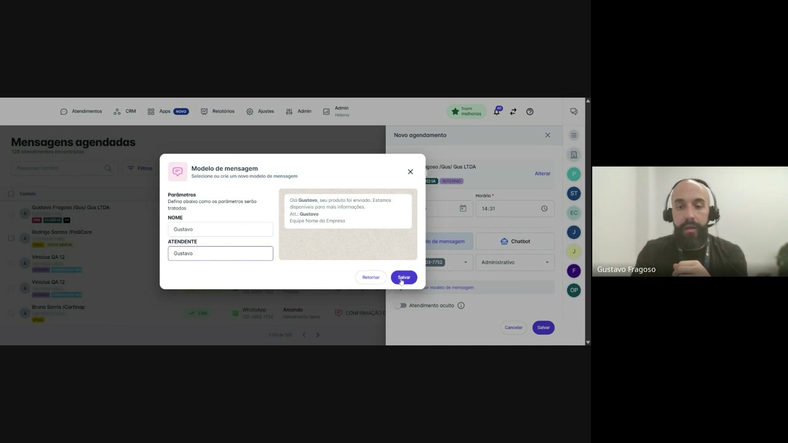

## `04:50` — Mensagem agendada aparece na tela de atendimento

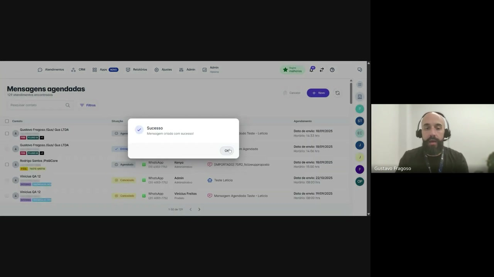

## `05:00` — Explicação do tempo de segurança antes do envio da mensagem agendada

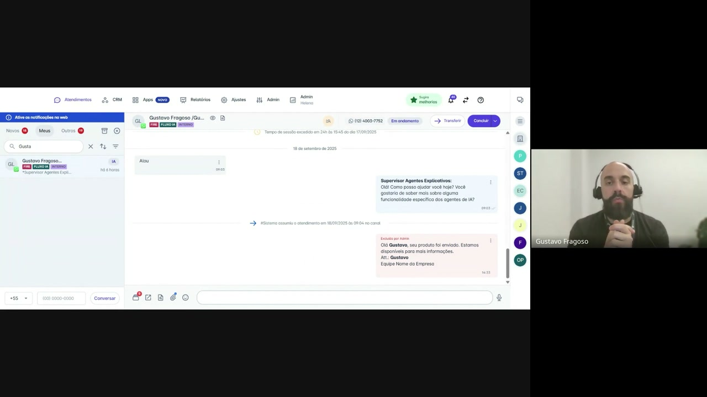

## `06:35` — Cadastro de um novo modelo de mensagem com a categoria "Mensagem agendada"

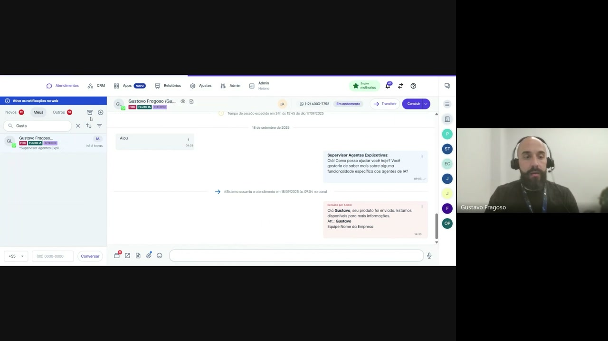

## `07:22` — Acesso ao menu de anexos e seleção de "Mensagens Agendadas"

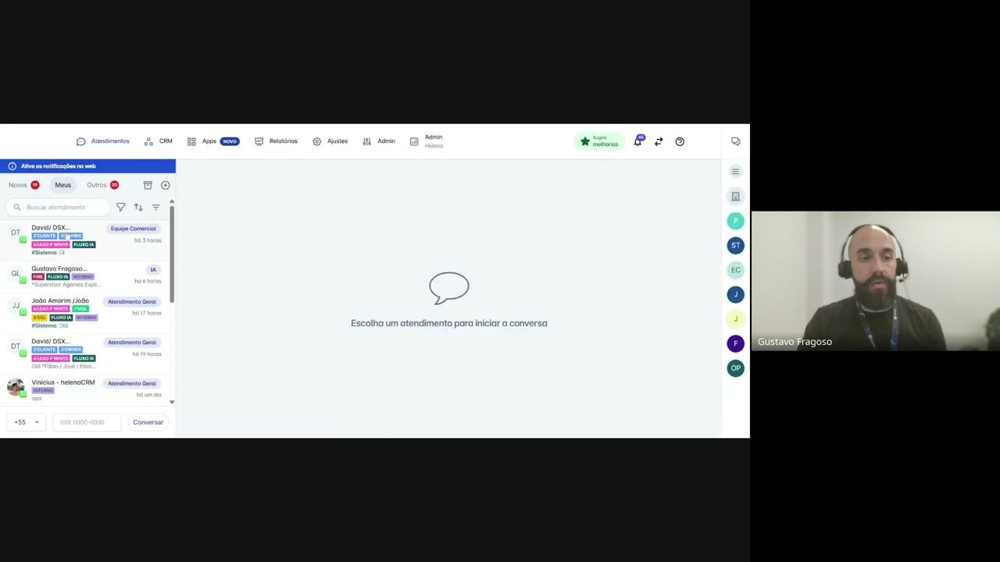

## `07:40` — Acesso ao painel de "Mensagens Agendadas" dentro de um funil do CRM

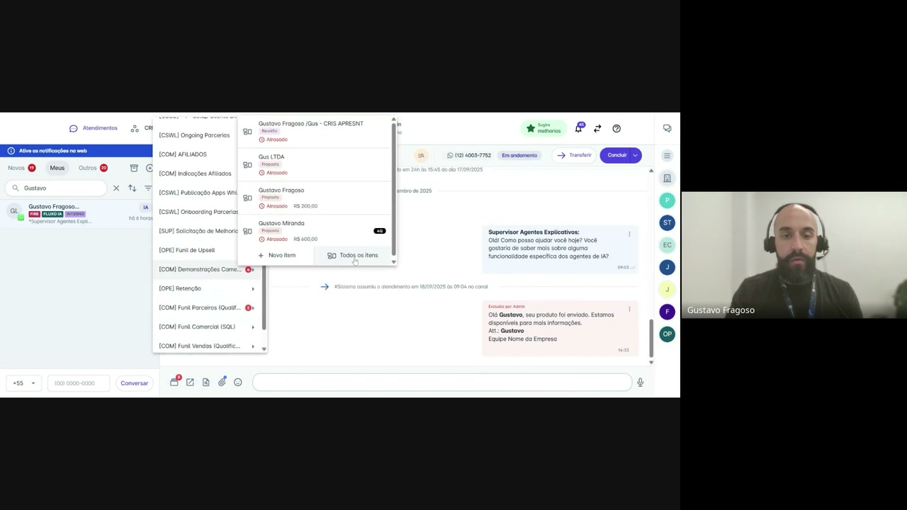

## `08:15` — Slide de texto: "Onde Agendar suas Mensagens"

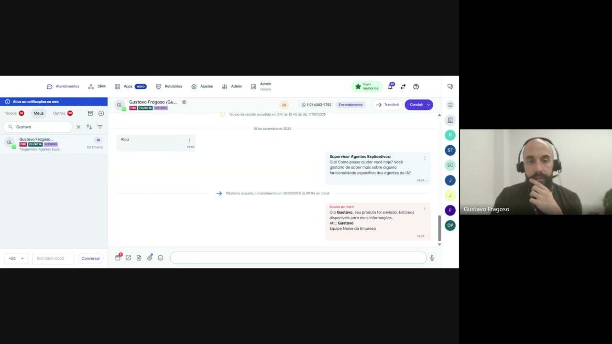

## `08:15` — Documentação da API de "Mensagens Agendadas"

## `08:56` — Agradecimentos e encerramento.

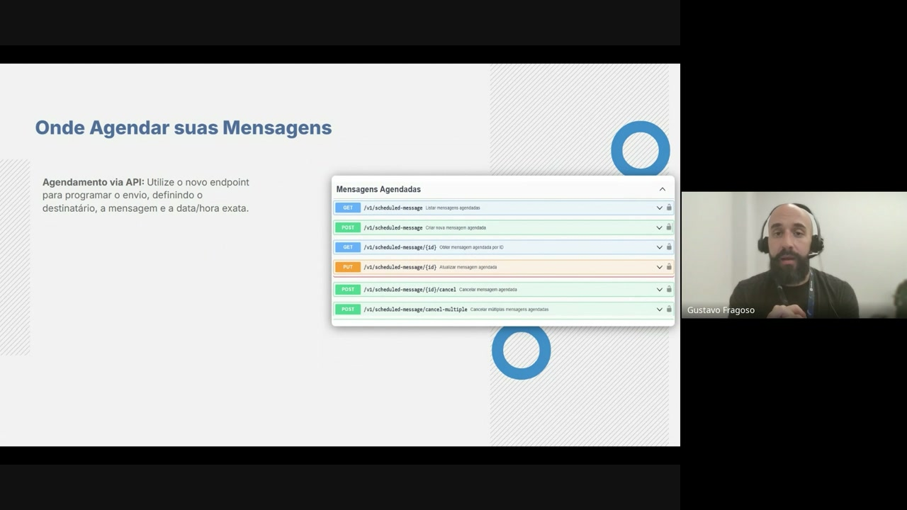
