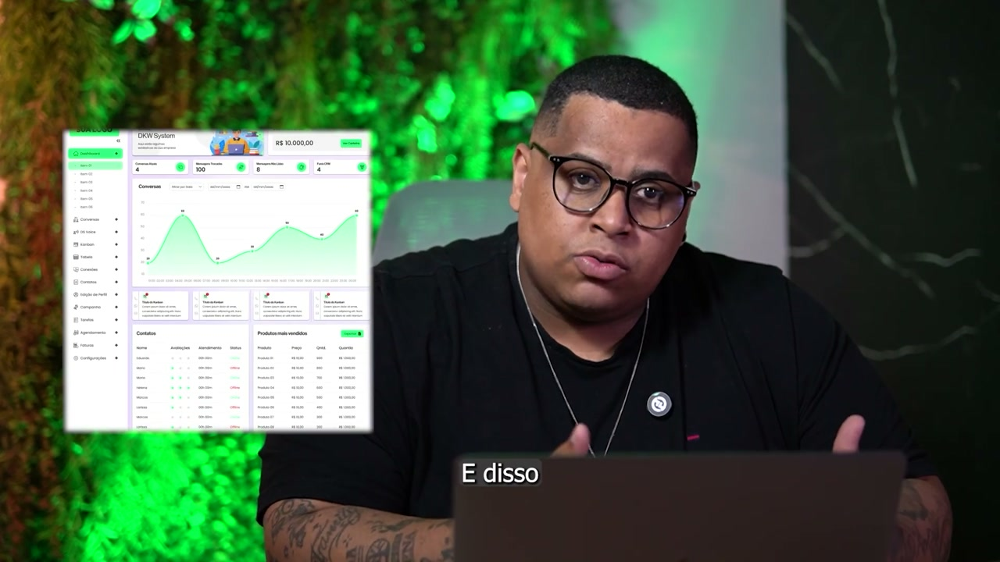
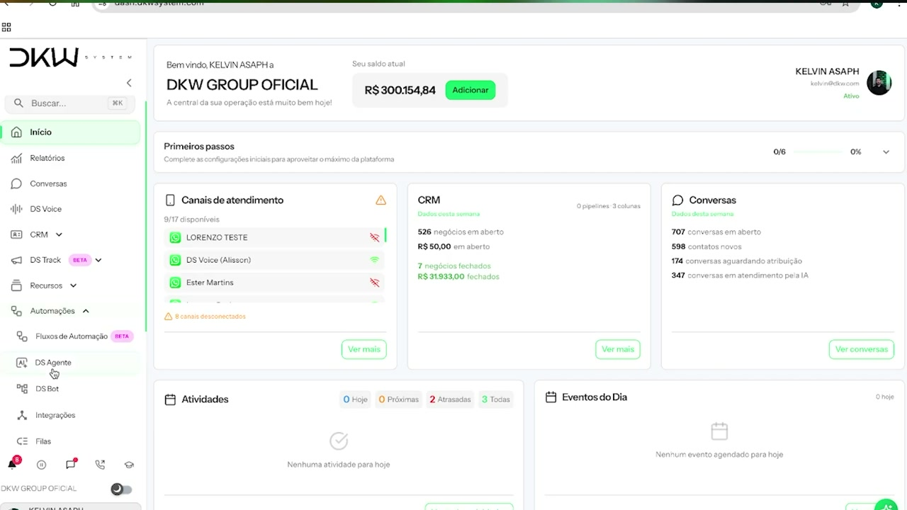
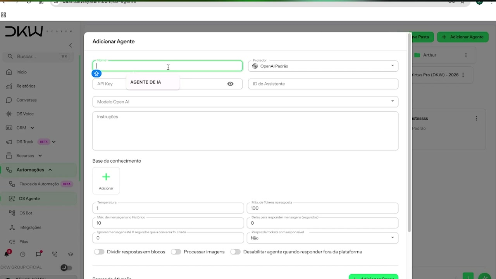
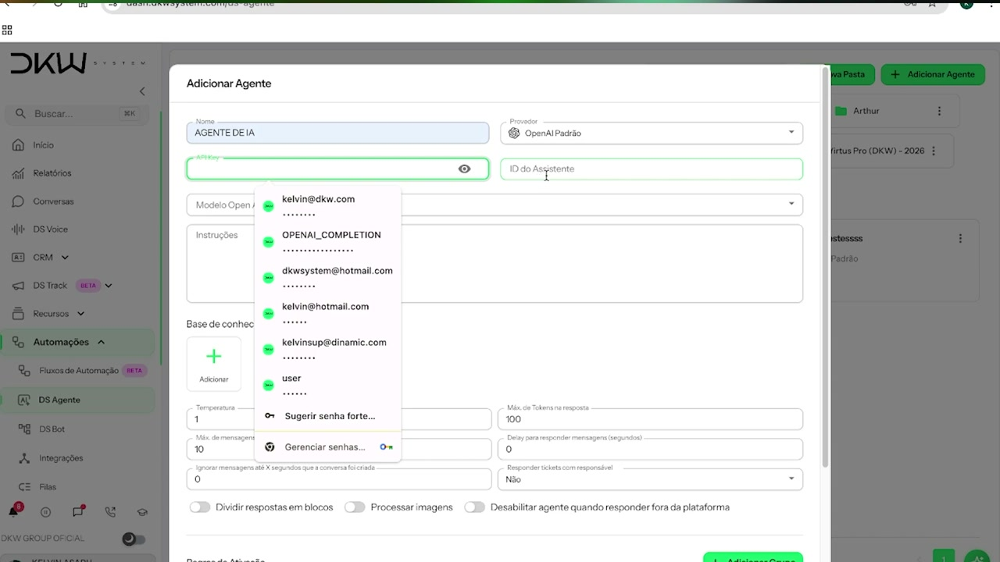
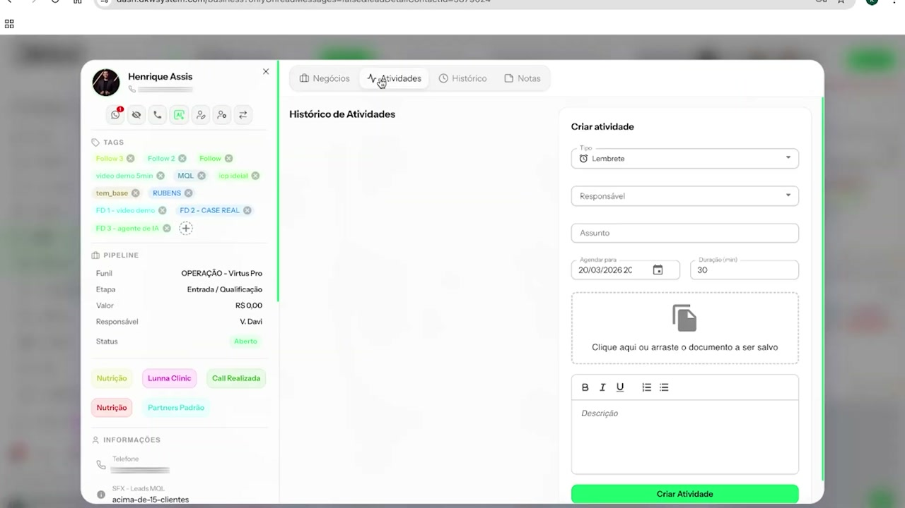
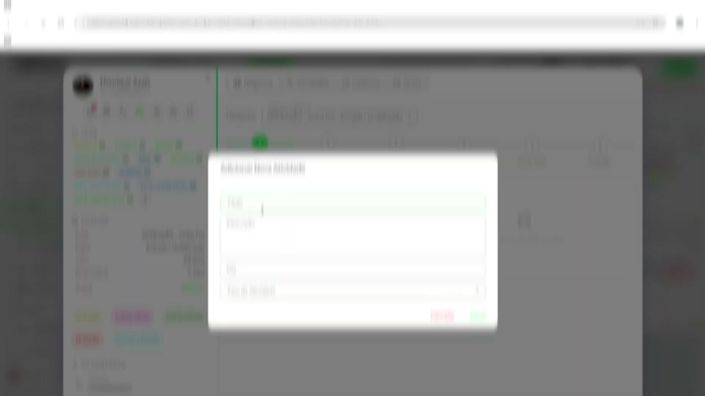
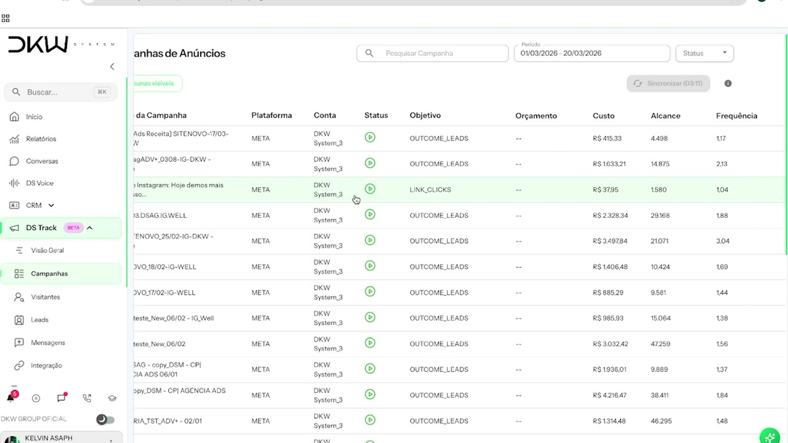
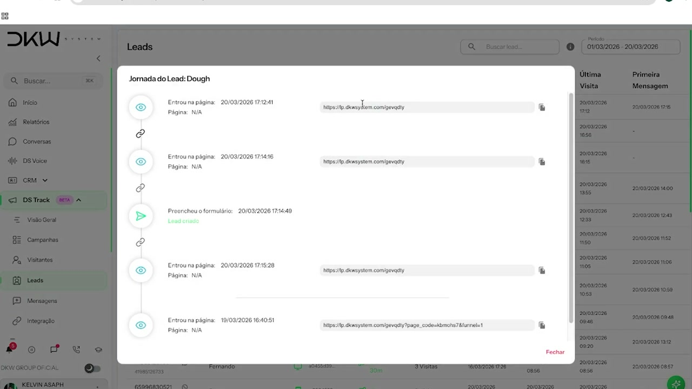

# COMO CRIAR UM SAAS COM SUA MARCA [Para agências]!!

**URL:** https://www.youtube.com/watch?v=E3fpTjW5kQE  
**Canal:** DKW GROUP  
**Data:** 2026-03-25  
**Objetivo:** Levantamento da plataforma Nexvy/DKW whitelabel para replicação de UI  
**Total de frames:** 32

---

## `00:00` — Início do vídeo, homem explicando como criar um produto SaaS em formato White Label.

## `00:09` — Homem se apresentando como Alisson Gonçalves, CMO da DKW System.

## `00:22` — Alisson explicando o modelo de negócio SaaS.

## `00:41` — Explicação do benefício de uma assinatura paga para a empresa.

## `00:51` — Benefícios do faturamento recorrente.

## `01:00` — Como ter acesso a um sistema SaaS sem precisar criar ou ter conhecimento técnico.

## `01:17` — O vídeo será dividido em três etapas: como funciona o mercado, ferramentas práticas e como criar seu sistema com a DKW System.

## `01:30` — Benefício de iniciar a jornada com SaaS através de um White Label.

## `01:53` — DKW System como uma empresa de software.

## `02:06` — Canais de CRM, VoIP, agente de IA, WhatsApp e automações.

## `02:27` — DKW System com mais de 500 parceiros e 2500 clientes ativos.

## `02:50` — Visualização da tela do software DKW System, mostrando o painel de controle com identidade visual personalizável.

## `03:00` — Aumento do ticket médio do cliente, acoplando ferramentas de CRM e agente de IA.

## `03:47` — Público-alvo da DKW System: agências de marketing, consultorias empresariais, profissionais autônomos, donos de loja, e-commerce, empresas de serviços e agentes de IA.

## `04:47` — Alisson mostrando como funciona a ferramenta.

## `05:00` — Tela do painel de controle da DKW System, mostrando canais de atendimento, CRM, conversas e atividades.

## `05:08` — Demonstração da funcionalidade DS Agente, onde se pode adicionar um agente de IA.

## `05:14` — Configuração de um agente de IA, mostrando campos para nome, API Key, ID do assistente, modelo Open AI e instruções.

## `05:20` — Mais opções de configuração do agente de IA, incluindo temperatura, mínimo de tokens e regras de ativação.

## `05:36` — Plataforma que permite conectar API oficial e não oficial, e também Instagram para gerenciamento de atendimento.

## `06:05` — Demonstração da gestão de CRM, com cards e ficha técnica do lead.

## `06:09` — Detalhes do card de lead, exibindo opções para criar atividades, histórico e notas.

## `06:23` — DS Track, uma nova funcionalidade para rastreamento de campanhas.

## `06:28` — Tela do DS Track, mostrando campanhas de anúncios, volume de tráfego, visitantes, leads e vendas.

## `06:45` — Visualização dos leads gerados através das campanhas no DS Track.

## `06:55` — Jornada do Lead Dough, mostrando os momentos de conversões específicas e por onde o lead passou.

## `07:20` — Como lucrar com a ferramenta White Label, com liberdade de precificação.

## `07:35` — Explicação sobre checkout próprio e links de pagamentos recorrentes.

## `07:49` — Observação do saldo liberado para saque e tempo de disponibilidade.

## `08:11` — Exemplo de faturamento: um cliente de R$ 300 gera R$ 300 mensais.

## `08:23` — Chamada para ação para se tornar um parceiro DKW e ativar o White Label.

## `08:38` — Final do vídeo com o logotipo da DKW System.

