# [Parceiros] Inicio da cobrança

**URL:** https://www.youtube.com/watch?v=G0XsZWjQV8c  
**Canal:** HelenaCRM  
**Data:** 2025-11-13  
**Objetivo:** Levantamento da plataforma Nexvy/DKW whitelabel para replicação de UI  
**Total de frames:** 17

---

## `00:00` — Início da cobrança

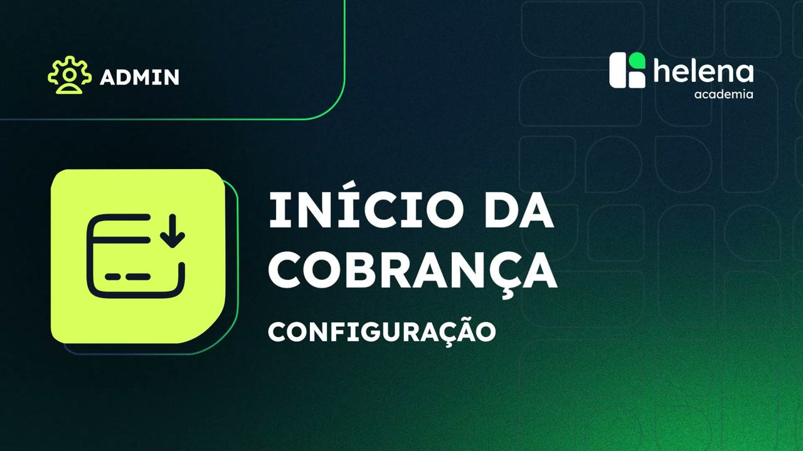

## `00:01` — Configuração

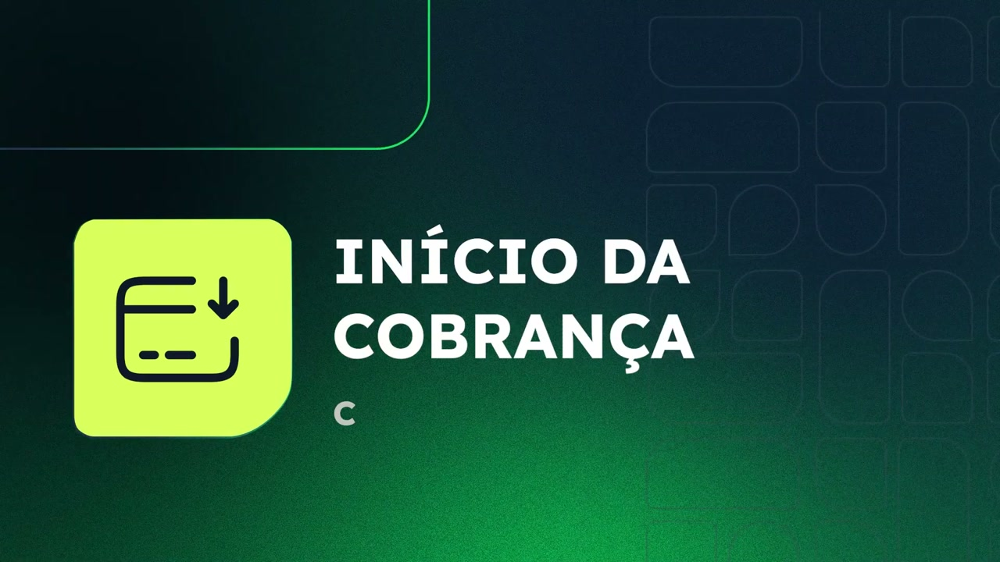

## `00:05` — Apresentação da Larissa Lopes

## `00:08` — Quando é iniciada a cobrança

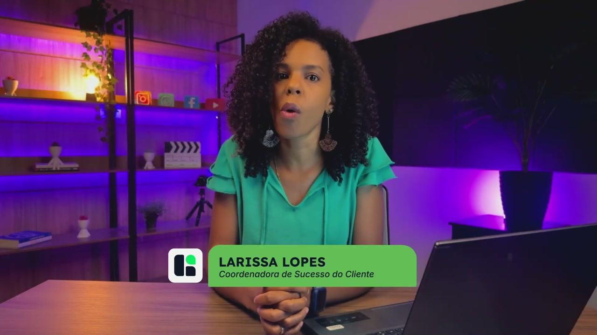

## `00:13` — A cobrança é pós-paga para os parceiros

## `00:17` — A cobrança é feita mensalmente e só é interrompida com o cancelamento da conta

## `00:27` — O faturamento é gerado no início de cada mês

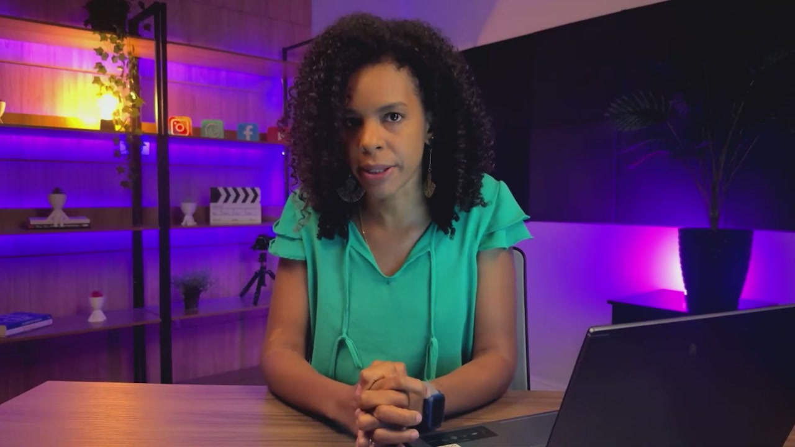

## `00:31` — Boleto emitido no dia 10 e vencimento no dia 15

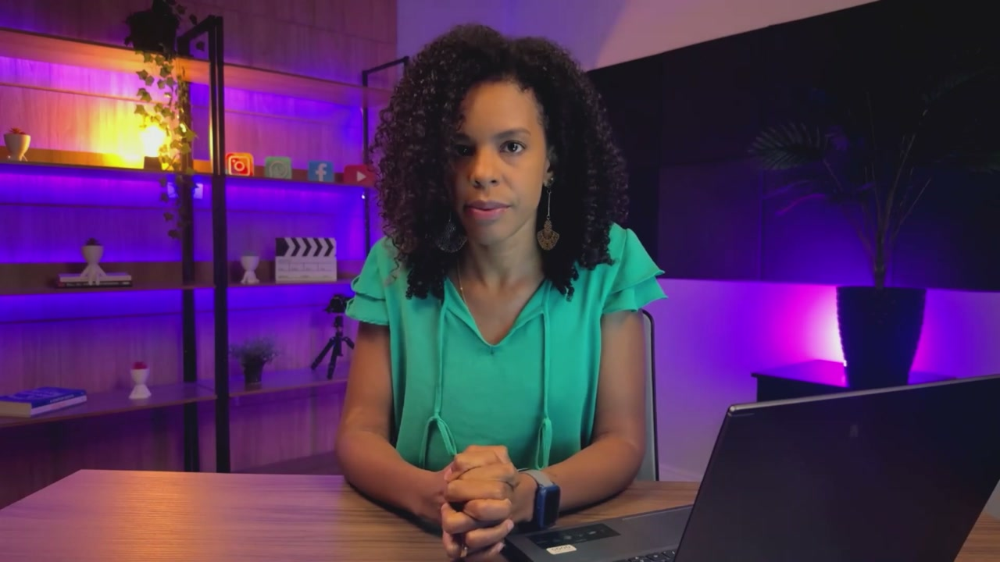

## `00:36` — Caso o dia 15 caia em um final de semana, o vencimento será ajustado para o dia útil seguinte

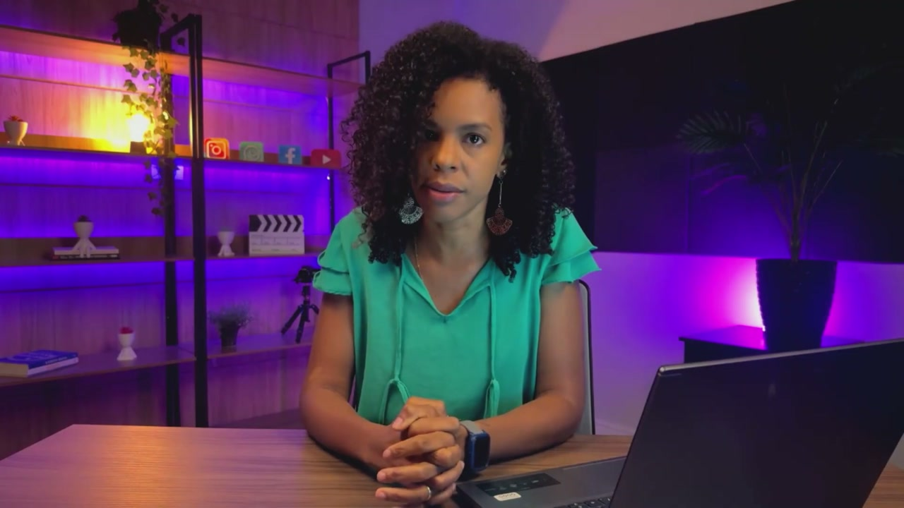

## `00:43` — Contas de demonstração para teste grátis (apenas para parceiros White Label)

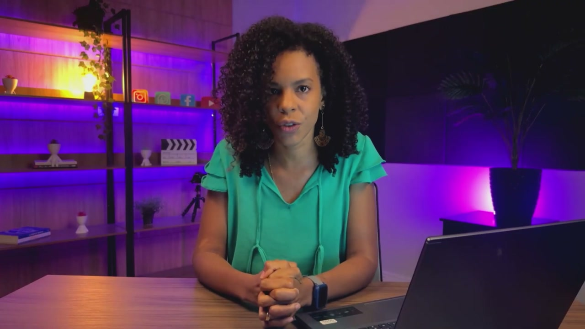

## `00:54` — A cobrança é iniciada ao colocar um canal (WhatsApp, Instagram, Facebook Messenger) ou mudar para qualquer status de produção que não seja cancelado

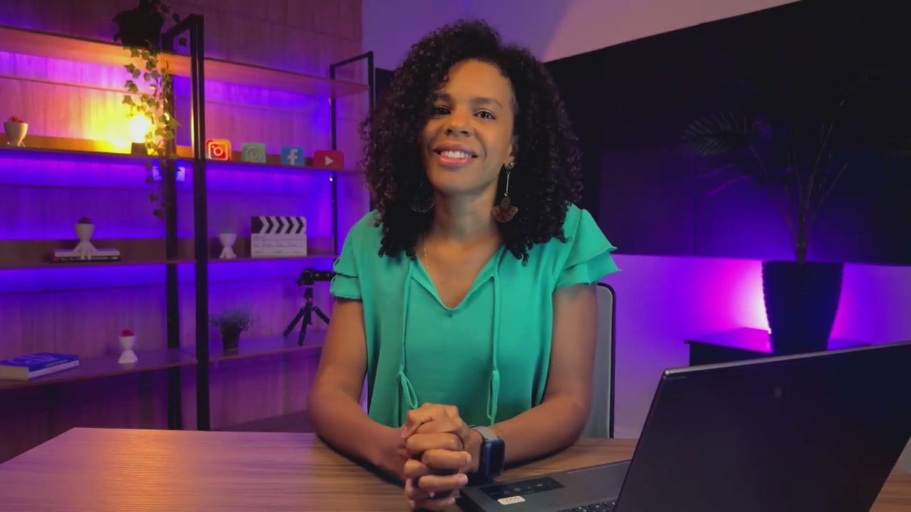

## `01:06` — Não é permitido voltar para o modo de demonstração após a alteração do status

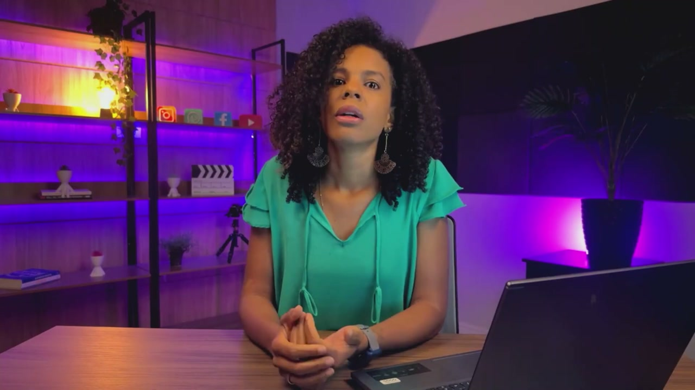

## `01:11` — Recomenda-se utilizar um número específico para o ambiente de demonstração

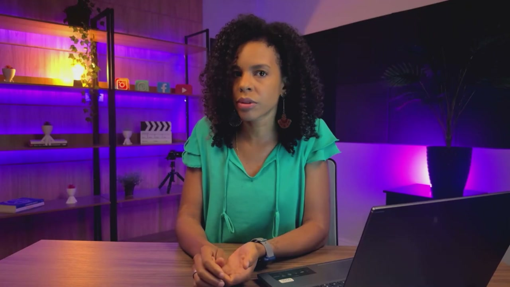

## `01:25` — Para interromper o faturamento, é necessário mudar o status da conta para cancelado e depois inativar a conta

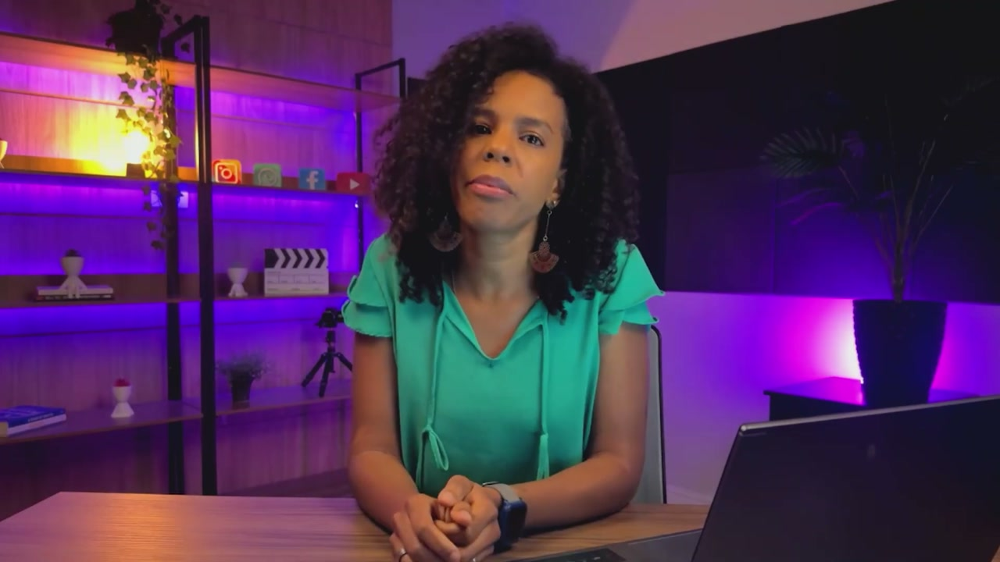

## `01:43` — Se o status for alterado para qualquer outro de produção, a data final de cancelamento é retirada e a cobrança é feita integralmente

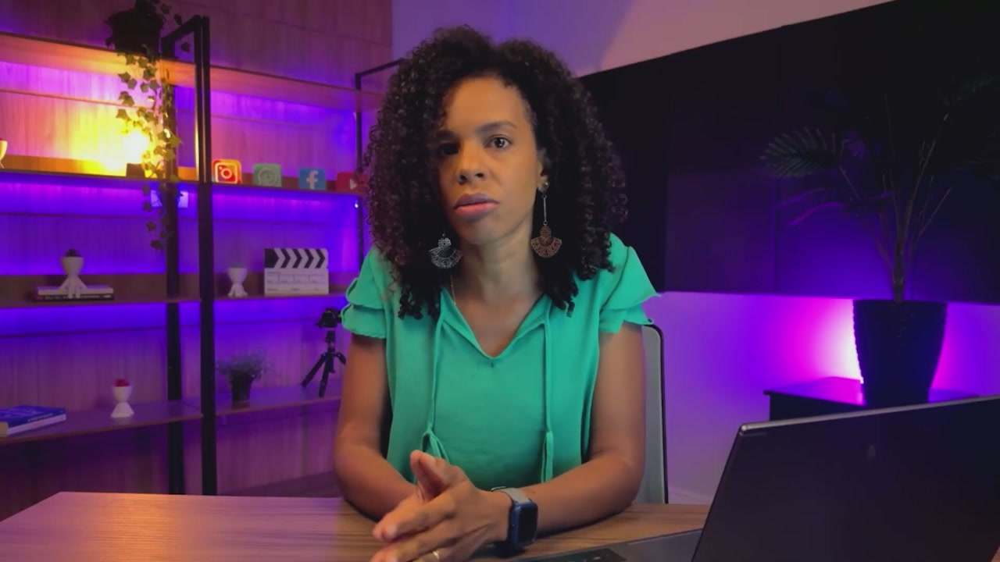

## `01:54` — Agradecimentos

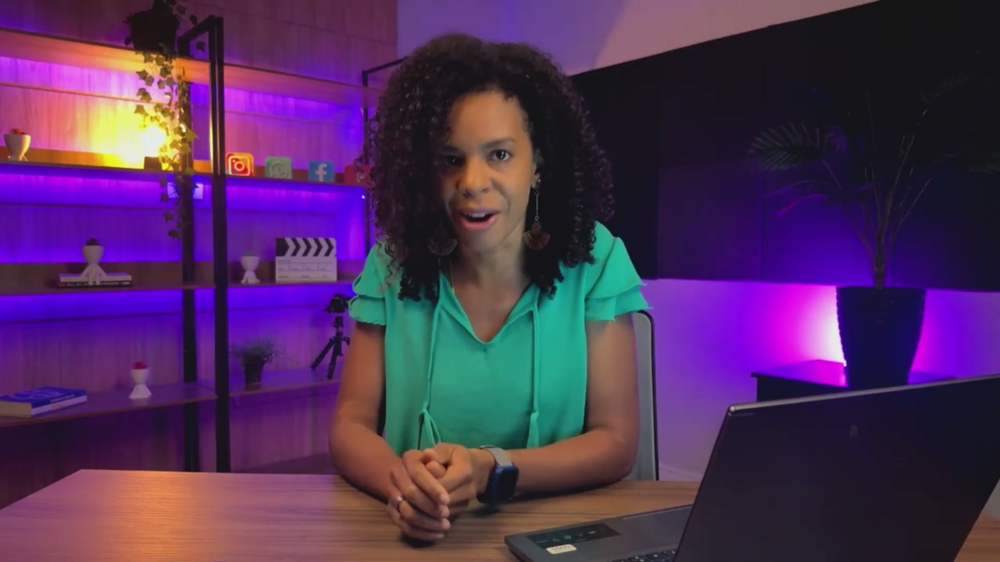

## `01:58` — Logotipo da Helena Academia

