# Conceitos de Distribuição de Atendimento na plataforma helenaCRM

**URL:** https://www.youtube.com/watch?v=GTX_QLA1zeg  
**Canal:** HelenaCRM  
**Data:** 2026-01-02  
**Objetivo:** Levantamento da plataforma Nexvy/DKW whitelabel para replicação de UI  
**Total de frames:** 21

---

## `00:00` — Título do vídeo "Distribuição de Atendimento" na tela.

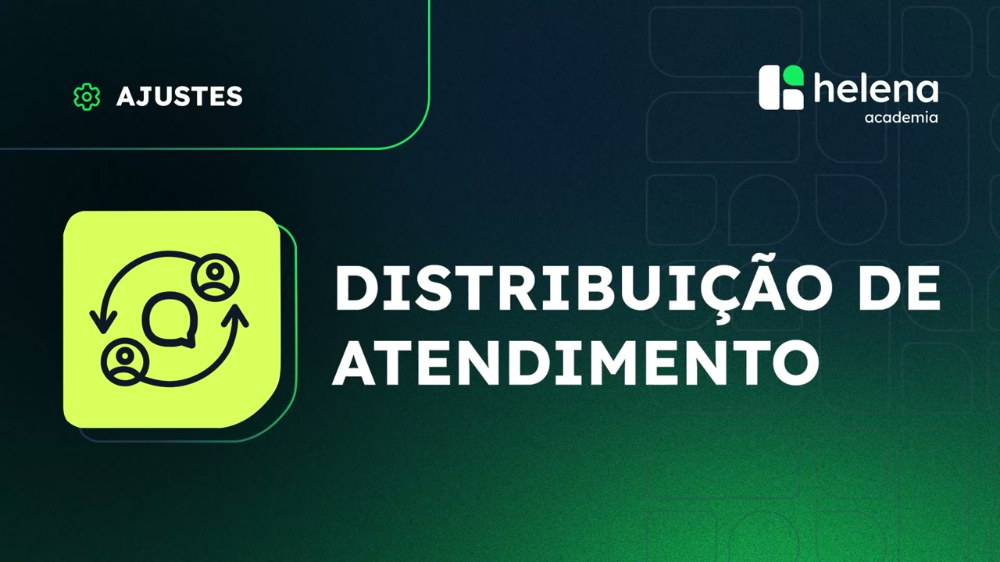

## `00:05` — A apresentadora Aline Medeiros aparece na tela.

## `00:43` — Descrição sobre "Usuários Supervisores e os marcados como 'Indisponível' não entram no rodízio".

## `00:53` — Mensagem "Atendimento expira em: 01:53".

## `01:21` — Tela de "Aplicativos Integrados" com o menu "Apps" selecionado.

## `01:25` — Opção "Mais apps" selecionada no menu "Apps".

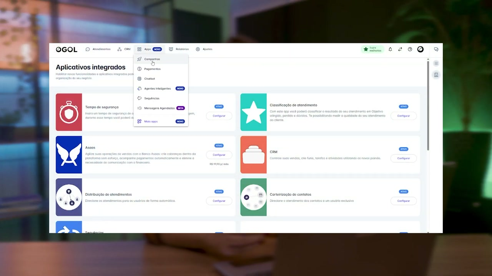

## `01:30` — Aplicativo "Distribuição de atendimentos" e o botão "Habilitar" destacado.

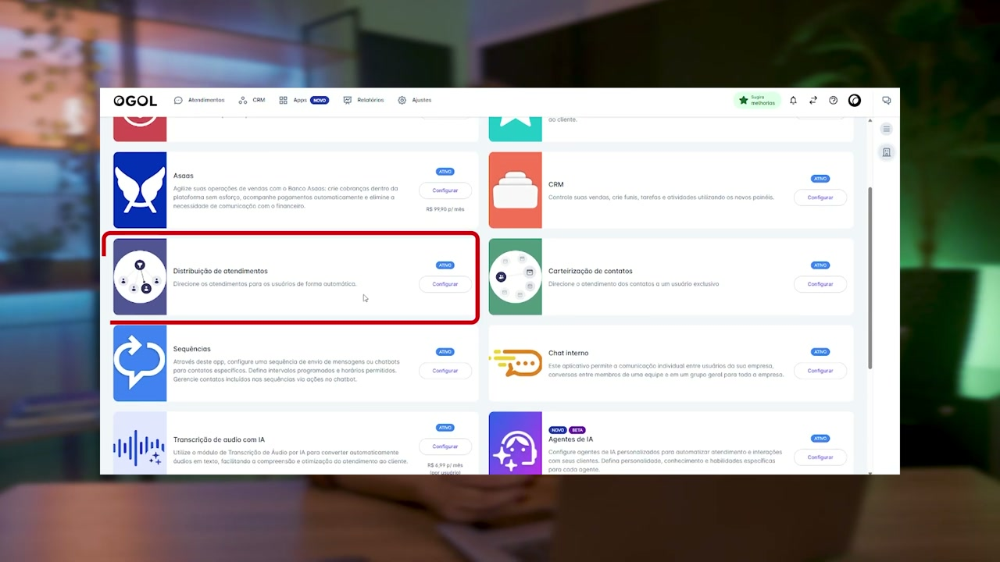

## `01:33` — Janela de configuração do aplicativo "Distribuição de atendimentos".

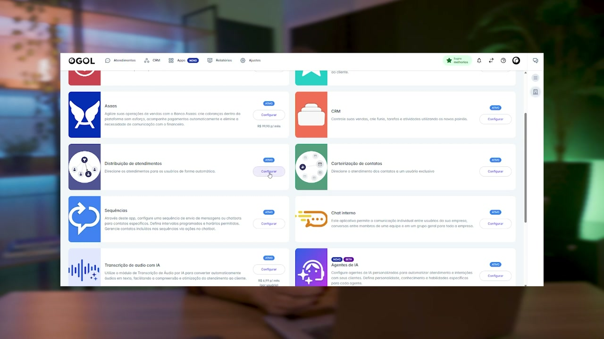

## `01:37` — Opção "Aplicativo habilitado" sendo ativada.

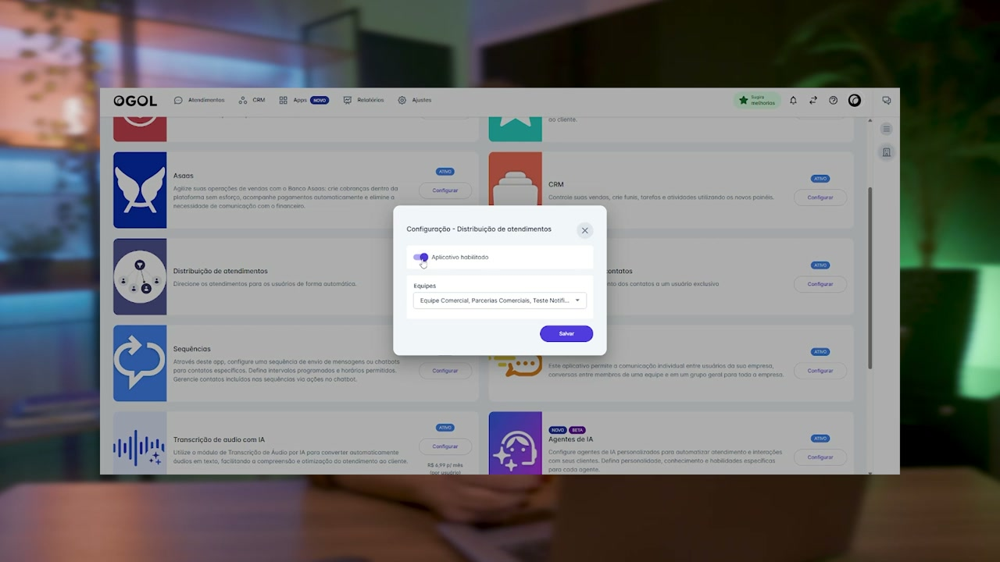

## `01:39` — Seleção de equipes.

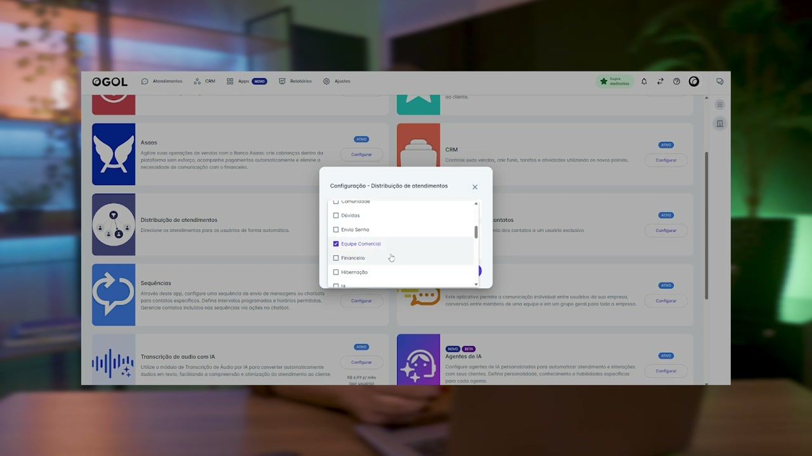

## `01:46` — Botão "Salvar" destacado.

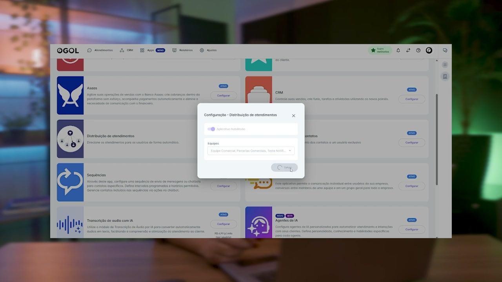

## `01:52` — Menu "Ajustes" e opção "Equipe" selecionada.

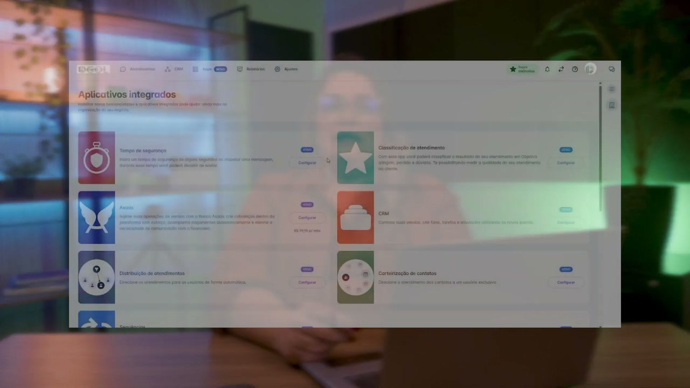

## `01:58` — Botão "Alterar" destacado na equipe selecionada.

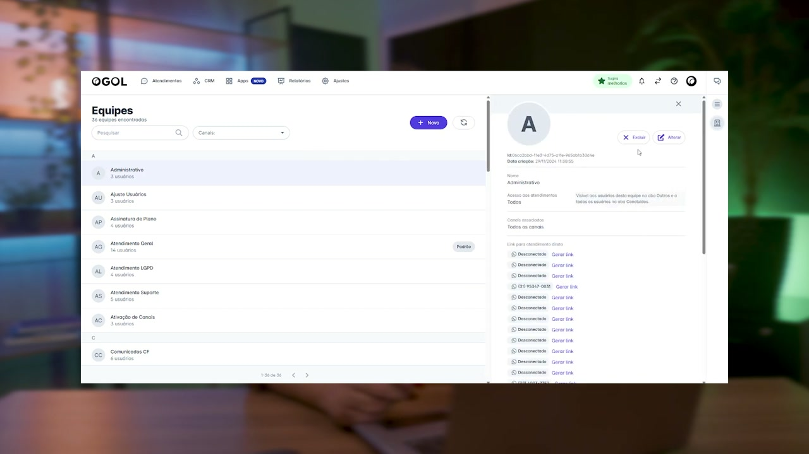

## `02:00` — Janela de ajustes, opção "Distribuição de atendimentos" e "Transbordo distribuído" destacadas.

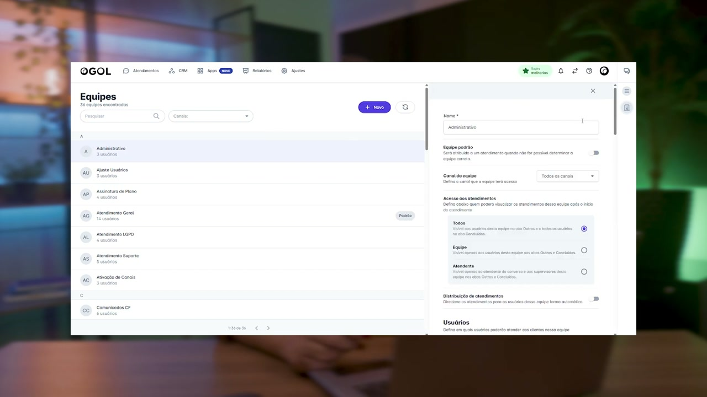

## `02:05` — Ativação da função "Transbordo distribuído".

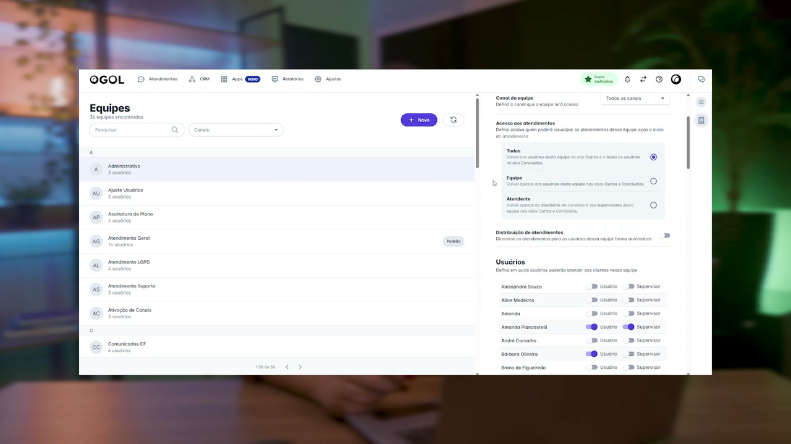

## `02:11` — Seleção do limite de tempo para realizar transbordo.

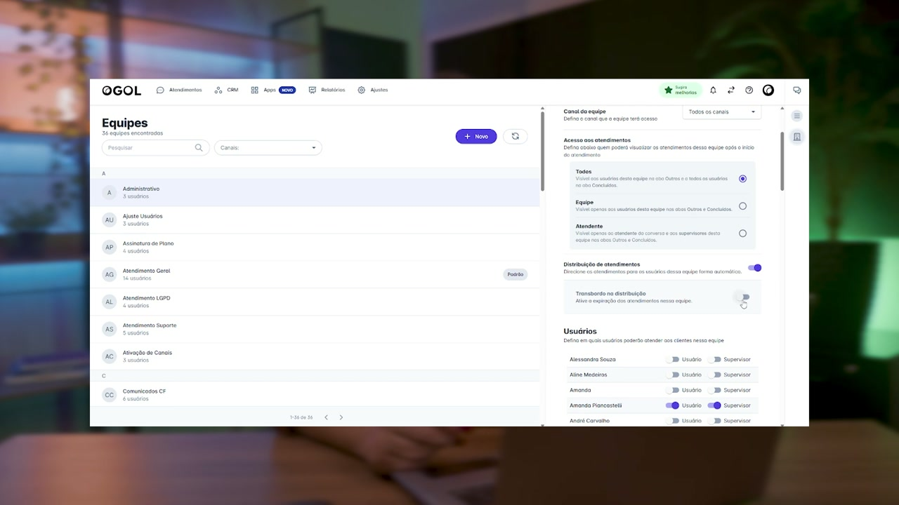

## `02:16` — Opção de limite de tempo selecionada.

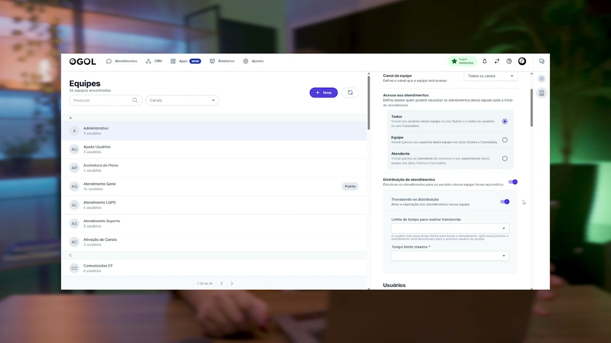

## `02:29` — Menu "Ajustes" e opção "Usuários" selecionada.

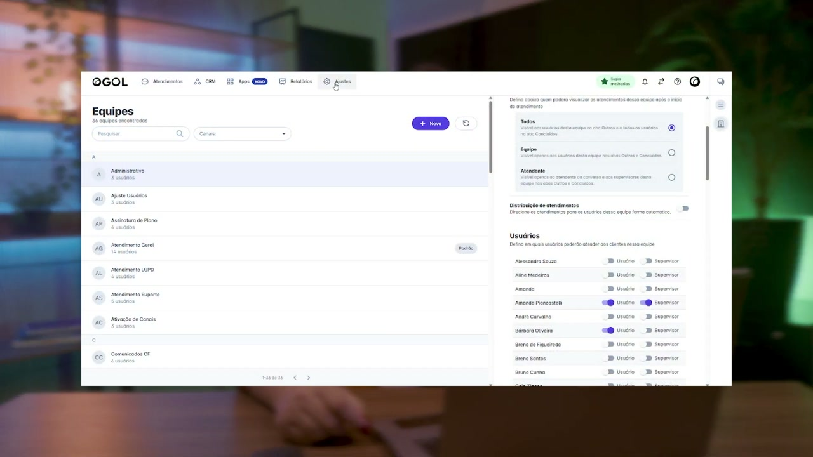

## `02:35` — Seleção do ícone de "check" e opção "Indisponível".

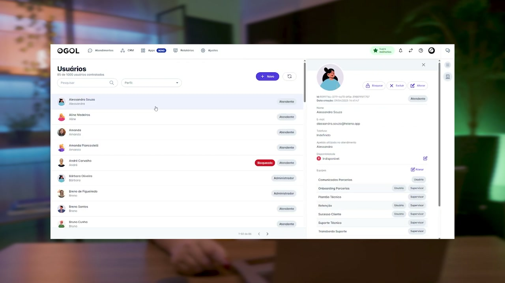

## `02:43` — Timer "Atendimento expira em: 01:53" exibido na mensagem.

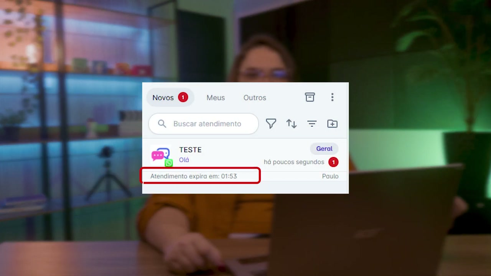

## `03:01` — Logotipo da Helena Academia na tela final.

