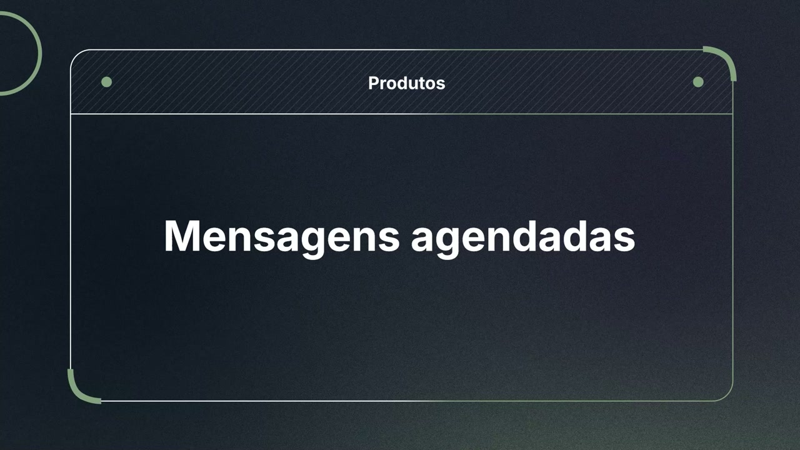
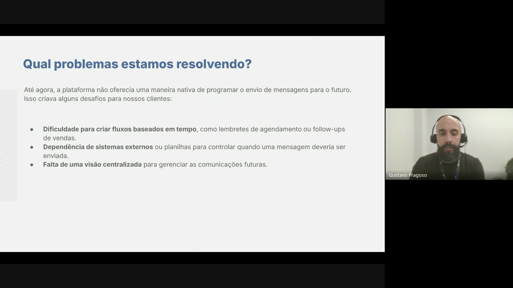
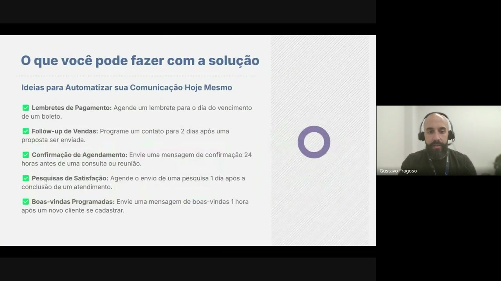

# Contexto de como usar Mensagens Agendadas no seu negócio na helenaCRM

**URL:** https://www.youtube.com/watch?v=JHONOag6fEo  
**Canal:** HelenaCRM  
**Data:** 2025-09-30  
**Objetivo:** Levantamento da plataforma Nexvy/DKW whitelabel para replicação de UI  
**Total de frames:** 6

---

## `00:00` — Título "Produtos" e subtítulo "Mensagens agendadas" em um fundo abstrato com formas e linhas.

## `00:05` — Um slide com o título "Mensagens Agendadas" e a imagem de pessoas trabalhando em computadores, com o nome "Gustavo Fragoso" na parte inferior.

## `00:38` — O slide muda para o título "Qual problemas estamos resolvendo?" e uma lista de 3 itens sobre dificuldades com programação de mensagens para o futuro.

## `01:24` — O slide muda para "Como Resolvemos? Uma Ferramenta Completa para Agendar e Gerenciar Mensagens" e três caixas com os títulos "Agendar", "Gerenciar" e "Automatizar", cada uma com uma breve descrição.

## `02:23` — O slide muda para "O que você pode fazer com a solução" e uma lista de 5 ideias para automatizar a comunicação, com checkboxes marcados.

## `03:36` — O slide muda para "Como Funciona na Prática?" com um fundo azul e linhas finas.

