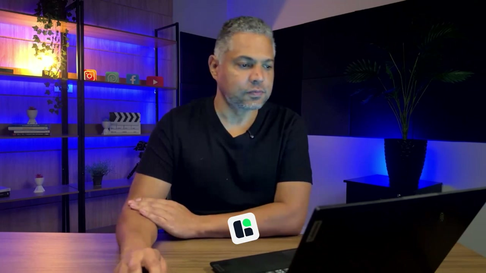
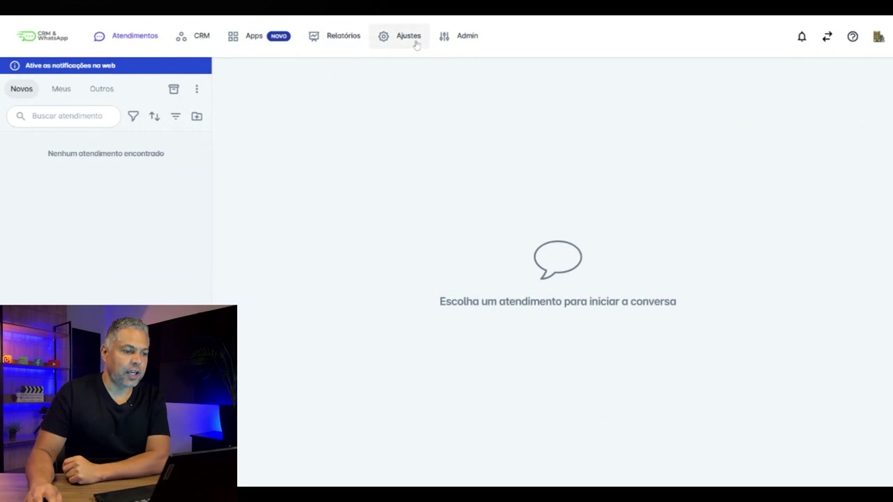
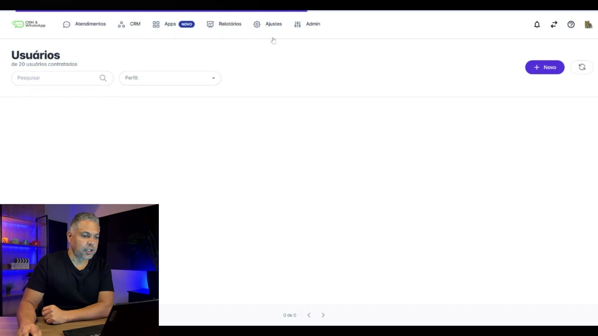
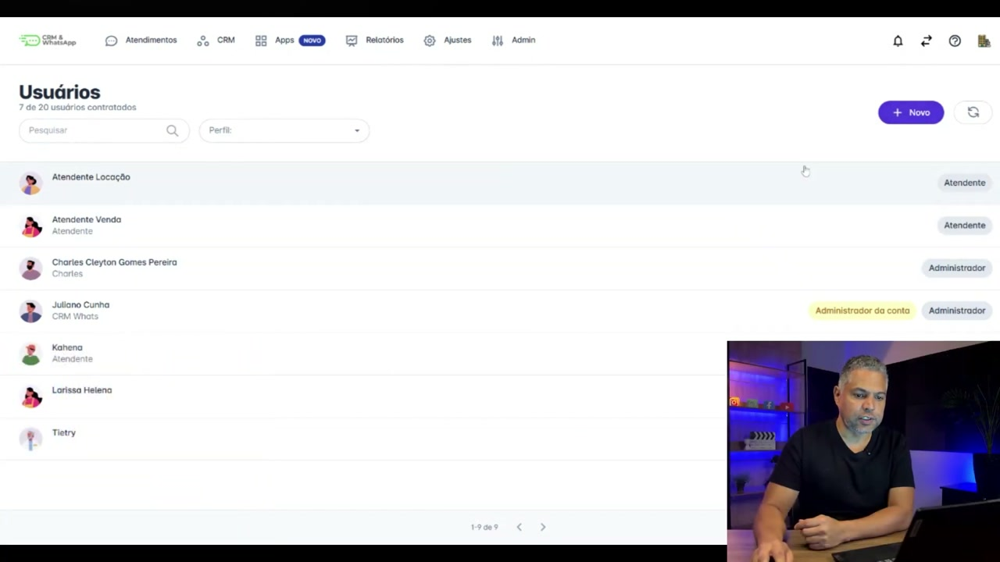
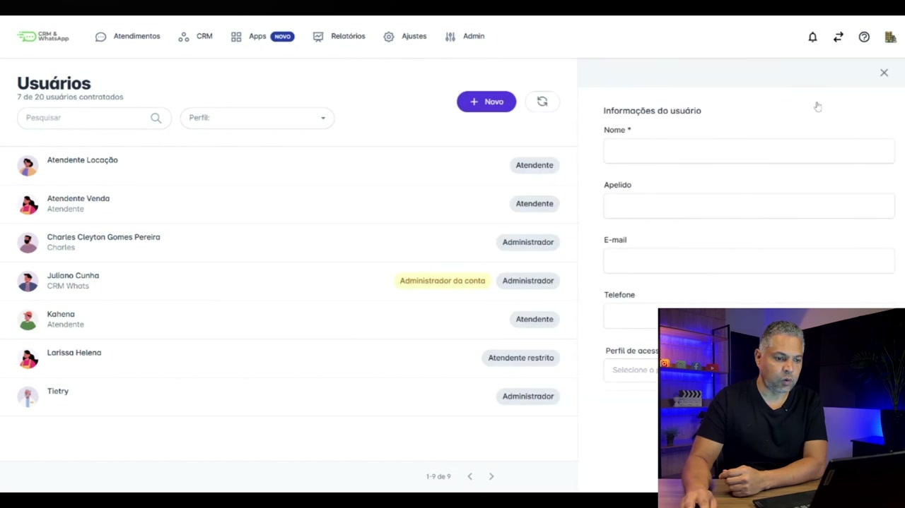
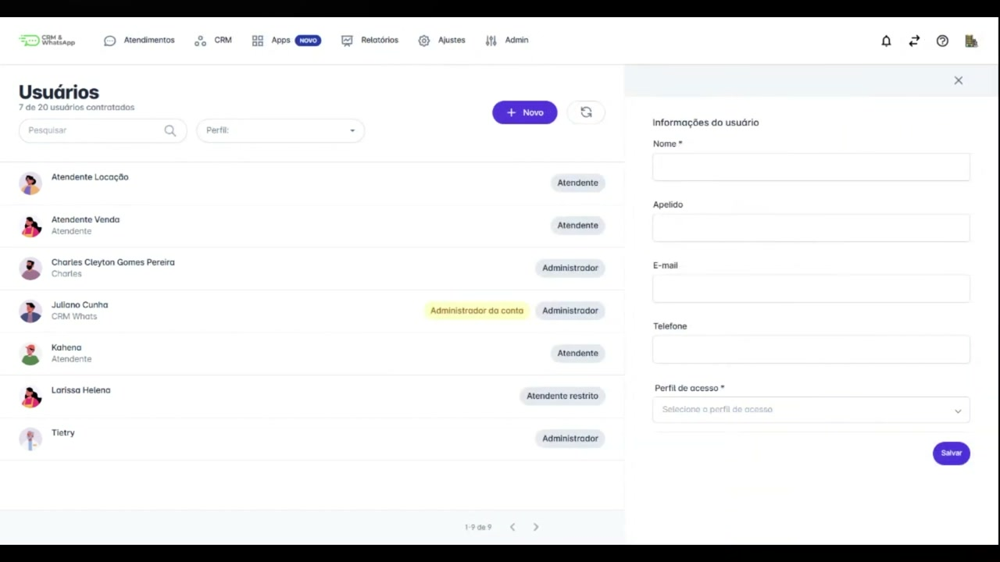
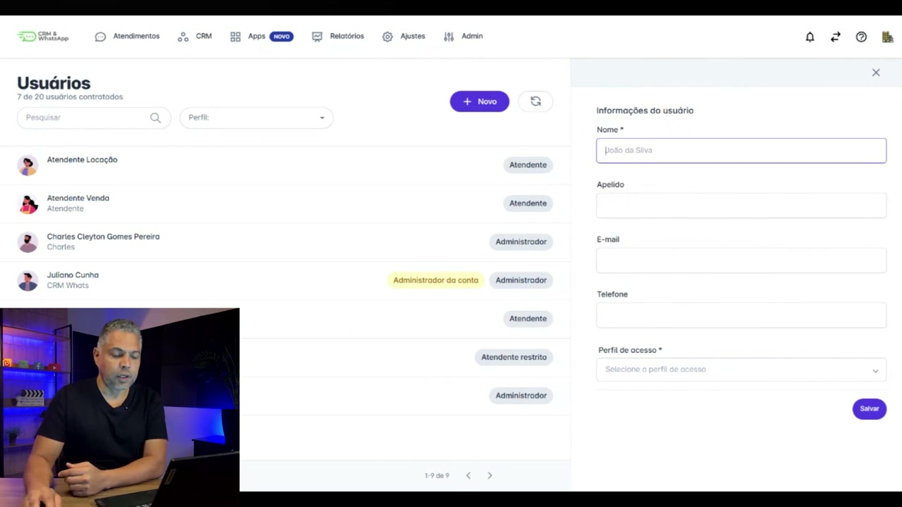
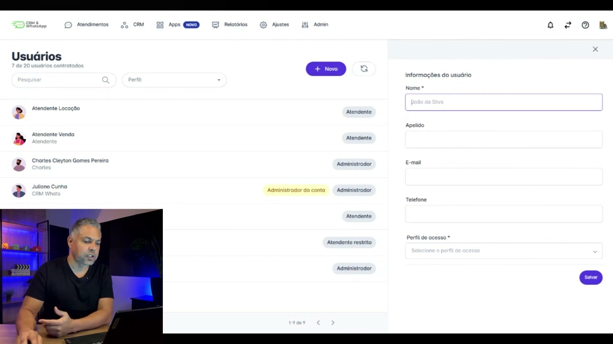
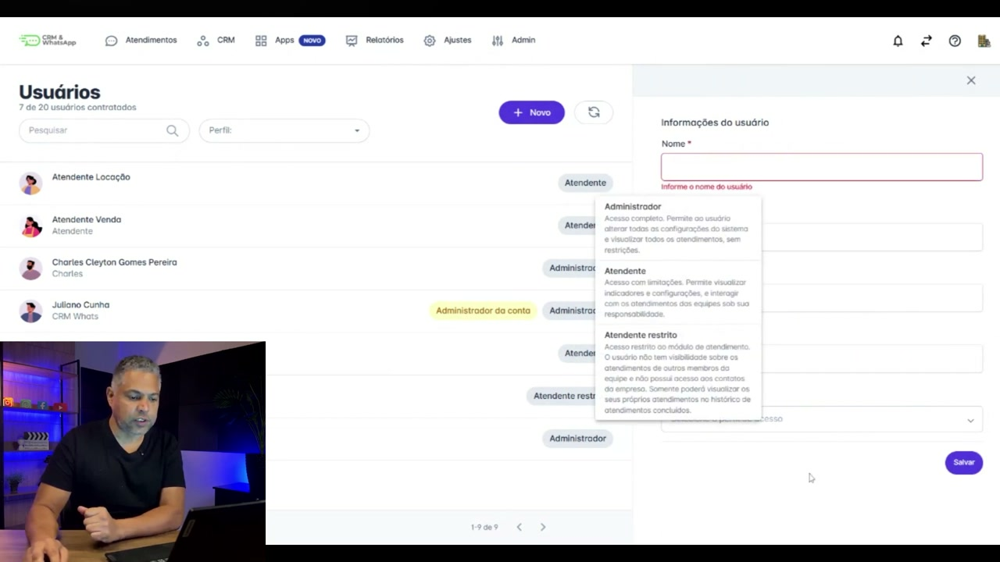

# Conceitos de Usuários na prática na plataforma helenaCRM

**URL:** https://www.youtube.com/watch?v=LsdXRmS7Agk  
**Canal:** HelenaCRM  
**Data:** 2025-11-05  
**Objetivo:** Levantamento da plataforma Nexvy/DKW whitelabel para replicação de UI  
**Total de frames:** 14

---

## `00:00` — Início do vídeo: tela inicial "USUÁRIOS NA PRÁTICA".

## `00:05` — O palestrante Charles Pereira, Analista de Sucesso do Cliente, se apresenta e explica o tema do vídeo: "Perfil de Usuário".

## `00:11` — Charles acessa a plataforma Helena CRM.

## `00:18` — Ele clica em "Ajustes" e, no menu que se abre, seleciona "Usuários".

## `00:20` — A tela "Usuários" é exibida, mostrando uma lista de usuários existentes.

## `00:29` — Charles clica em "+ Novo" para criar um novo usuário.

## `00:31` — Um formulário para "Informações do usuário" é exibido.

## `00:32` — Ele demonstra o preenchimento do campo "Nome".

## `00:42` — Ele explica que o campo "Apelido" é opcional e que, se não for preenchido, o sistema aparecerá como responsável pela mensagem.

## `00:57` — Charles explica que o campo "E-mail" ou "Telefone" é obrigatório para o login na plataforma.

## `01:10` — Ele clica no campo "Perfil de acesso" e mostra as opções disponíveis: "Atendente", "Atendente restrito" e "Administrador".

## `01:15` — Ele mostra a descrição de cada perfil de acesso ao passar o mouse sobre as opções.

## `01:39` — Charles retorna à tela da câmera, encerra a demonstração e fornece instruções adicionais.

## `01:47` — Tela final: logo da Helena Academia.

