# Conheça o módulo Central de Atendimento da HelenaCRM

**URL:** https://www.youtube.com/watch?v=Lus6OhCWhrg  
**Canal:** HelenaCRM  
**Data:** 2026-02-27  
**Objetivo:** Levantamento da plataforma Nexvy/DKW whitelabel para replicação de UI  
**Total de frames:** 27

---

## `00:00` — Título: "Central de Atendimento - Funcionalidades"

## `00:04` — Uma mulher falando sobre a funcionalidade "Central de Atendimento"

## `01:24` — Tela de Central de Atendimento - "Filas"

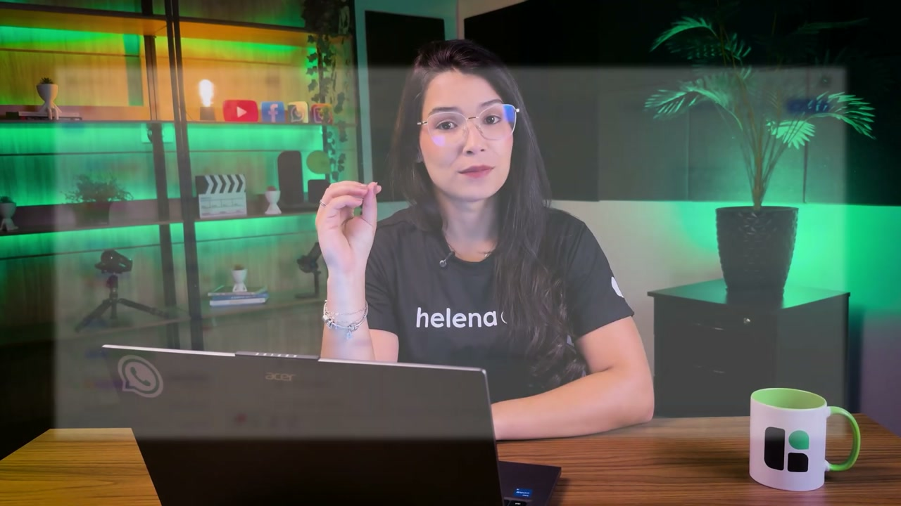

## `01:27` — Detalhe dos atendimentos

## `01:30` — Fila de "Novos"

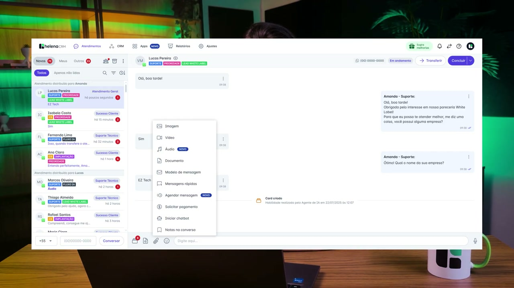

## `01:52` — Fila de "Meus"

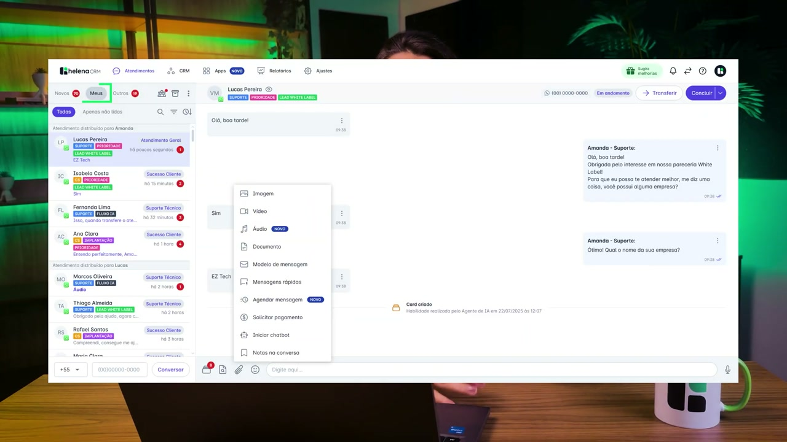

## `02:02` — Fila de "Outros"

## `02:13` — Tela de "Usuários" - Acesso de "Administrador"

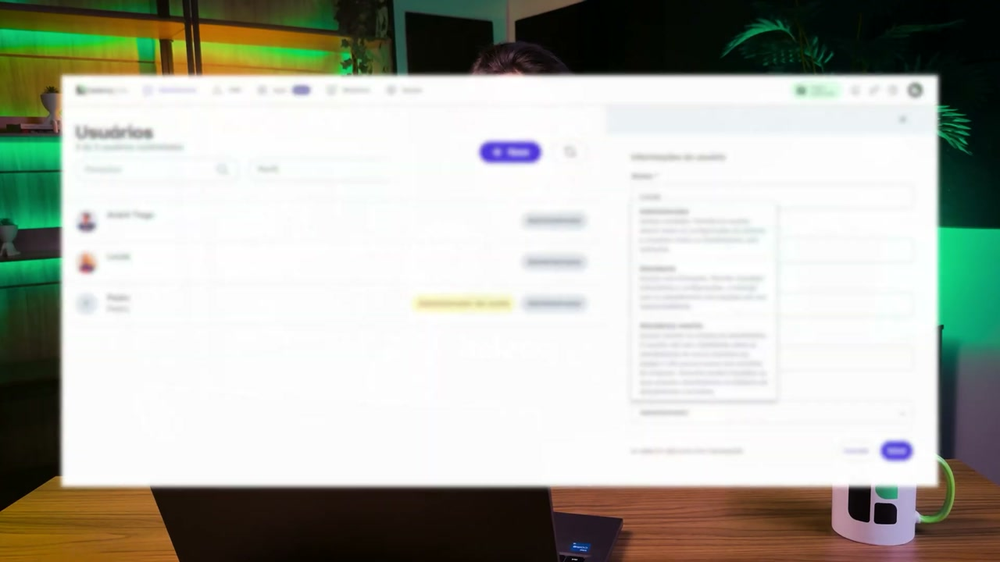

## `02:25` — Tela de "Usuários" - Acesso de "Atendimento"

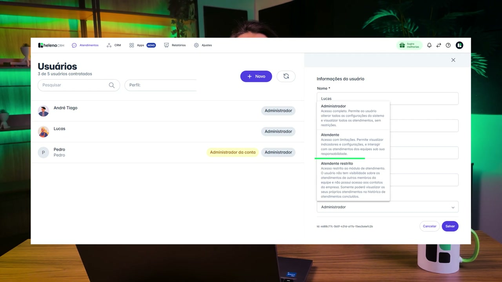

## `02:35` — Tela de "Usuários" - Acesso de "Atendimento restrito"

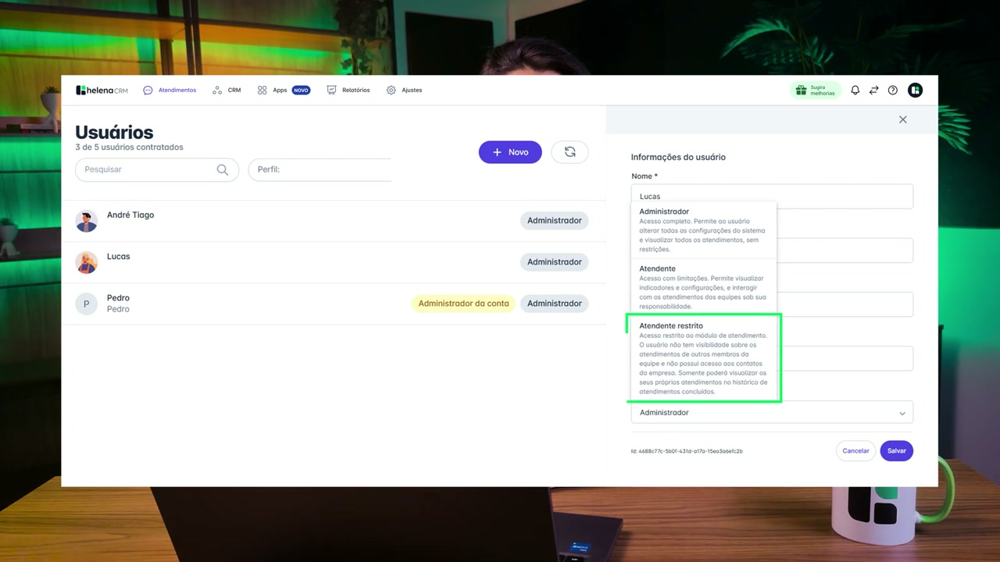

## `02:58` — Tela de "Contatos de clientes"

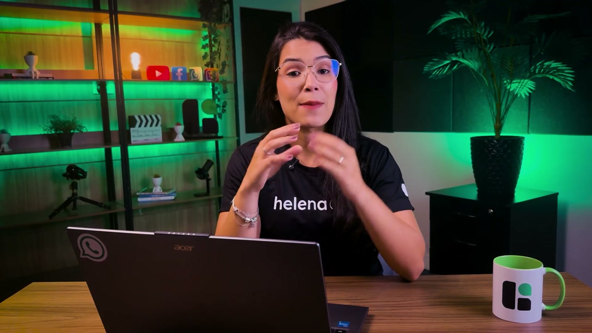

## `03:26` — Tela de "Agendar mensagem"

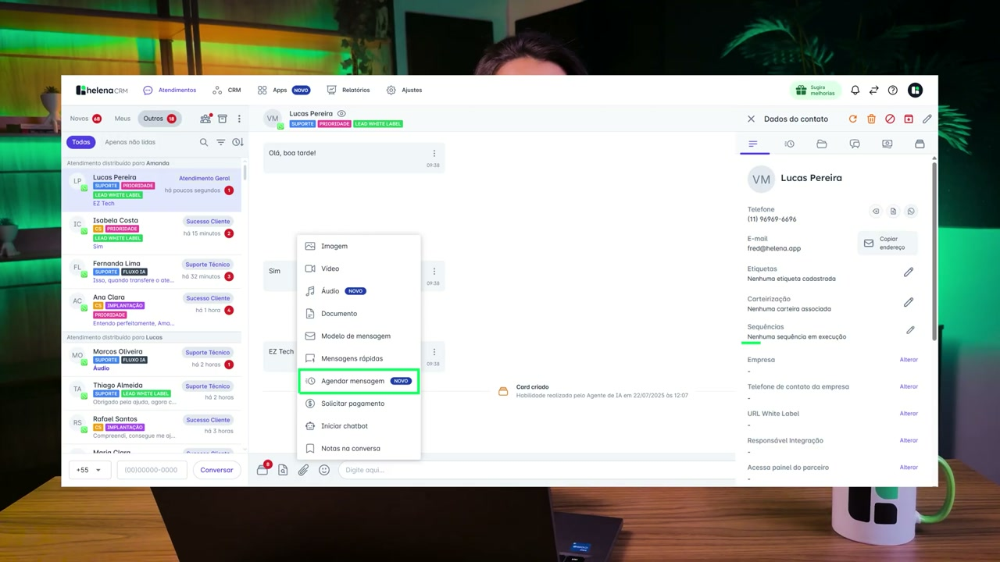

## `03:28` — Tela de "Sequências"

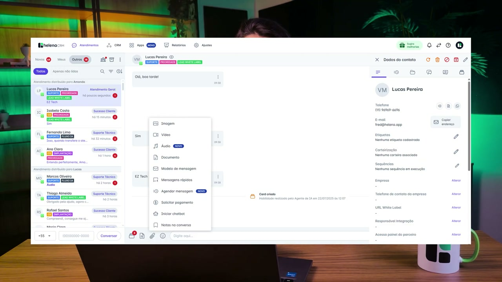

## `03:31` — Tela de "Modelos de mensagem"

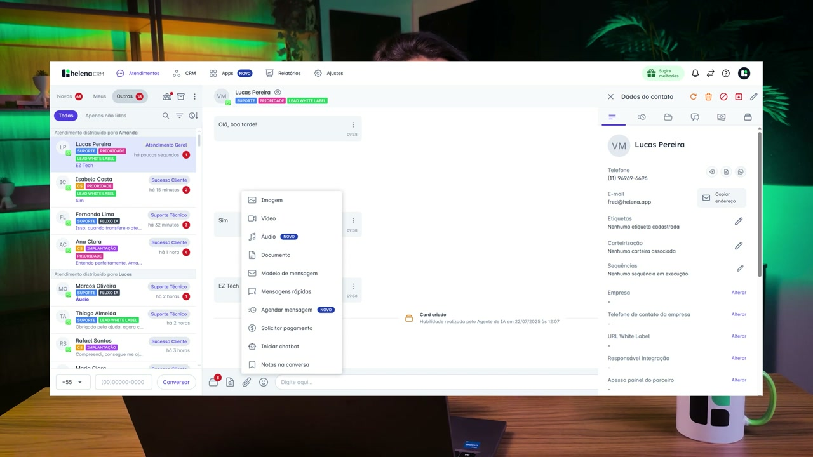

## `04:21` — Tela de "Solicitar pagamento"

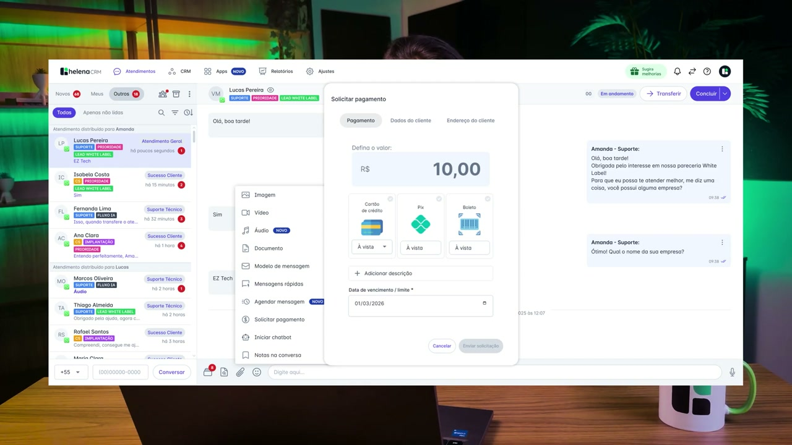

## `04:40` — Tela de "Grupos do WhatsApp"

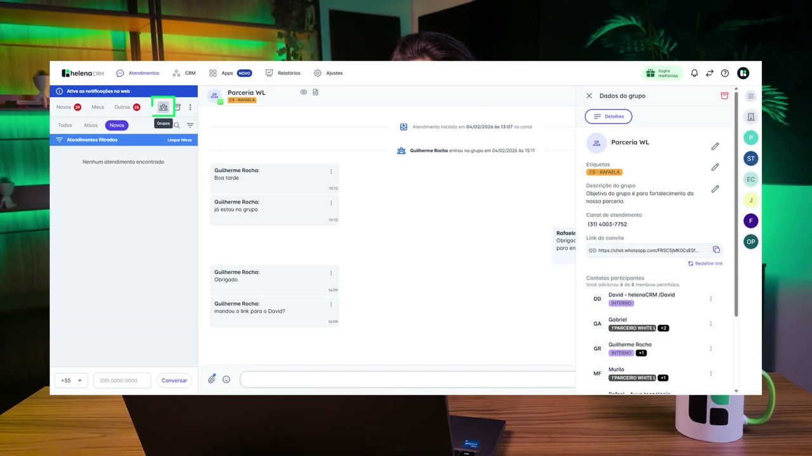

## `04:46` — Detalhe de "tags"

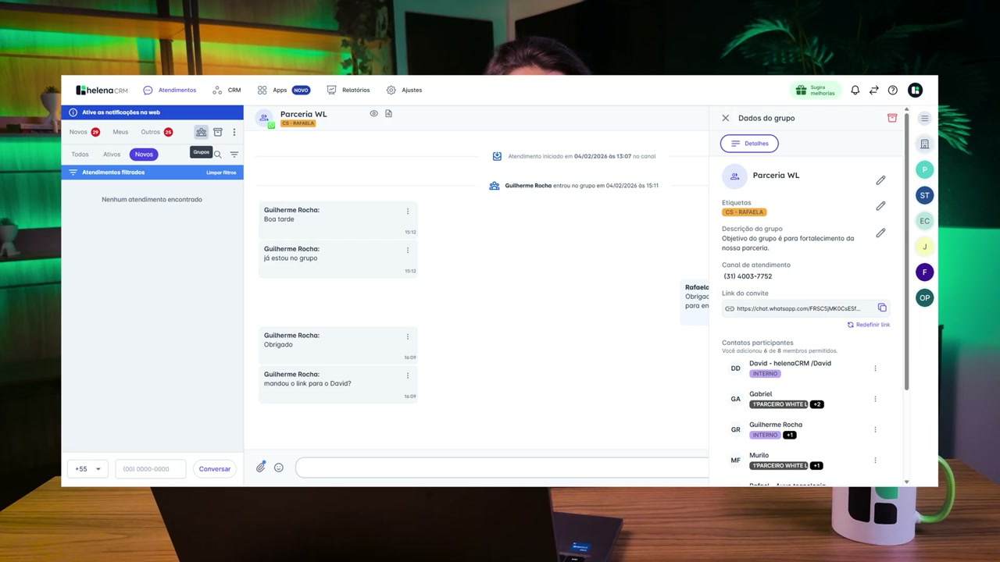

## `04:56` — Ícone de "Helena CRM"

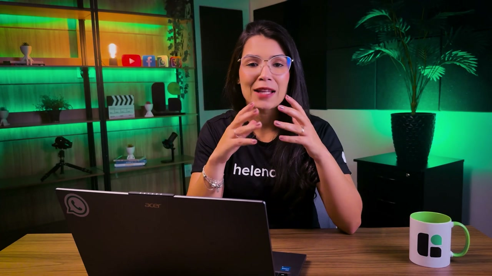

## `05:04` — Atendimento unificado e inteligente

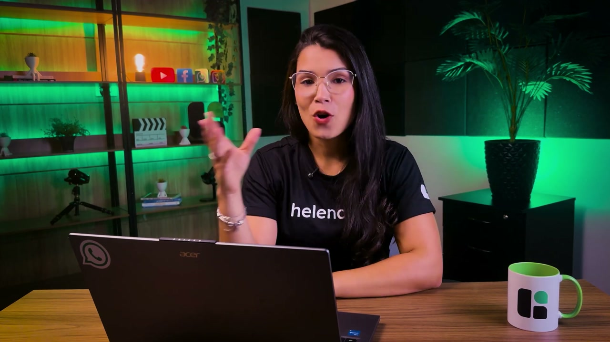

## `05:11` — Performance e produtividade

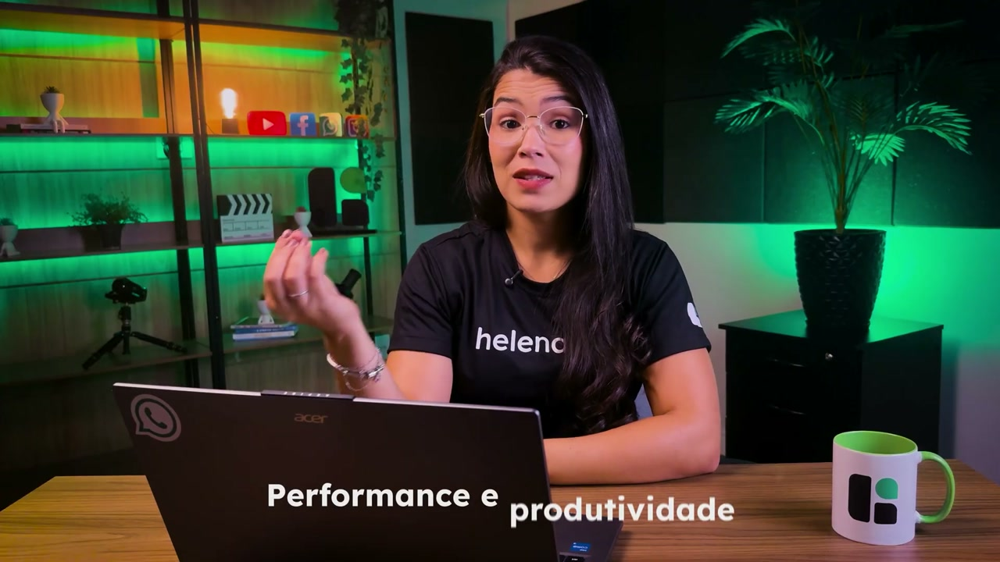

## `05:18` — Gestão baseada em dados

## `05:26` — Automação com eficiência

## `05:34` — Escalabilidade real

## `05:41` — Colaboração ampliada

## `05:49` — Experiência do cliente elevada

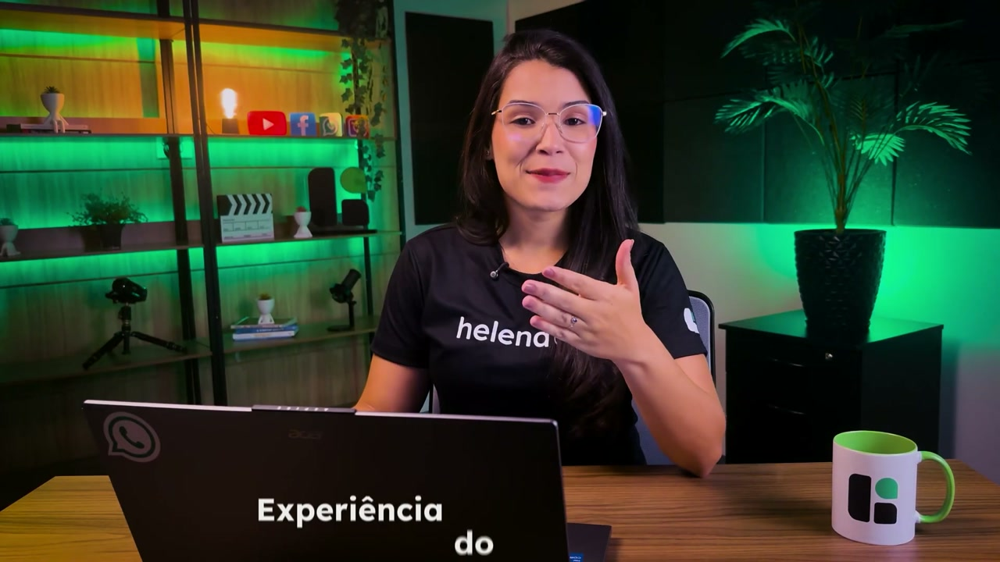

## `05:57` — Operação com a sua marca

## `06:23` — Logo Helena CRM

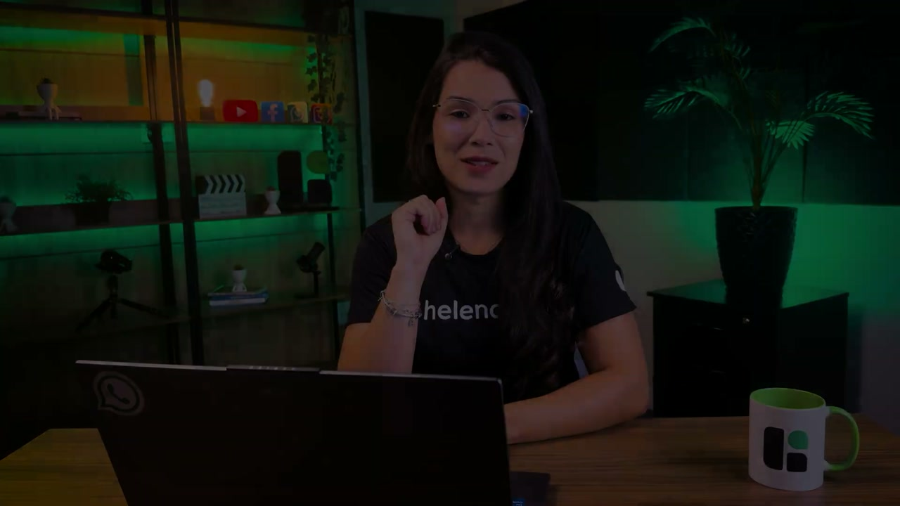
