# [Refazer] Como importar contatos para a plataforma

**URL:** https://www.youtube.com/watch?v=PvfppQNxQZs  
**Canal:** HelenaCRM  
**Data:** 2025-10-07  
**Objetivo:** Levantamento da plataforma Nexvy/DKW whitelabel para replicação de UI  
**Total de frames:** 19

---

## `00:00` — Visão geral da interface do CRM, exibindo a lista de contatos com informações de telefone, e-mail e etiquetas.

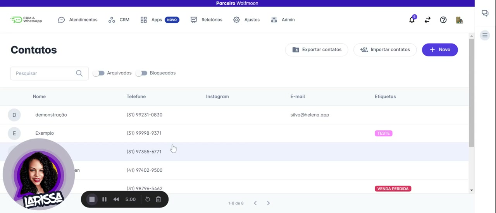

## `00:05` — Clique no botão "Importar contatos".

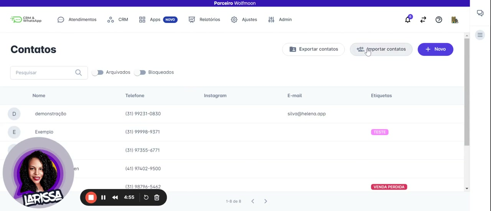

## `00:11` — É exibida uma janela "Importar contatos" com as opções de formato de arquivo (Copiar/Colar, Arquivo do Excel, Arquivo CSV, Arquivo Vcard).

## `00:20` — Seleciona a opção "Copiar/Colar".

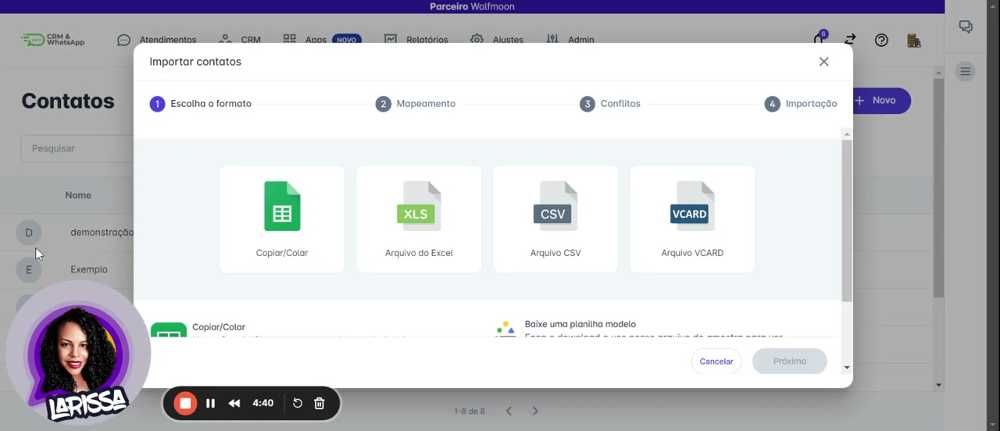

## `00:24` — Clique no botão "Próximo".

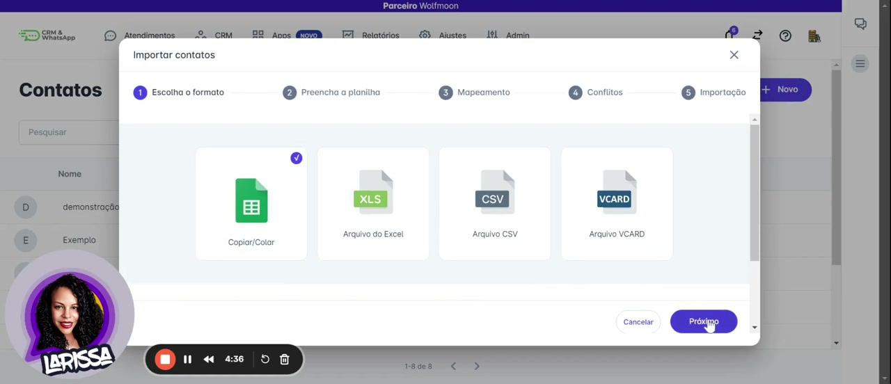

## `00:27` — A janela "Importar contatos" mostra "Planilha gerada" com as opções "Abrir planilha" e "Prosseguir".

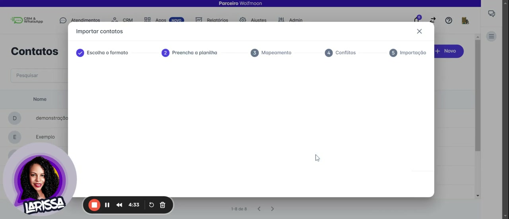

## `00:43` — Clique no botão "Abrir planilha".

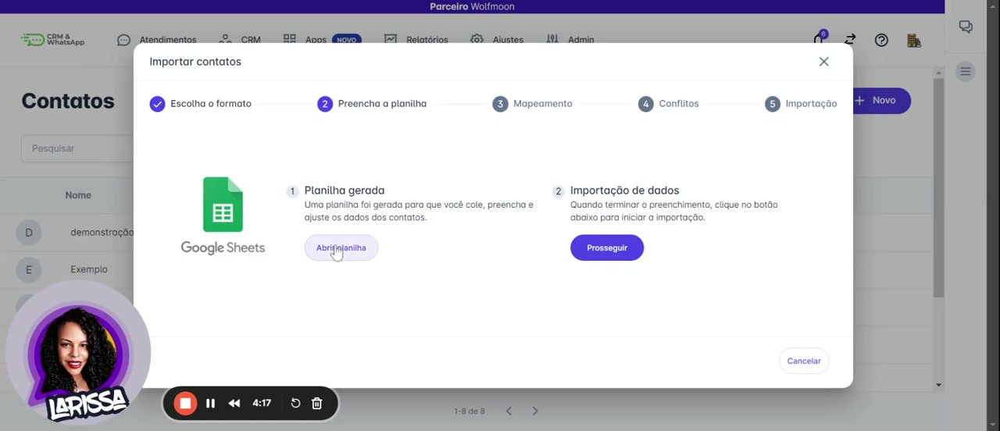

## `00:46` — Abre uma planilha do Google Sheets com colunas para "Telefone", "Email", "Instagram", "Etiquetas", "Notas Internas", "Carteira", "Data da consulta/Teste - nome do contador".

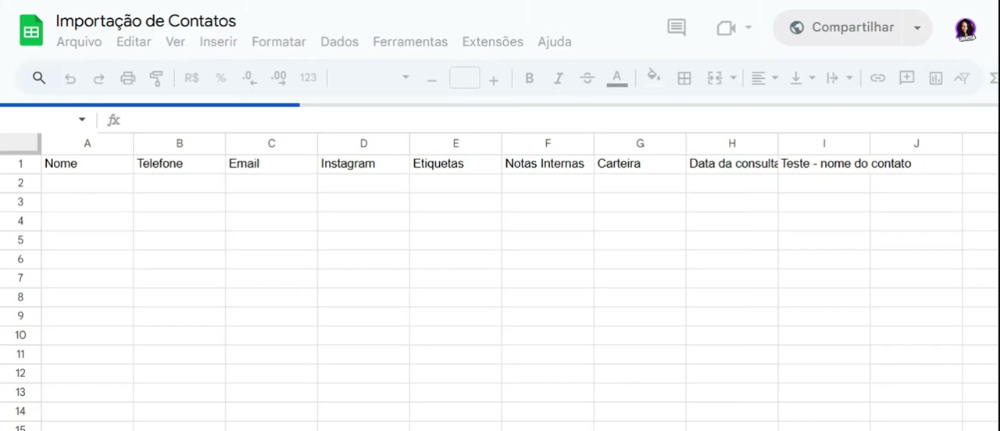

## `00:50` — Preenche o campo "Nome" com "Test".

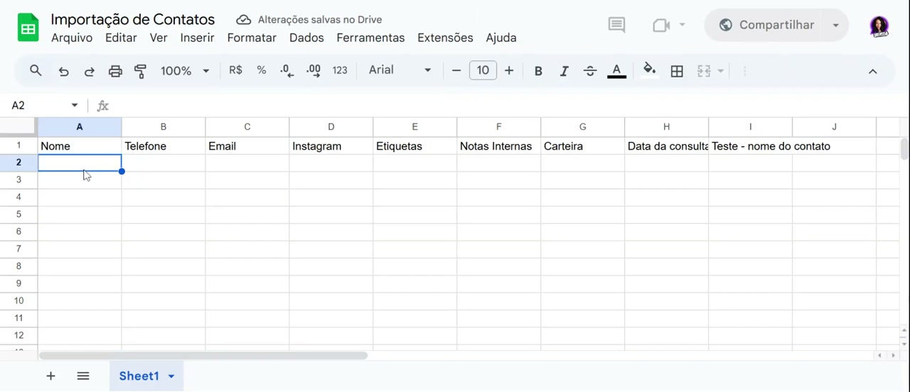

## `00:55` — Preenche o campo "Telefone" com "3199999-9999".

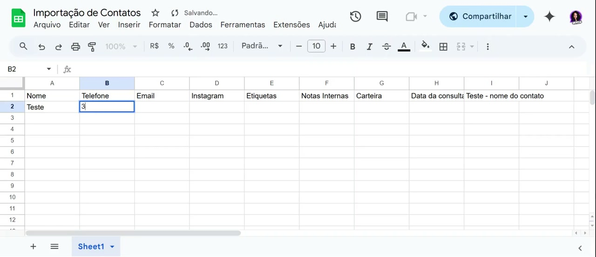

## `01:03` — Preenche o campo "Email" com "teste@teste.com".

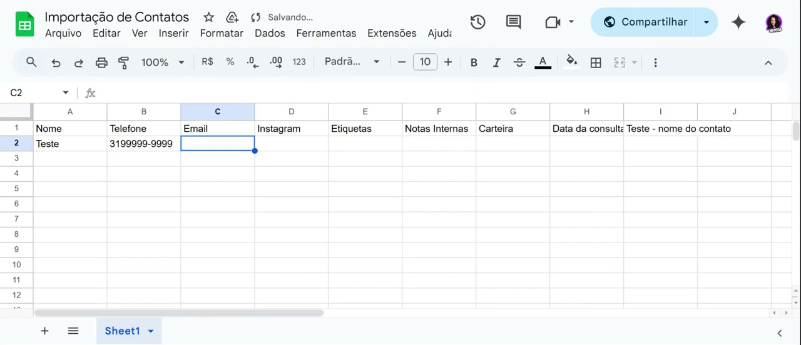

## `01:11` — Preenche o campo "Instagram" com "testete".

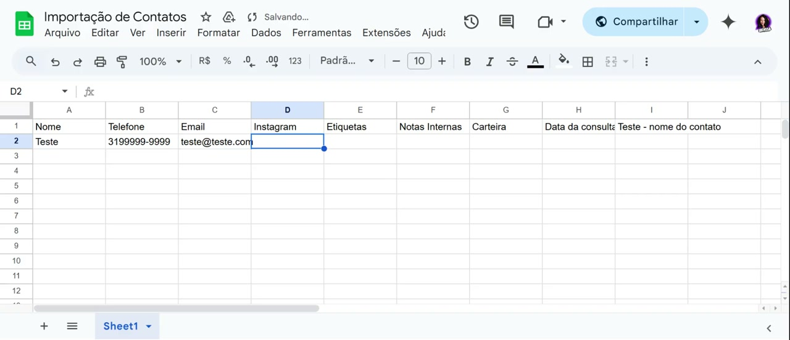

## `01:23` — Preenche o campo "Etiquetas" com "teste".

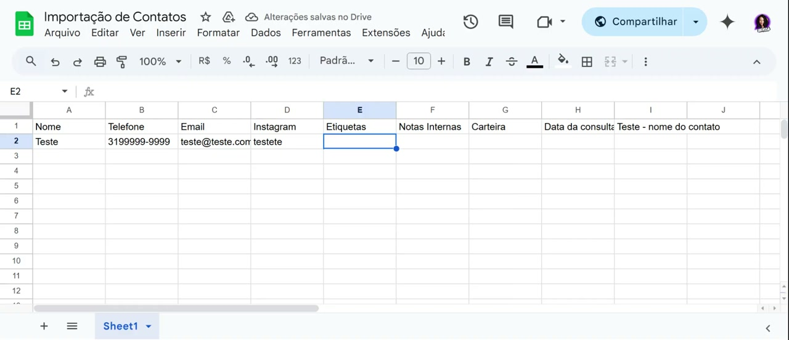

## `01:31` — Retorna para a interface do CRM para clicar no botão "Prosseguir".

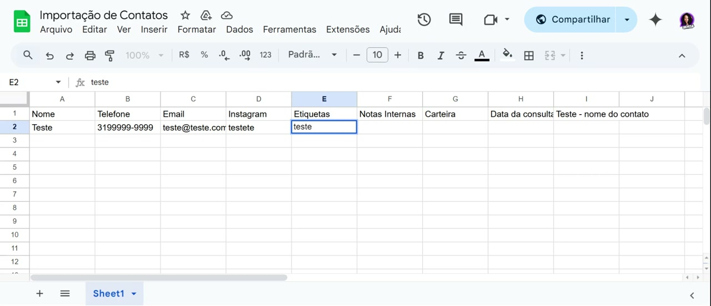

## `01:32` — A janela "Importar contatos" mostra "Mapeamento" e "Conflitos" marcados como completos, e "Importação" em progresso.

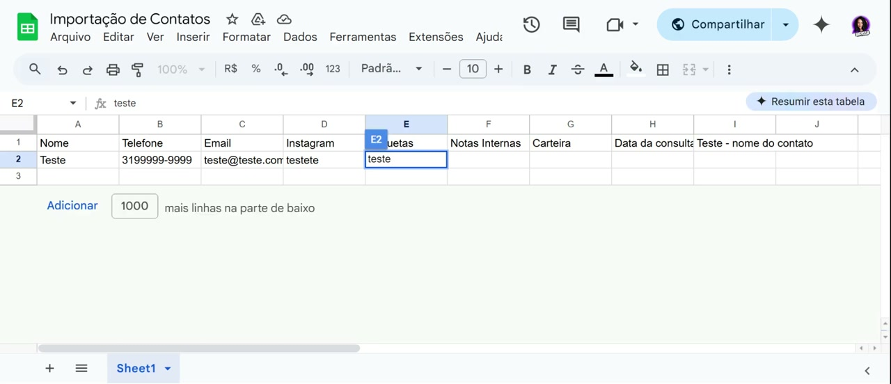

## `02:04` — A janela "Importar contatos" mostra a etapa "Conflitos".

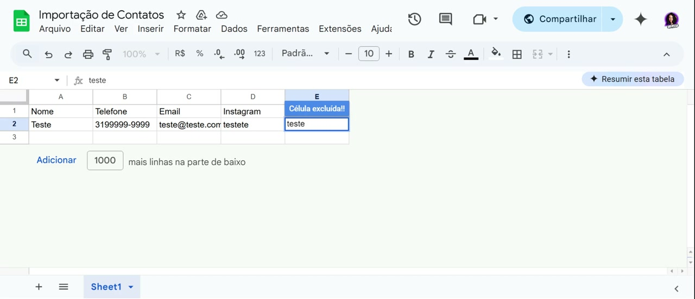

## `02:30` — A janela "Importar contatos" mostra a etapa "Importação" e solicita um código de confirmação enviado para o e-mail.

## `02:51` — Insere o código de confirmação.

## `03:01` — A importação é concluída.

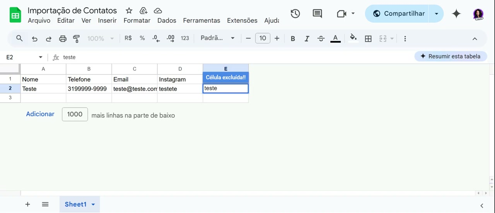
