# Ações de Fluxo no Chatbot da plataforma helenaCRM

**URL:** https://www.youtube.com/watch?v=RFn_fw6wYOw  
**Canal:** HelenaCRM  
**Data:** 2026-01-02  
**Objetivo:** Levantamento da plataforma Nexvy/DKW whitelabel para replicação de UI  
**Total de frames:** 27

---

## `00:00` — Título do vídeo: Chatbot: Ações de Fluxo.

## `00:08` — O analista de sucesso do cliente Caio Tinoco aparece no vídeo para iniciar a explicação.

## `00:09` — Tela da plataforma de criação de chatbot, mostrando um grupo de interações e as ações disponíveis no canto direito.

## `00:11` — Destaque para a ação "Criar Condicional".

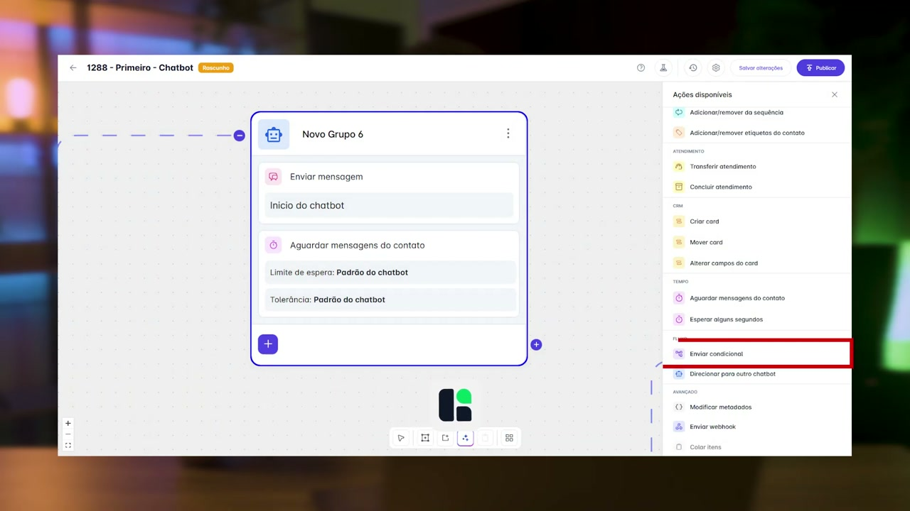

## `00:24` — Tela de configuração da condicional, mostrando o "Grupo 1" com campos para "campo de contato", "nome", "igual a" e "valor".

## `00:26` — Destaque para a opção "ou" e "e" no canto superior direito da tela de configuração da condicional.

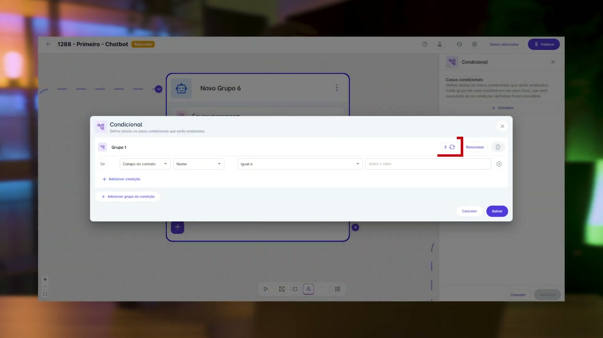

## `00:30` — Configuração das condições: "campo do contato Nome igual a Caio" ou "campo do contato Nome igual a Tinoco".

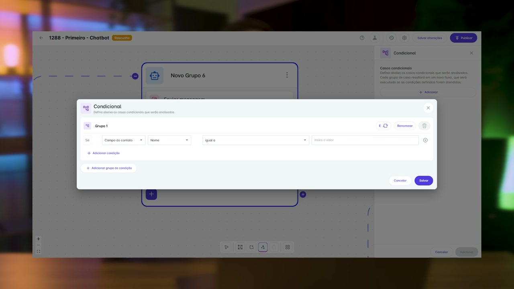

## `00:46` — Destaque para o botão "Adicionar grupo de condição".

## `00:47` — Dois grupos de condição são mostrados na tela, "Grupo 1" e "Grupo 2".

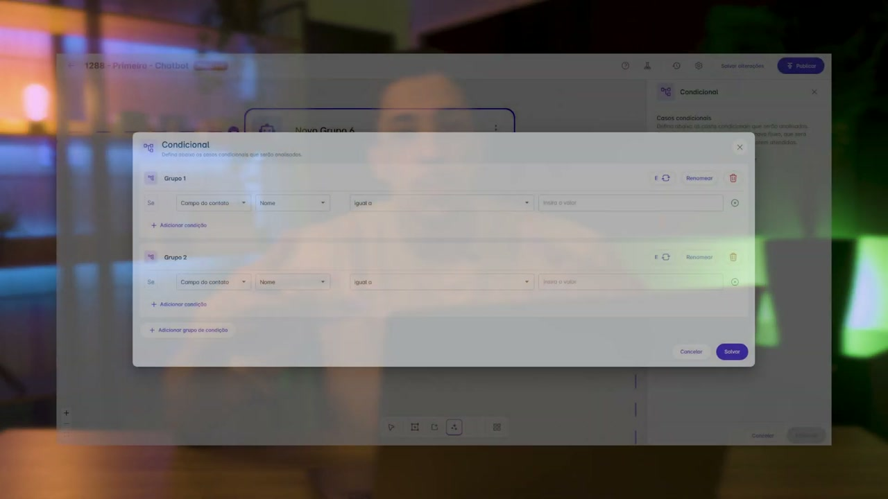

## `01:00` — A condicional é adicionada ao fluxo do chatbot, exibindo o "Grupo 1" e "Caso padrão".

## `01:03` — A condicional no fluxo do chatbot mostra dois pontos de conexão.

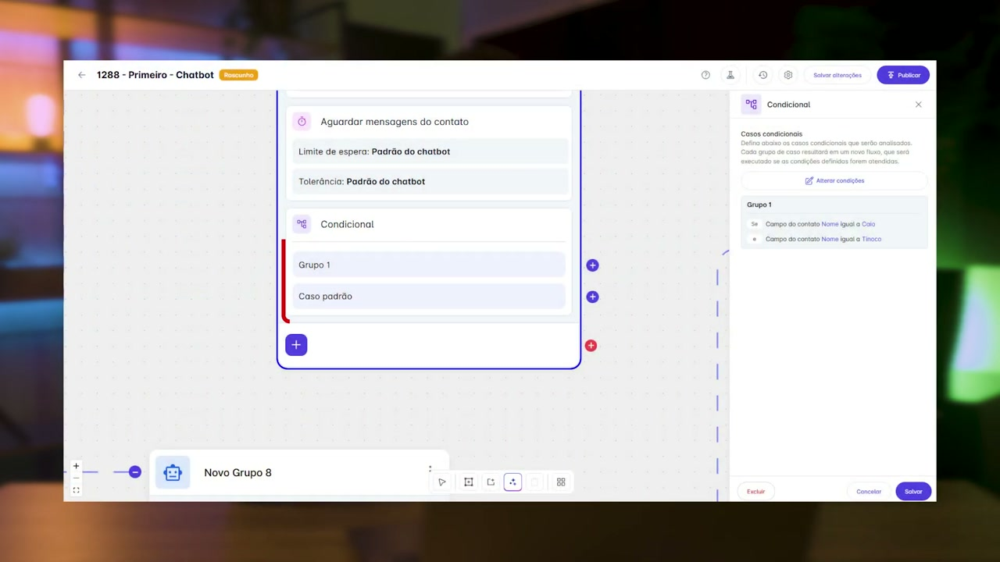

## `01:08` — Destaque para "Grupo 1" e "Caso padrão" no fluxo do chatbot.

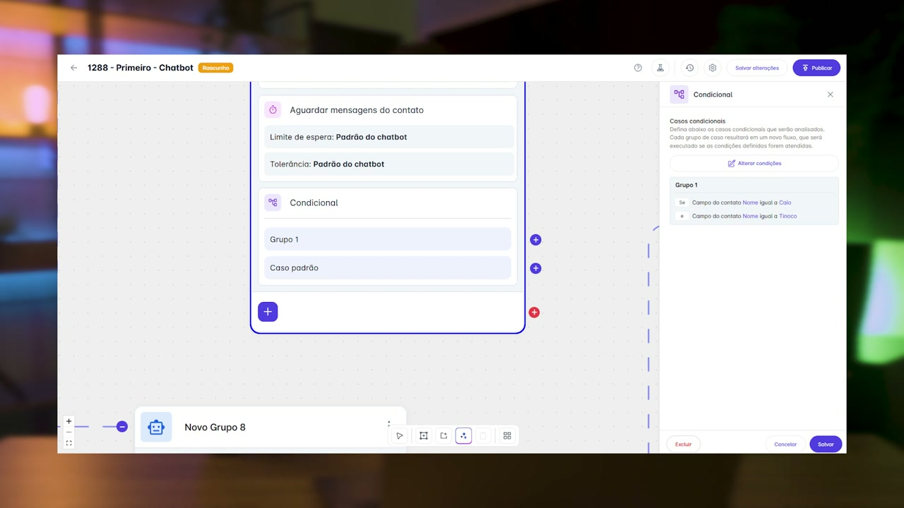

## `01:36` — Tela do fluxo do chatbot com um "Grupo 3" e a opção de "Condicional" no painel lateral.

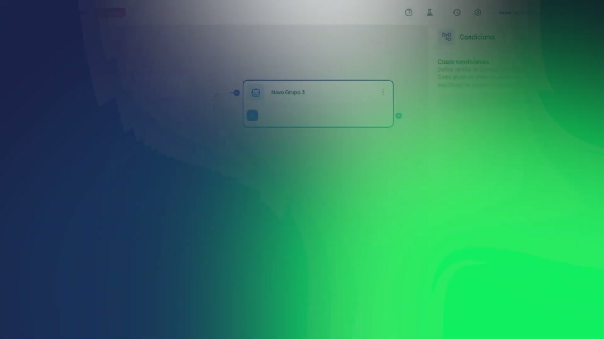

## `01:39` — Clique no botão "Adicionar" para criar uma nova condicional.

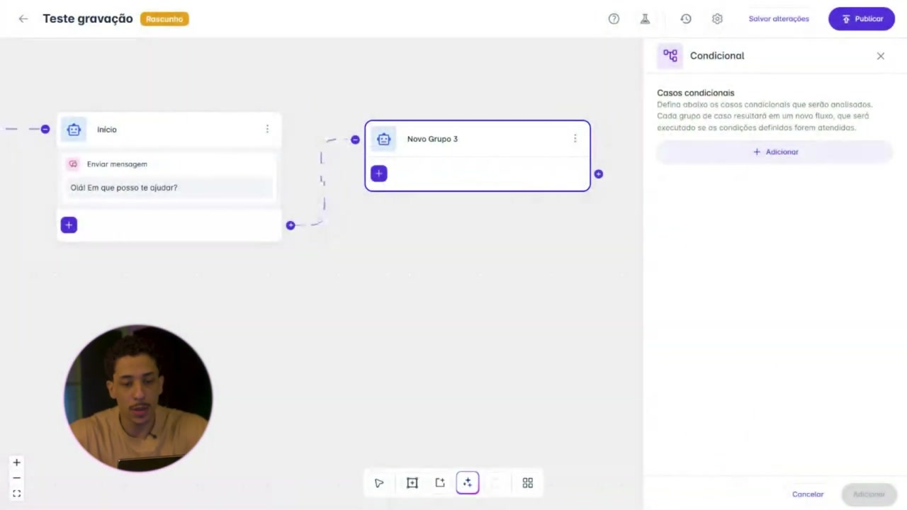

## `01:40` — Nova tela de configuração da condicional com "Grupo 1".

## `01:47` — Configuração das duas condições de nome: "Campo do contato Nome igual a Caio" e "Campo do contato Nome igual a Tinoco".

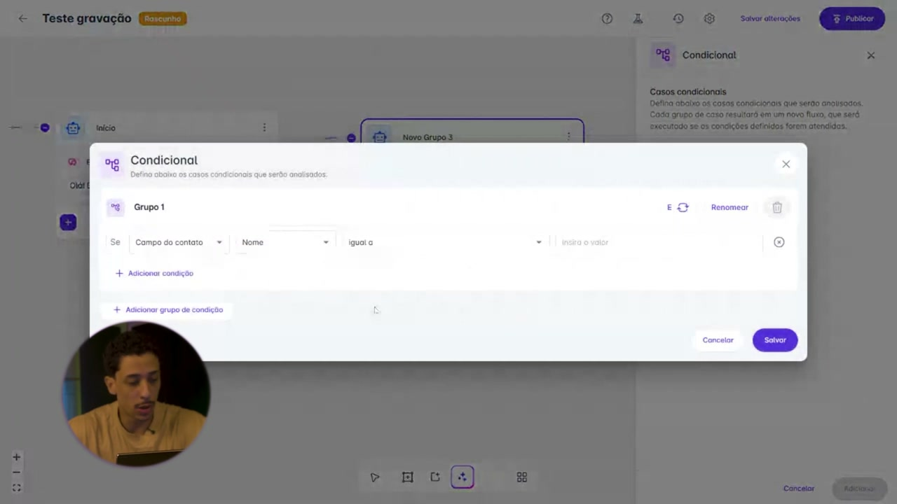

## `02:10` — Condicional salva, exibindo o "Grupo 1" e o "Caso padrão" no fluxo do chatbot.

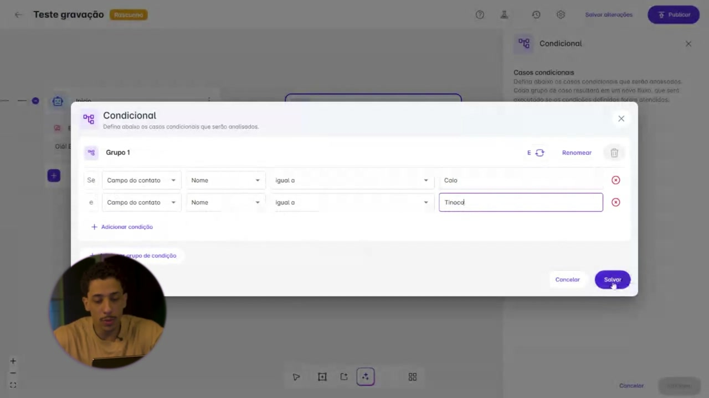

## `02:11` — Dois novos grupos ("Novo Grupo 4" e "Novo Grupo 5") são adicionados ao fluxo do chatbot, conectados às opções da condicional.

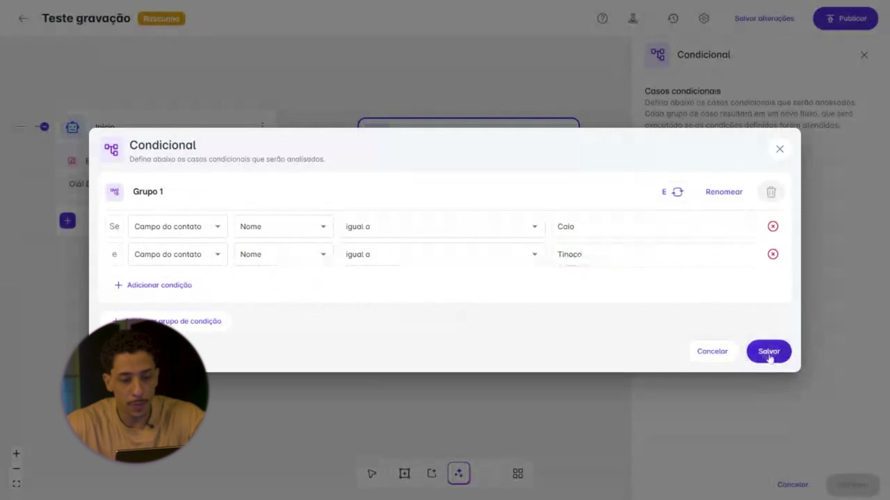

## `02:19` — A condicional mostra a configuração do "Grupo 1" com os nomes "Caio" e "Tinoco".

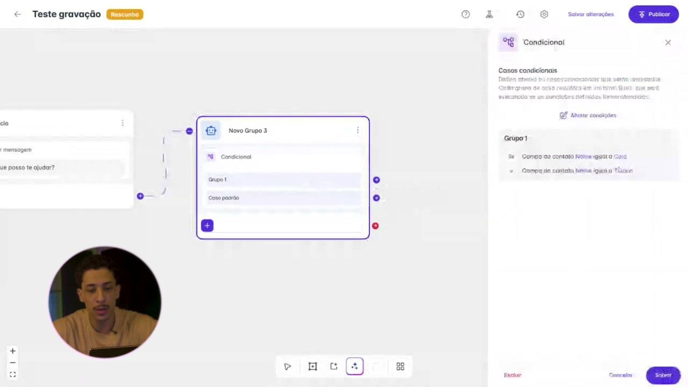

## `02:50` — Conexões do "Grupo 1" e "Caso padrão" com os novos grupos criados.

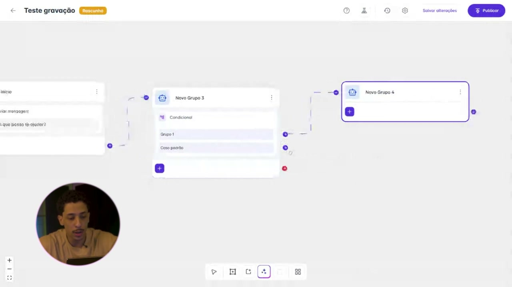

## `03:02` — Tela de configuração da condicional, mostrando "Grupo 1" e "Grupo 2" com diferentes opções de variáveis.

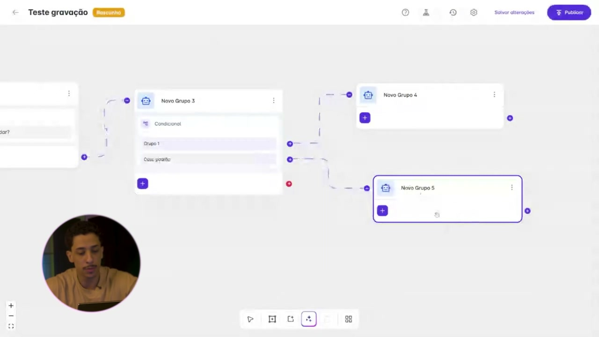

## `03:09` — Destaque para a lista de "campo de contato" no "Grupo 2" que inclui "Horário de funcionamento", "Resposta a uma pergunta", "Resposta a um modelo", "Campo do contato", "Etiqueta de contato", "Última mensagem do contato", "Modalidade do contato", "Método do atendimento", "Zona virtual" e "Dia da semana atual".

## `03:26` — Destaque para as opções de "diferente de", "contém", "não contém" e "está definido".

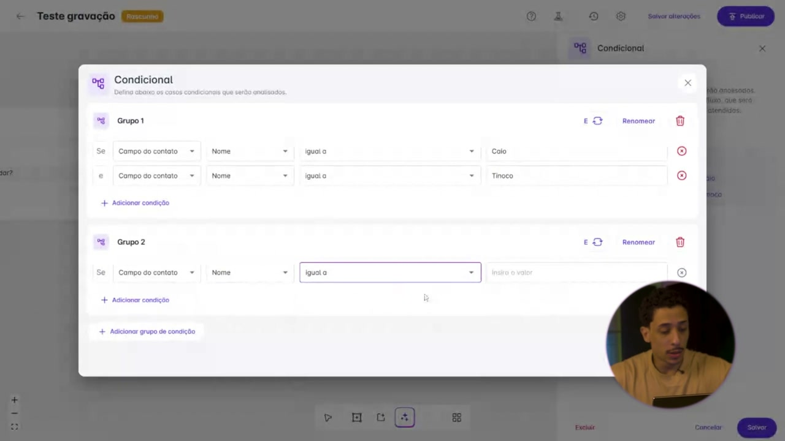

## `03:49` — Destaque para a ação "Direcionar para outro chatbot" no painel lateral.

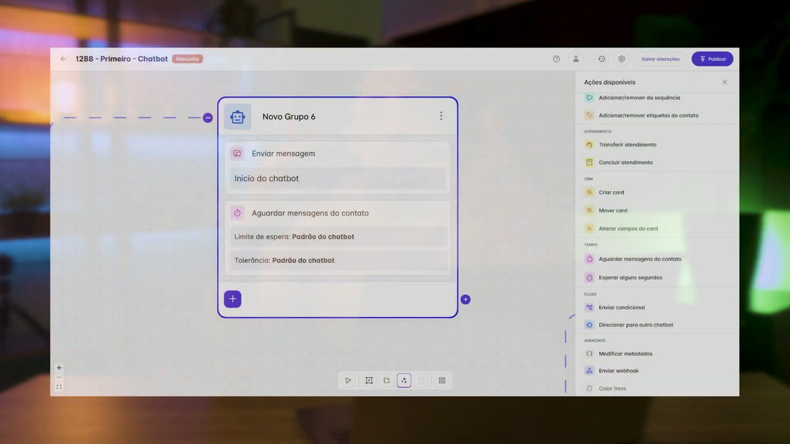

## `03:52` — Tela de configuração da ação "Direcionar para outro chatbot", com um dropdown para selecionar o chatbot de destino.

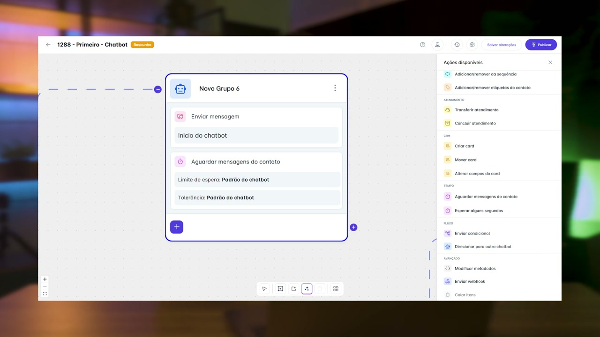

## `04:09` — Um texto informativo aparece na tela: "O chatbot precisa ter uma versão publicada".

## `04:21` — Fim do vídeo e exibição do logo da Helena Academia.

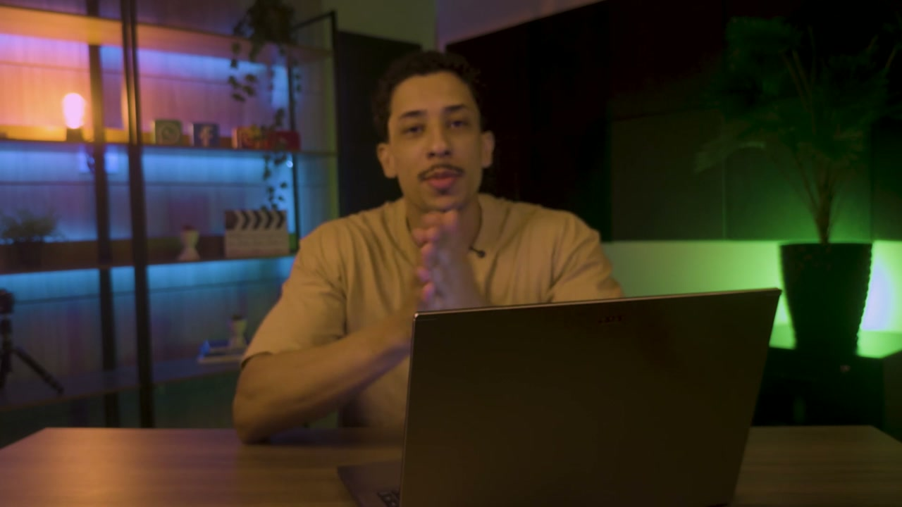
