# Como etiquetar contatos com o chatbot da helenaCRM

**URL:** https://www.youtube.com/watch?v=SHTF1dwAtuc  
**Canal:** HelenaCRM  
**Data:** 2025-10-06  
**Objetivo:** Levantamento da plataforma Nexvy/DKW whitelabel para replicação de UI  
**Total de frames:** 24

---

## `00:00` — Visão geral do painel do chatbot.

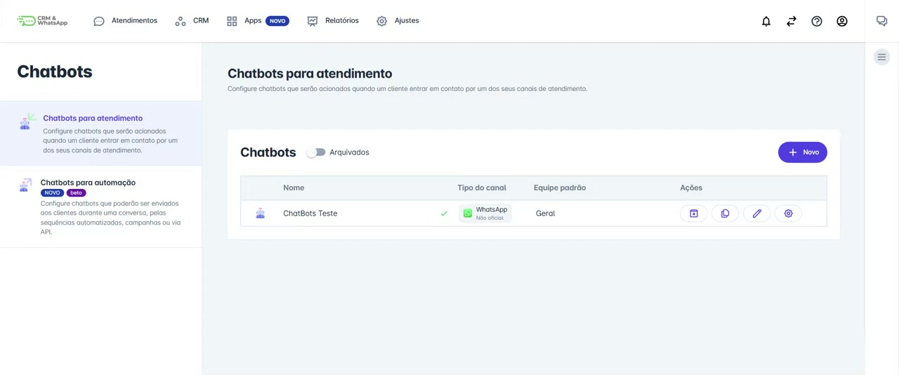

## `00:13` — Clicando no botão "Novo" para criar um novo chatbot.

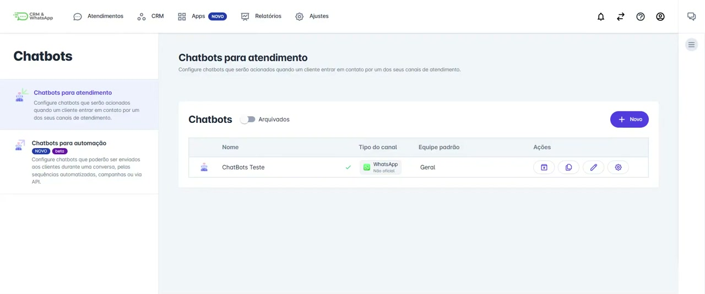

## `00:17` — Preenchendo o campo "Nome" para o novo chatbot.

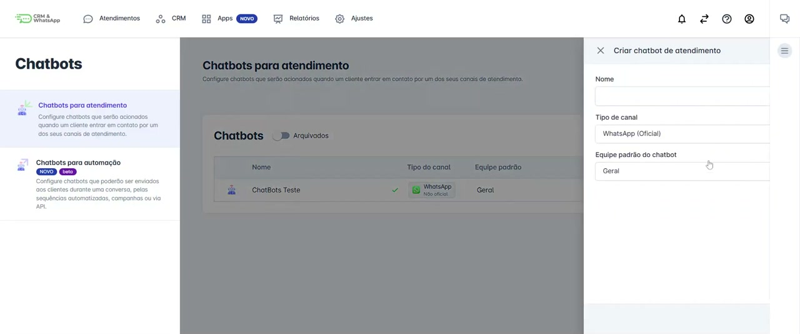

## `00:26` — O novo chatbot "Teste Etiqueta" foi criado.

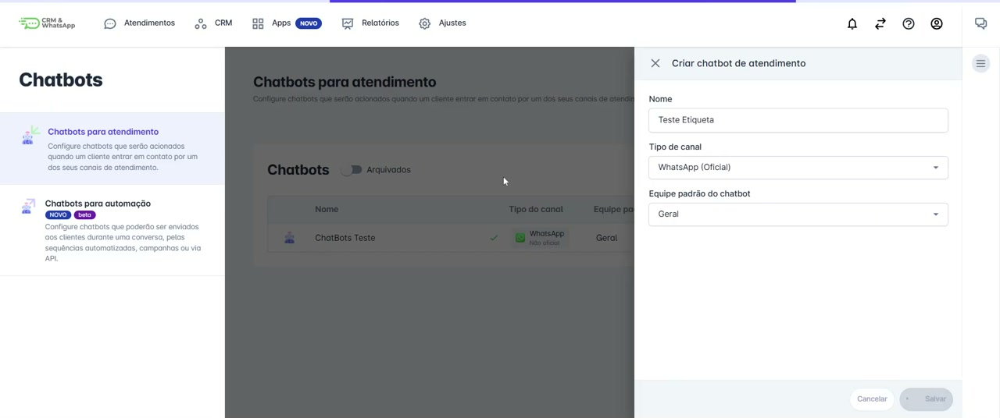

## `00:28` — Excluindo a mensagem inicial pré-definida.

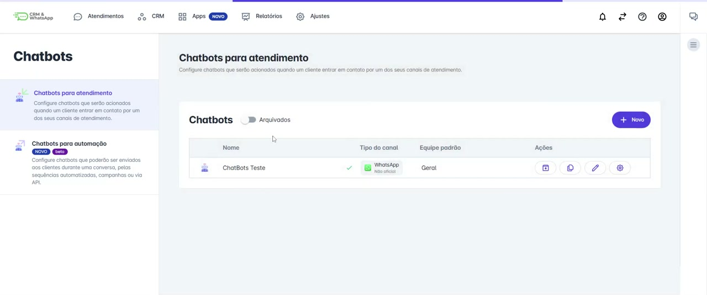

## `00:33` — Adicionando um "Menu de Opções".

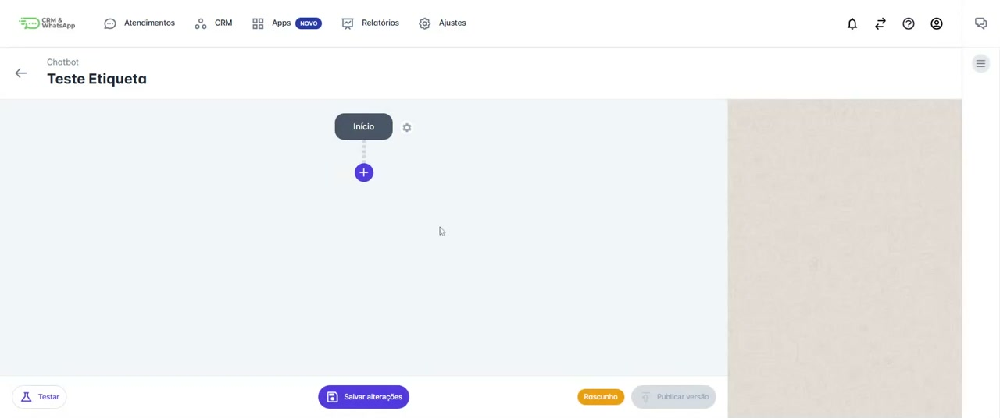

## `00:38` — Selecionando o componente "Menu com botões".

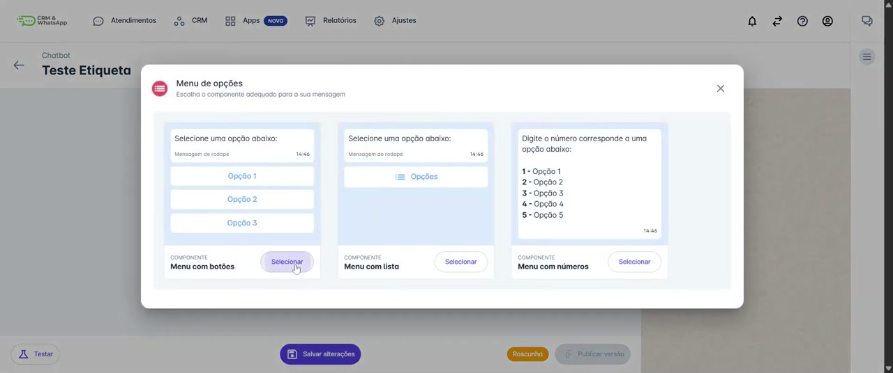

## `00:40` — Editando a mensagem principal do menu para perguntar "Olá, tudo bem? Você já é cliente?".

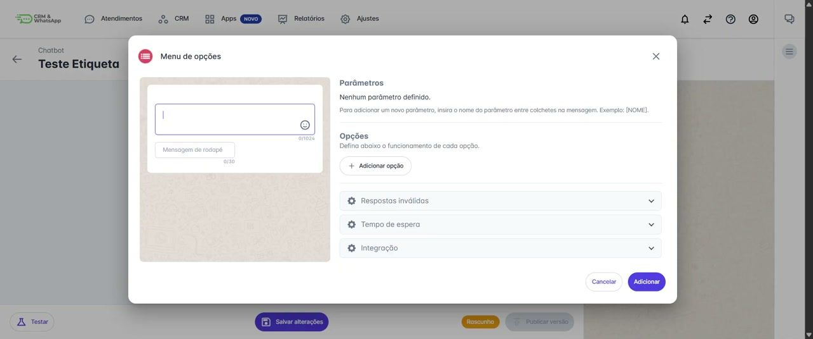

## `00:56` — Adicionando a opção "Sim" ao menu.

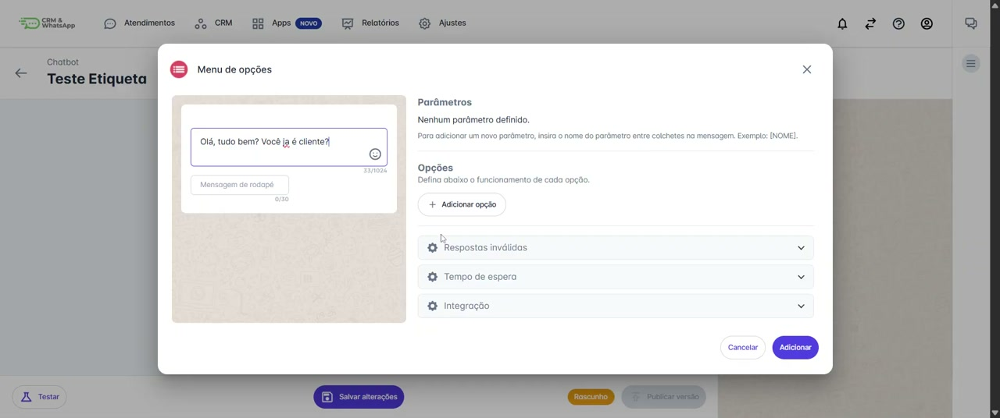

## `01:00` — Adicionando a opção "Não" ao menu.

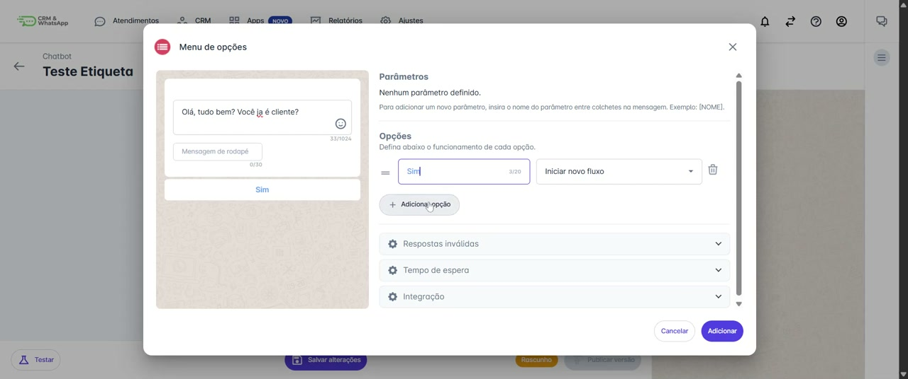

## `01:06` — Selecionando a opção "Sim" para configurar o fluxo.

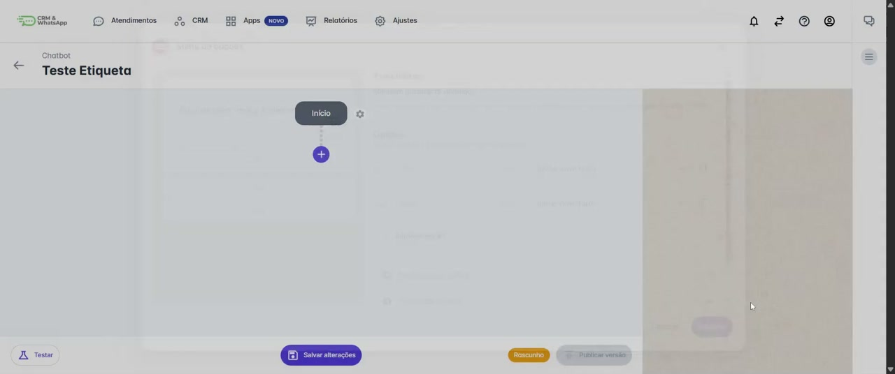

## `01:10` — Excluindo a mensagem inicial do fluxo "Sim".

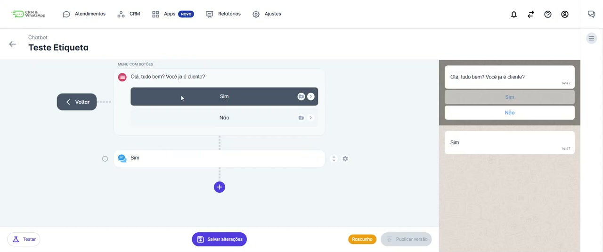

## `01:18` — Adicionando uma ação para "Adicionar/remover etiquetas".

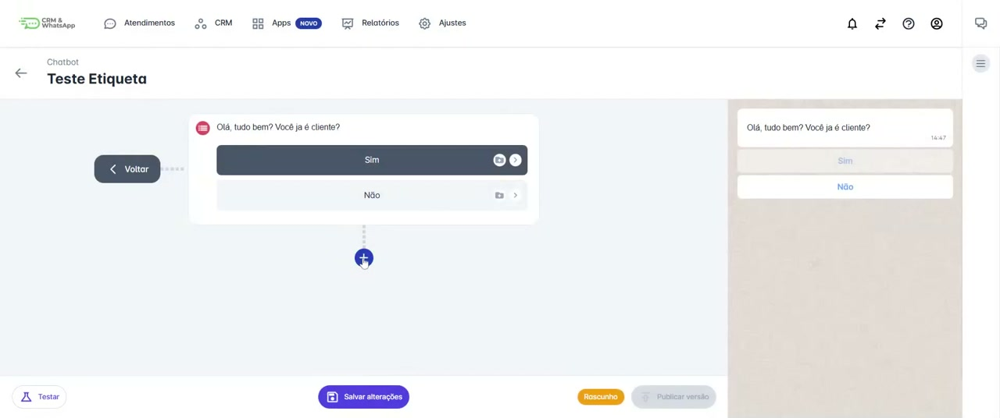

## `01:23` — Selecionando a etiqueta "Cliente" para ser adicionada.

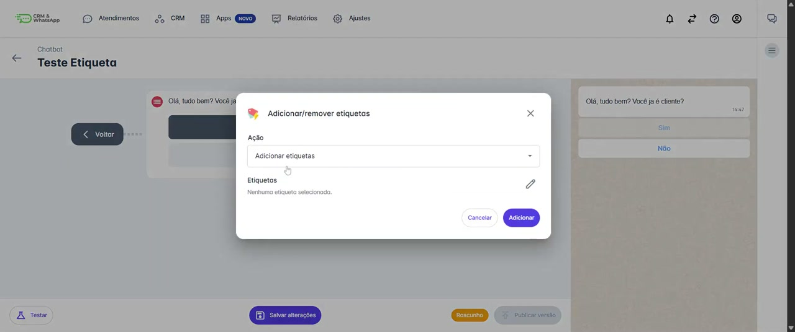

## `01:30` — Ação "Adicionar etiquetas ao contato" com a etiqueta "Cliente" foi adicionada ao fluxo "Sim".

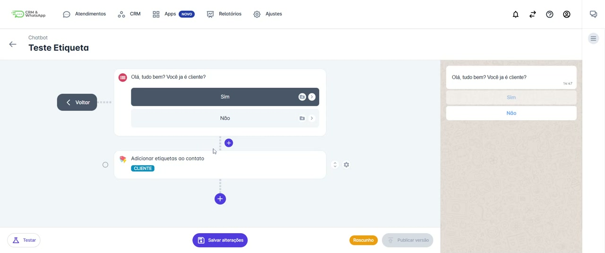

## `01:36` — Adicionando uma "Pergunta" ao fluxo "Sim".

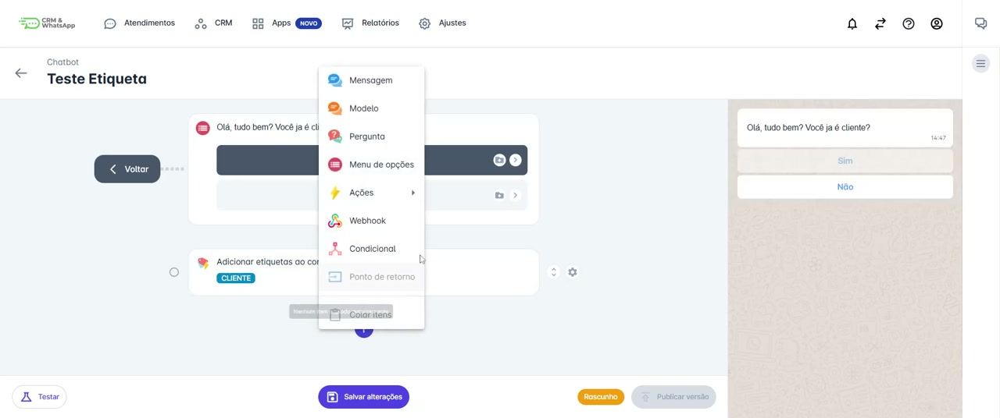

## `01:40` — Editando a pergunta para "Como posso te ajudar?".

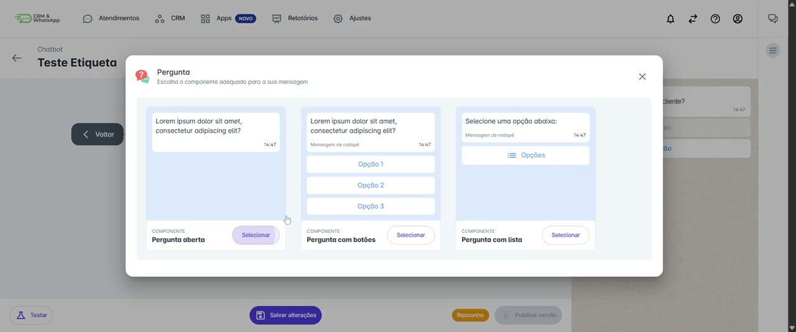

## `01:46` — O fluxo "Sim" agora inclui a adição da etiqueta "Cliente" e uma pergunta.

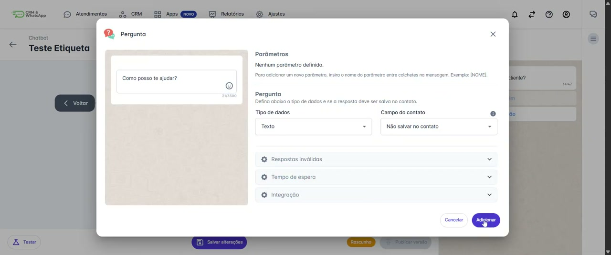

## `01:50` — Clicando na opção "Não" para configurar o fluxo correspondente.

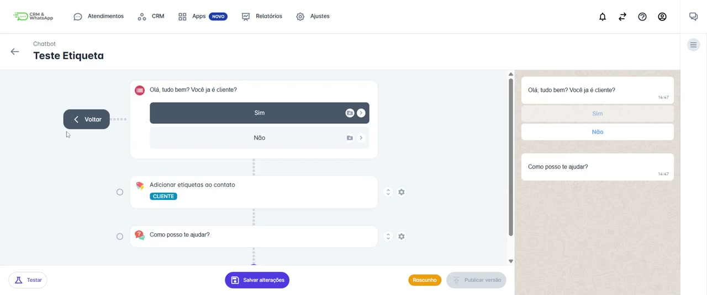

## `01:55` — Excluindo a mensagem inicial do fluxo "Não".

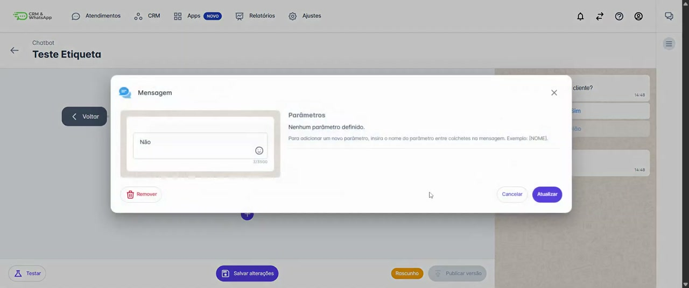

## `01:58` — Adicionando uma "Pergunta" ao fluxo "Não".

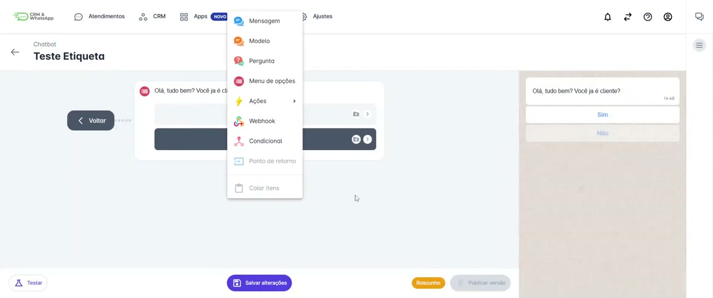

## `02:04` — Editando a pergunta para "Como posso te ajudar? (Seguir fluxo não cliente)".

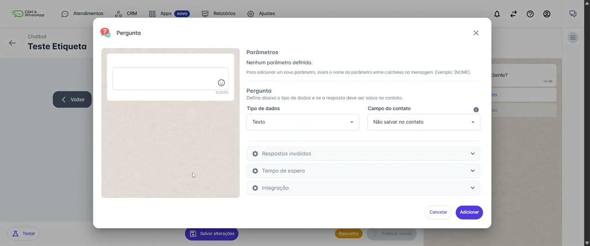

## `02:18` — O fluxo "Não" agora inclui uma pergunta.

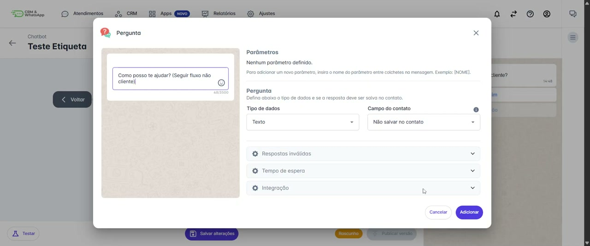

## `02:27` — Visão geral dos dois fluxos, "Sim" e "Não", mostrando as etiquetas e perguntas correspondentes.

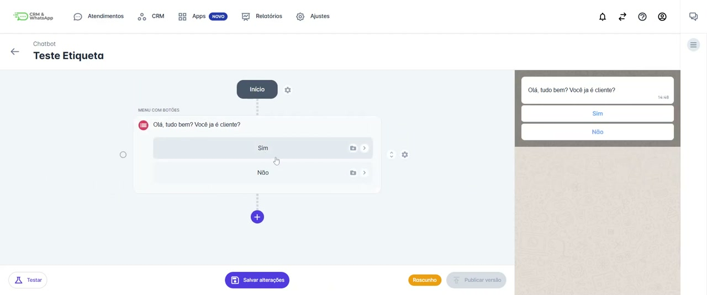
