# Cadastro de campo personalizado em Contatos no CRM da helencaCRM

**URL:** https://www.youtube.com/watch?v=TBl14qCjbcM  
**Canal:** HelenaCRM  
**Data:** 2025-10-07  
**Objetivo:** Levantamento da plataforma Nexvy/DKW whitelabel para replicação de UI  
**Total de frames:** 33

---

## `00:00` — A tela inicial do painel de atendimentos do sistema Wolfmoon, mostrando atendimentos e a opção de escolher um atendimento para iniciar uma conversa.

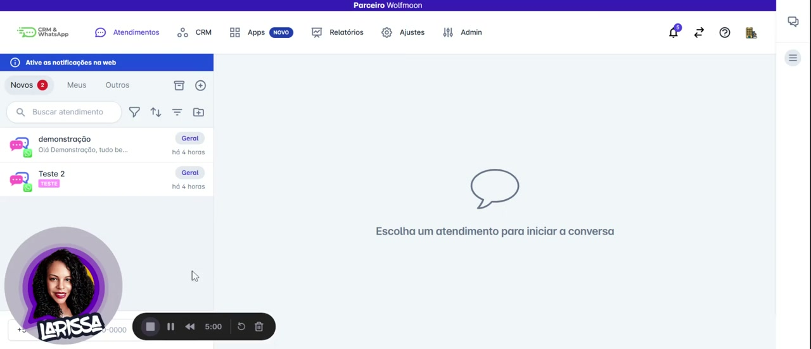

## `00:06` — O mouse clica em "CRM".

## `00:09` — Um menu suspenso aparece com as opções "Contatos", "Painéis" e "Carteiras".

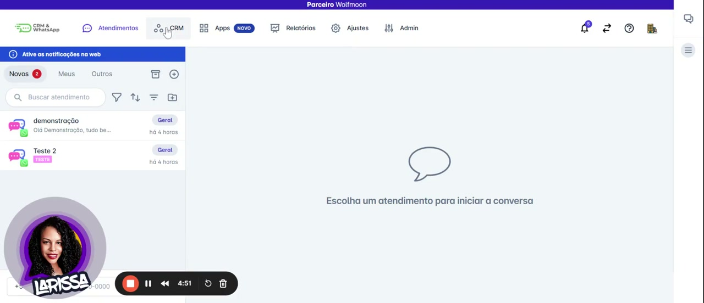

## `00:10` — O mouse clica em "Contatos".

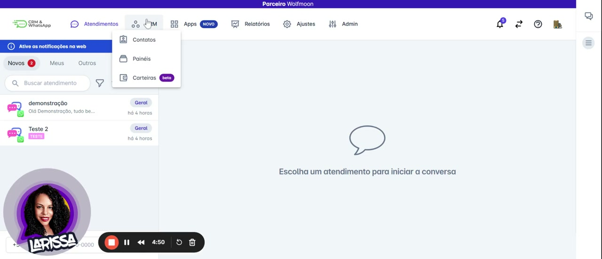

## `00:12` — A tela "Contatos" é exibida, mostrando uma lista de contatos com informações como nome, telefone, Instagram e e-mail.

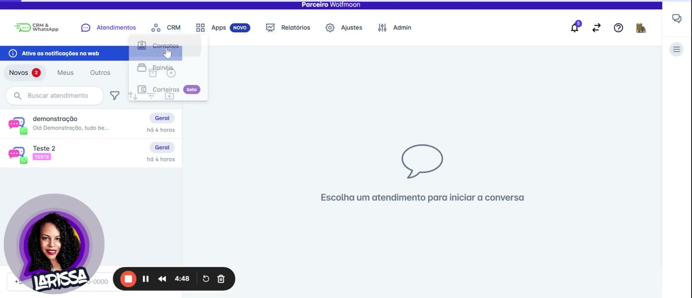

## `00:14` — O mouse clica no contato "demonstração".

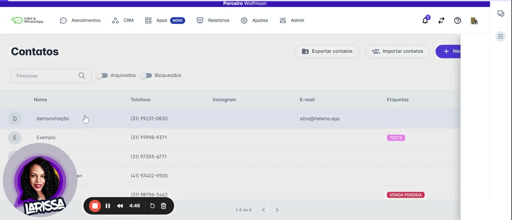

## `00:15` — Uma tela lateral "Dados do contato" surge, mostrando detalhes do contato, conversas e painéis.

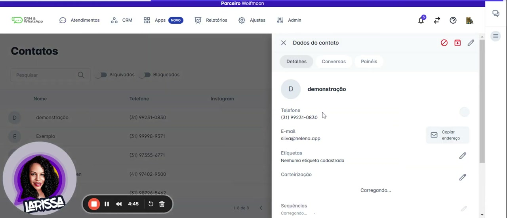

## `00:19` — O mouse clica em "Adicionar/Alterar campos personalizados".

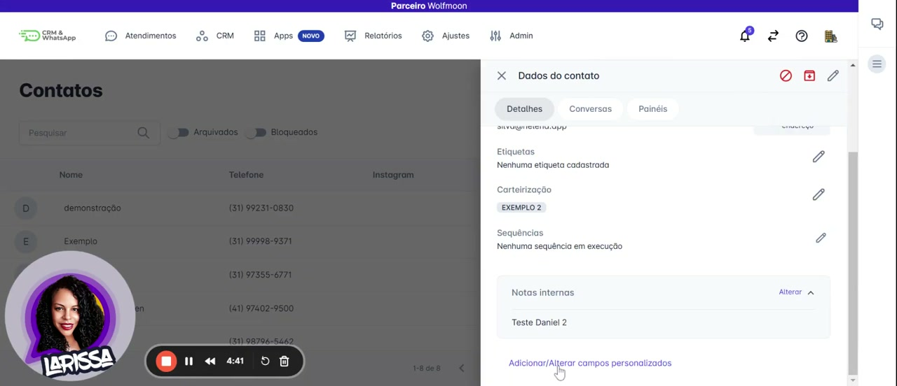

## `00:20` — Uma janela "Edição de campos personalizados" é aberta, com as opções "Adicionar um novo campo" e "Adicionar um novo grupo de campos".

## `00:22` — O mouse clica em "Adicionar um novo campo".

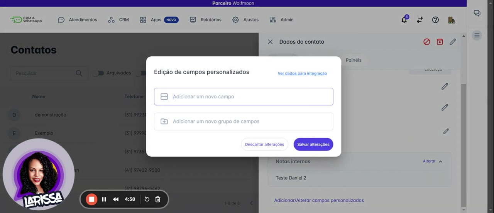

## `00:22` — Uma janela "Adicionar novo campo personalizado" aparece, com os campos "Tipo" e "Nome". O tipo padrão é "Texto curto".

## `00:24` — O mouse clica no campo "Tipo", exibindo um menu suspenso com diversas opções de tipo de campo (Texto curto, Texto longo, Número inteiro, Número decimal, Lista de opções, Multiseleção, Data, Data e hora, Booleano, Link, CPF/CNPJ, CEP).

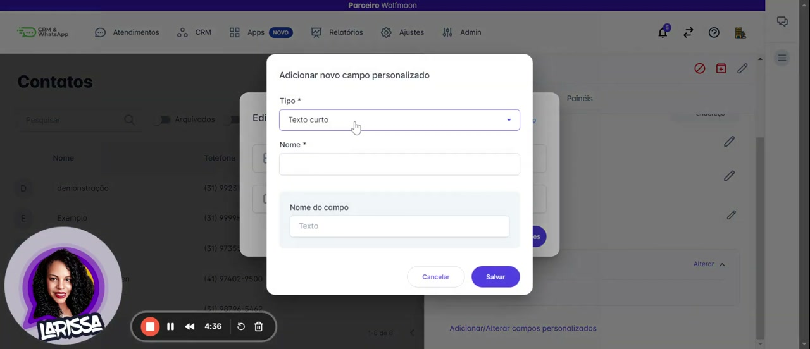

## `00:27` — O mouse clica em "Texto longo".

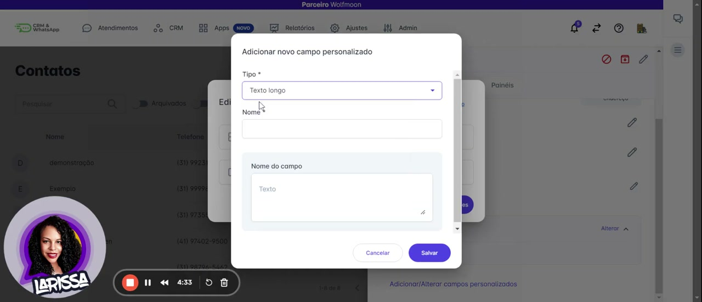

## `00:28` — O mouse clica em "Número inteiro".

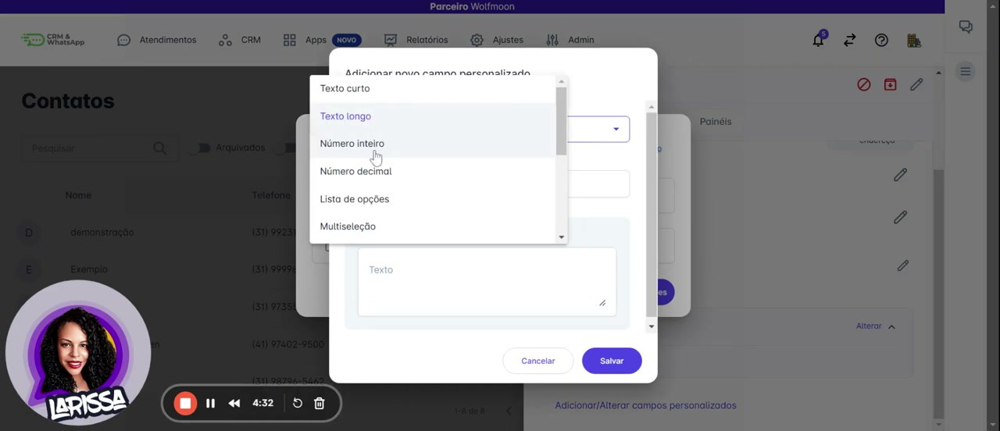

## `00:30` — O mouse clica em "Número decimal".

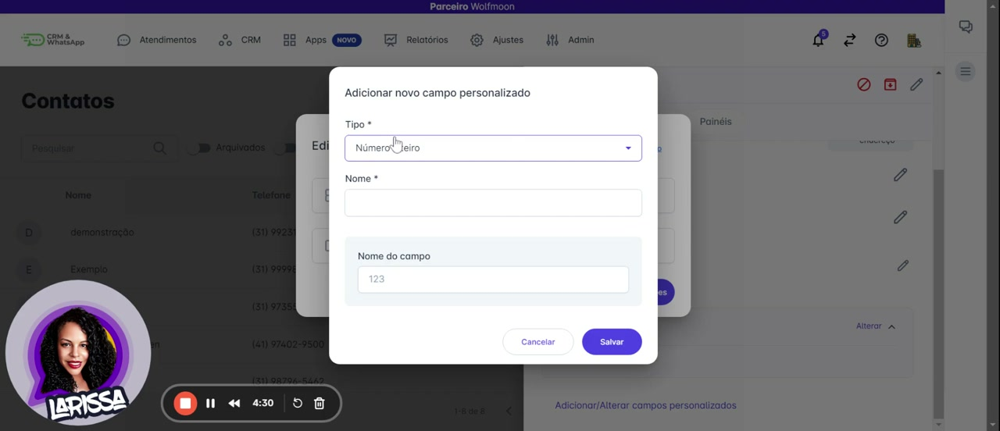

## `00:31` — O mouse clica em "Lista de opções".

## `00:32` — O mouse clica em "Multiseleção".

## `00:33` — O mouse clica em "Data".

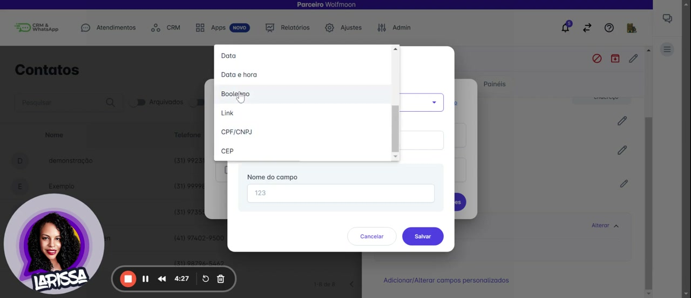

## `00:34` — O mouse clica em "Data e hora".

## `00:37` — O usuário digita "Data da consulta" no campo "Nome".

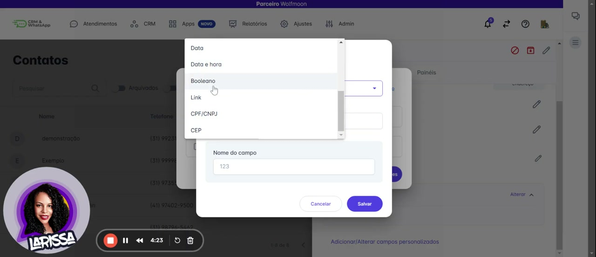

## `00:46` — O mouse clica em "Salvar".

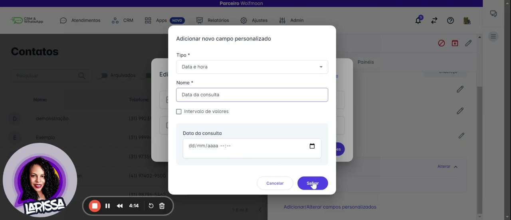

## `00:47` — O campo "Data do consulta" aparece na lista "Edição de campos personalizados".

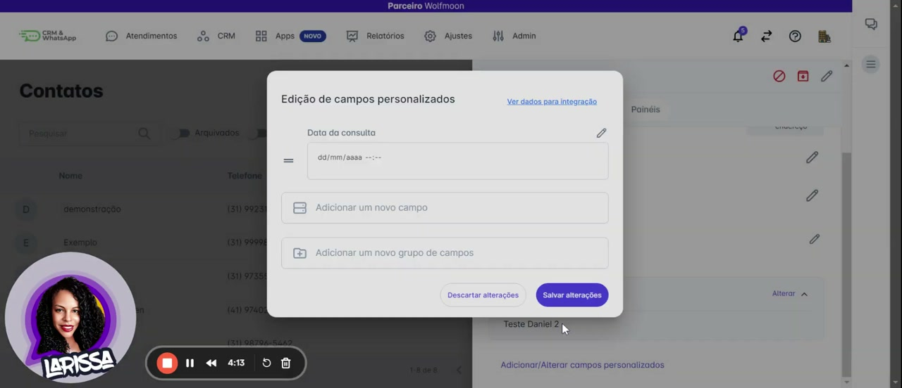

## `00:52` — O mouse clica em "Adicionar um novo grupo de campos".

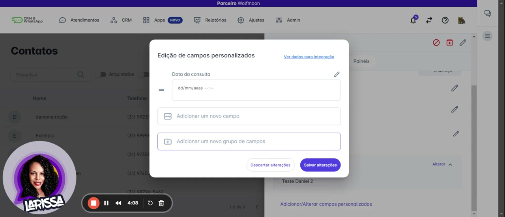

## `01:04` — O usuário digita "Teste" no campo de nome do grupo.

## `01:05` — O mouse clica em "Salvar".

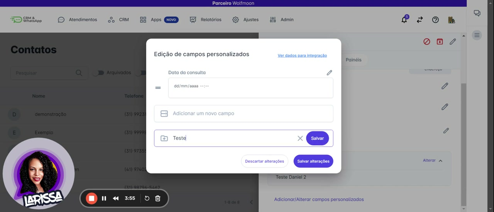

## `01:06` — O grupo "Teste" é adicionado.

## `01:08` — O mouse clica em "Adicionar novo campo" dentro do grupo "Teste".

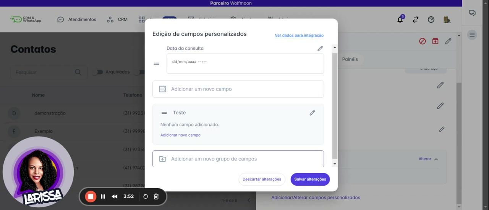

## `01:10` — Uma janela "Adicionar novo campo personalizado" é aberta.

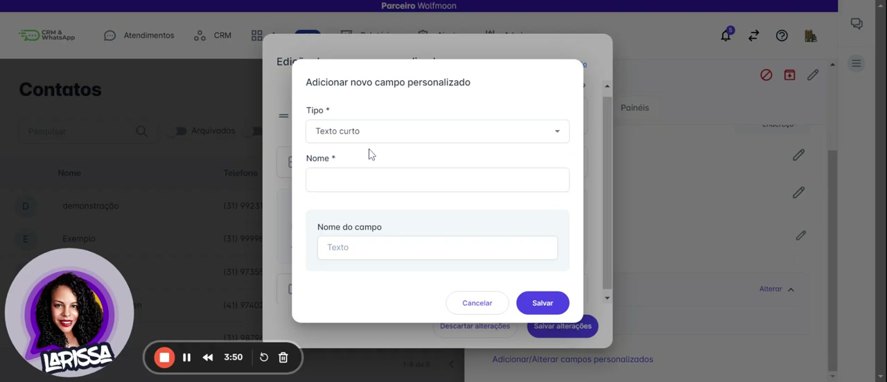

## `01:13` — O usuário digita "nome do contato" no campo "Nome".

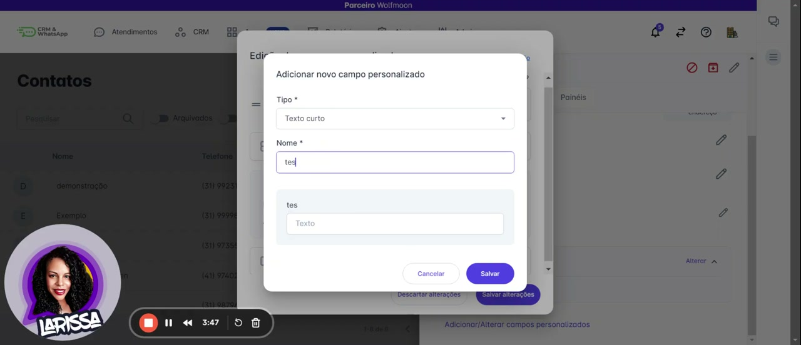

## `01:19` — O mouse clica em "Salvar".

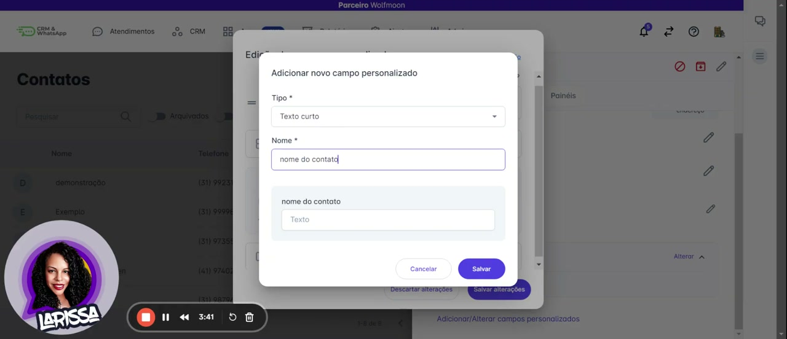

## `01:20` — O campo "nome do contato" é adicionado dentro do grupo "Teste".

## `01:22` — O mouse clica em "Salvar alterações".

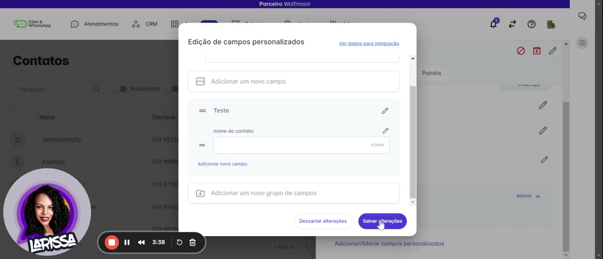

## `01:24` — A tela "Dados do contato" é atualizada, mostrando o campo "Data do consulta" e o grupo "Teste" com o campo "nome do contato" adicionados.

