# Ativação e utilização do Chat Interno na helenaCRM

**URL:** https://www.youtube.com/watch?v=X115LzVAliA  
**Canal:** HelenaCRM  
**Data:** 2025-09-24  
**Objetivo:** Levantamento da plataforma Nexvy/DKW whitelabel para replicação de UI  
**Total de frames:** 18

---

## `00:00` — Título do vídeo "Chat interno"

## `00:05` — Apresentação da Aline Medeiros

## `00:28` — Texto na tela: "Facilitar a troca de informações"

## `00:32` — Texto na tela: "Agilidade na resolução"

## `00:39` — Começo do tutorial.

## `00:46` — Clicou no botão “apps”.

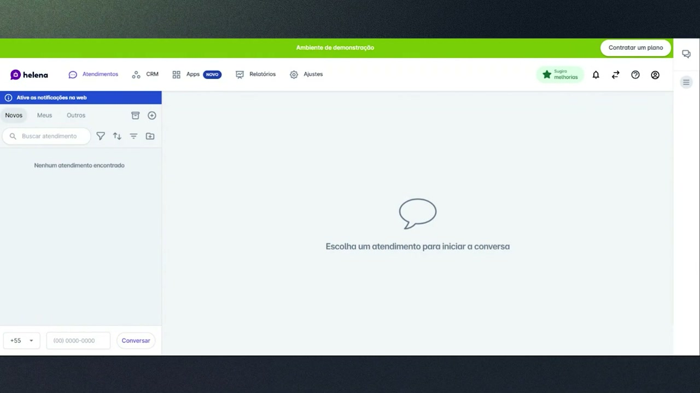

## `00:53` — Clicou na opção “mais apps”.

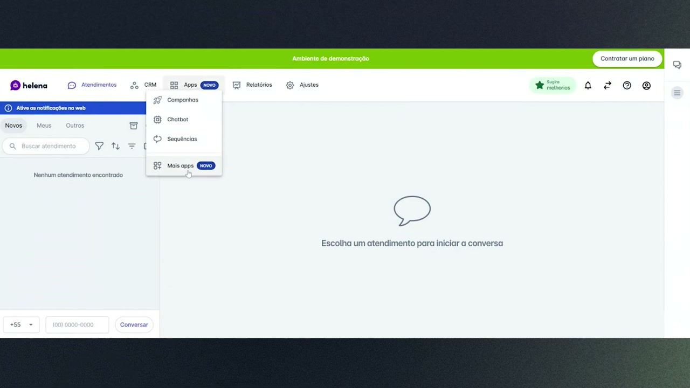

## `01:00` — Clicou em “Configurar” na opção "Chat interno".

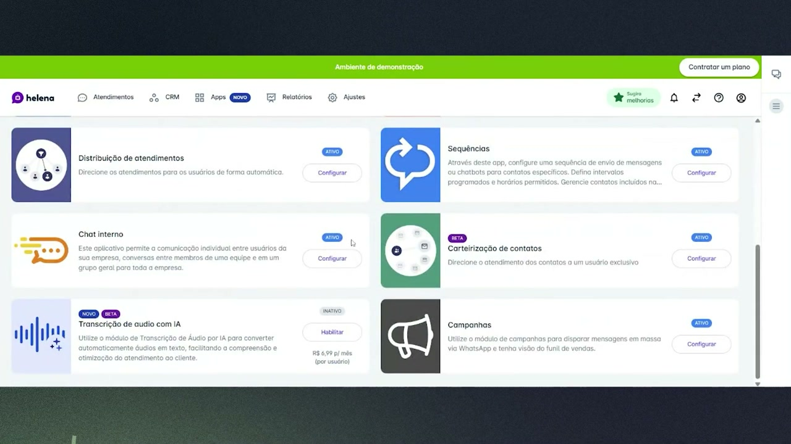

## `01:03` — Ativou a opção “Aplicativo habilitado”.

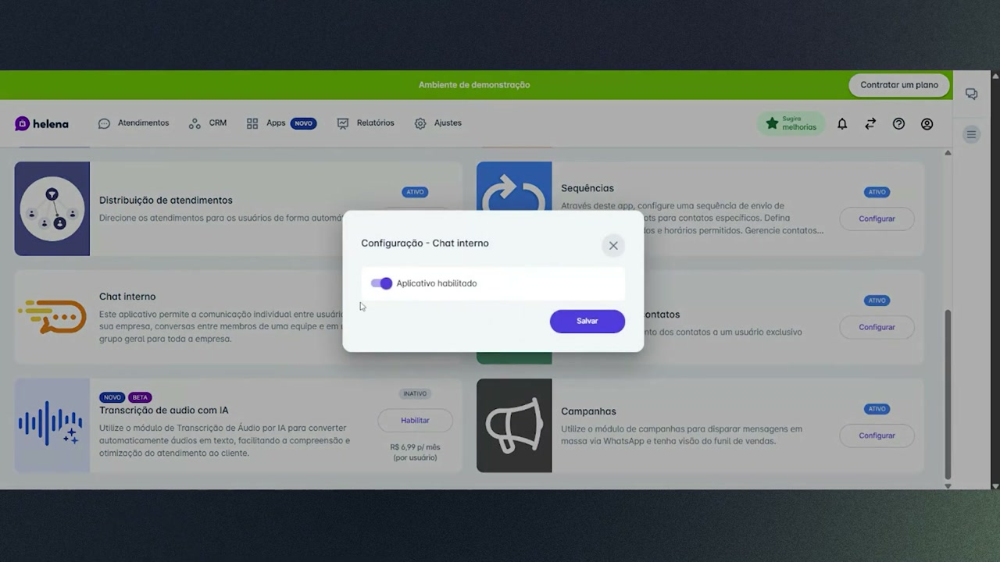

## `01:13` — Clicou em “Salvar”.

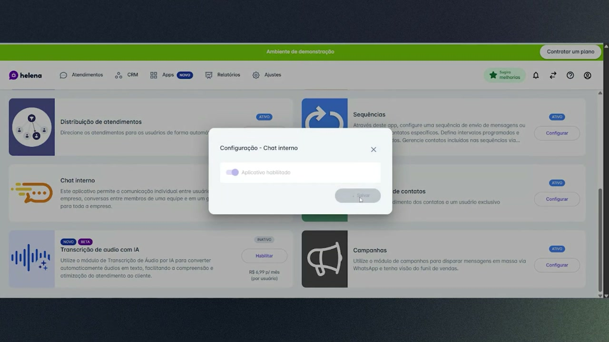

## `01:28` — Clicou no ícone de chat interno no canto superior direito.

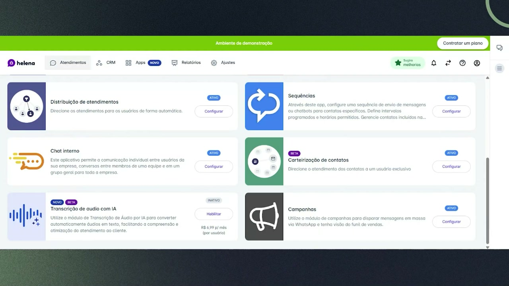

## `01:45` — Selecionou o usuário "Ana Paula".

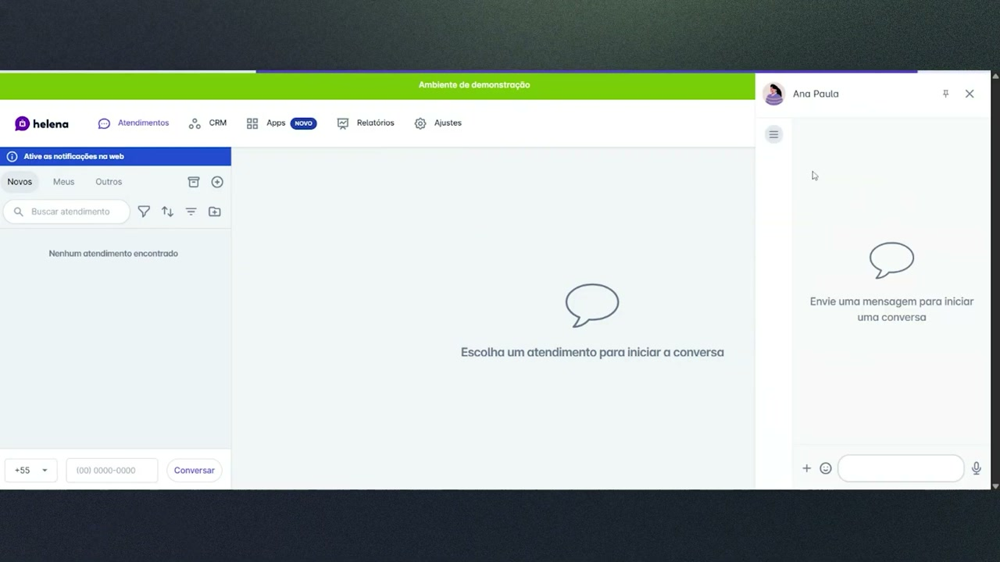

## `01:50` — Digitou "Olá" na caixa de texto.

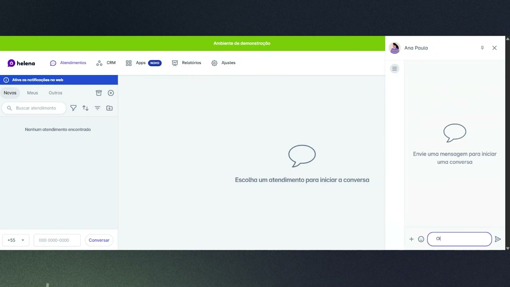

## `01:54` — Clicou no ícone de chat interno novamente.

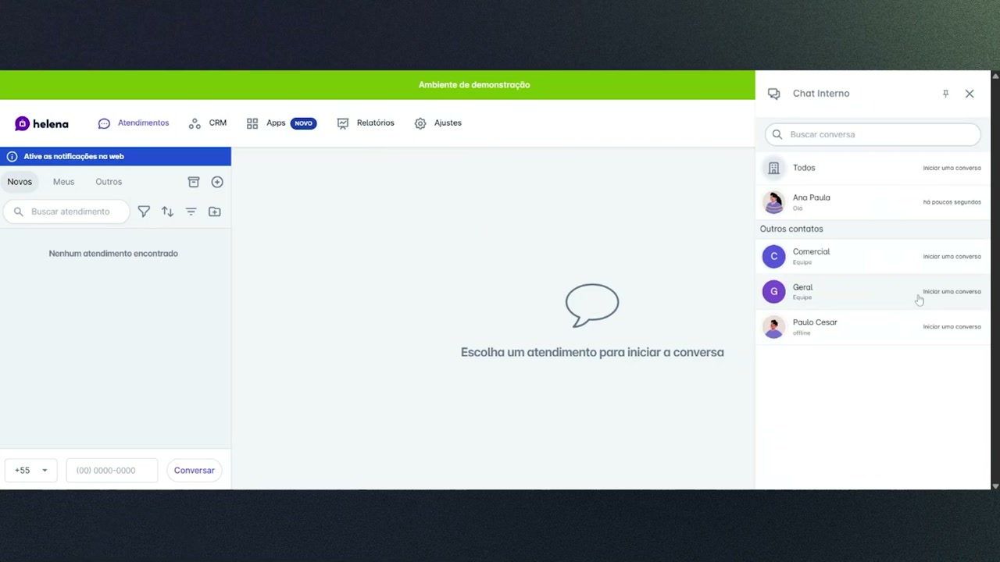

## `02:06` — Selecionou o grupo "Comercial".

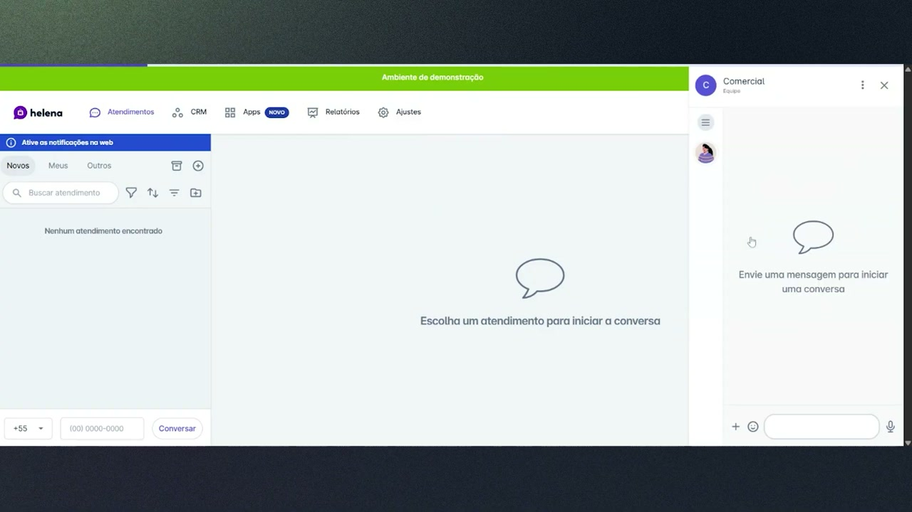

## `02:09` — Digitou "Olá" na caixa de texto.

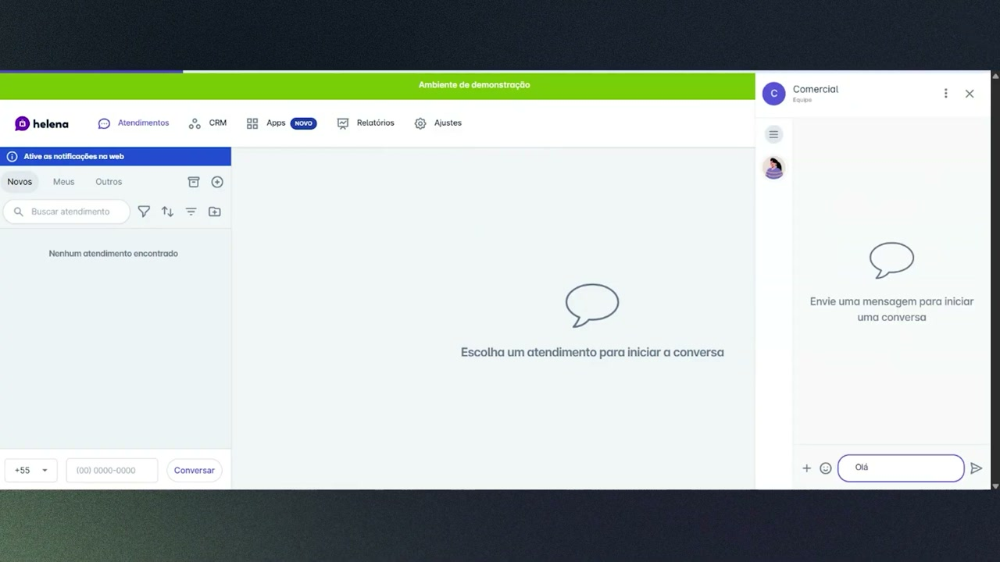

## `02:12` — Clicou no ícone de chat interno novamente.

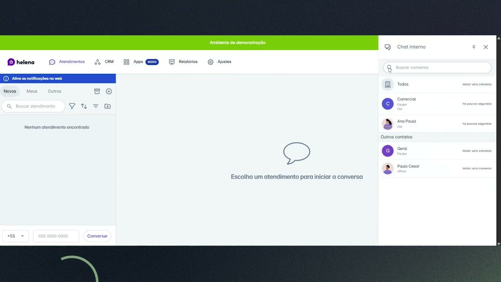

## `03:10` — Logo da "academia helena".

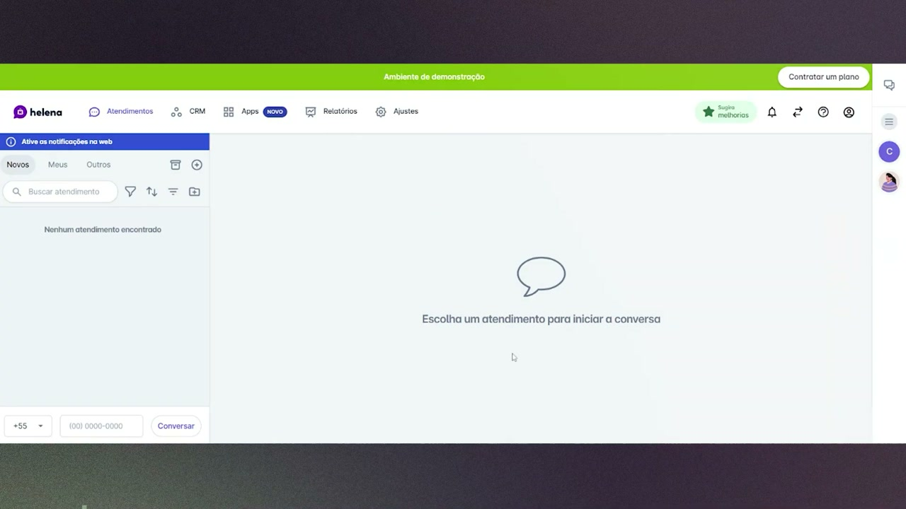
