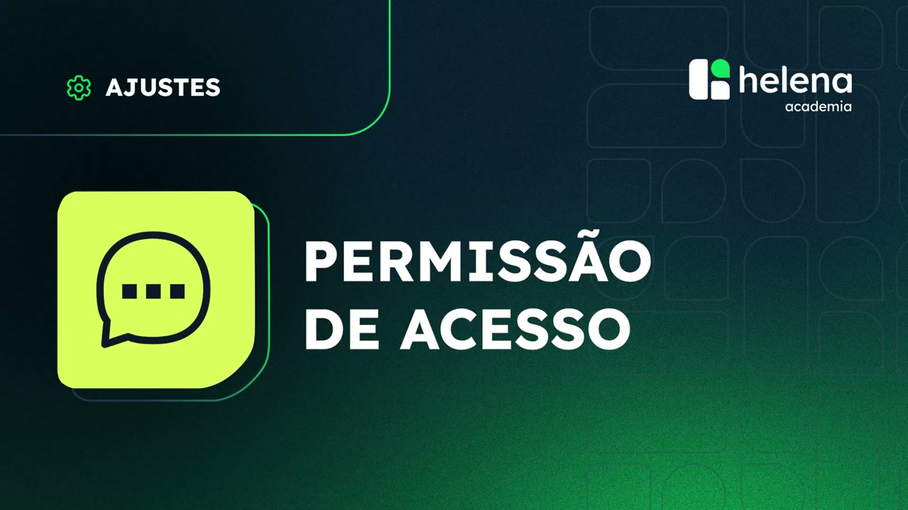
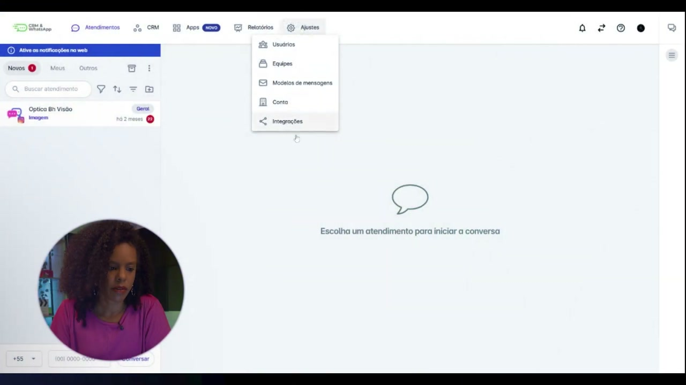
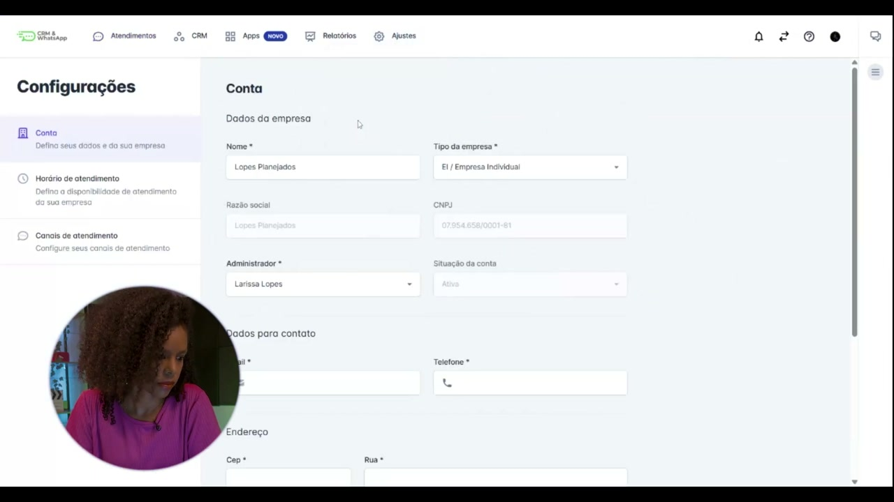
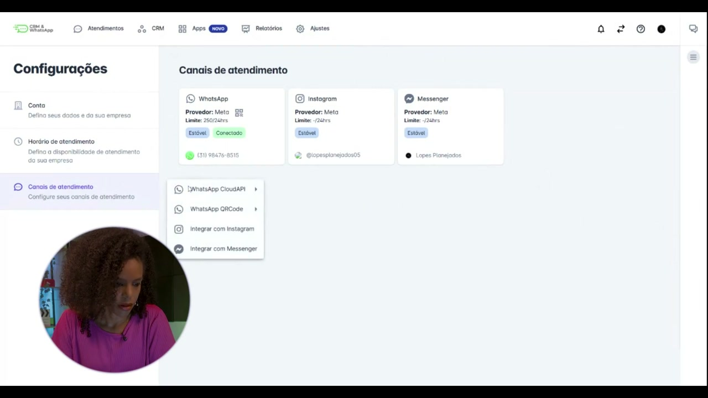
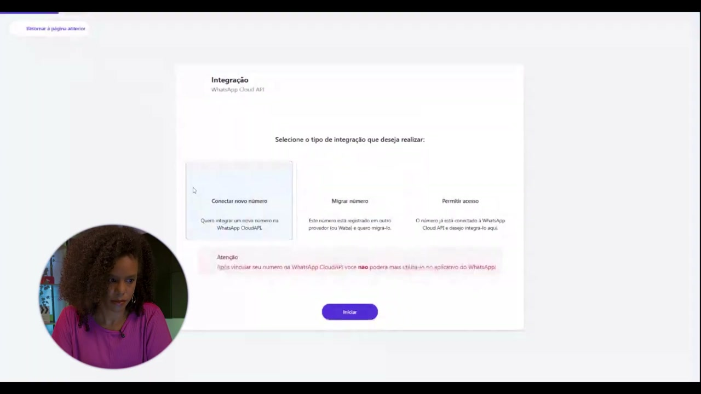
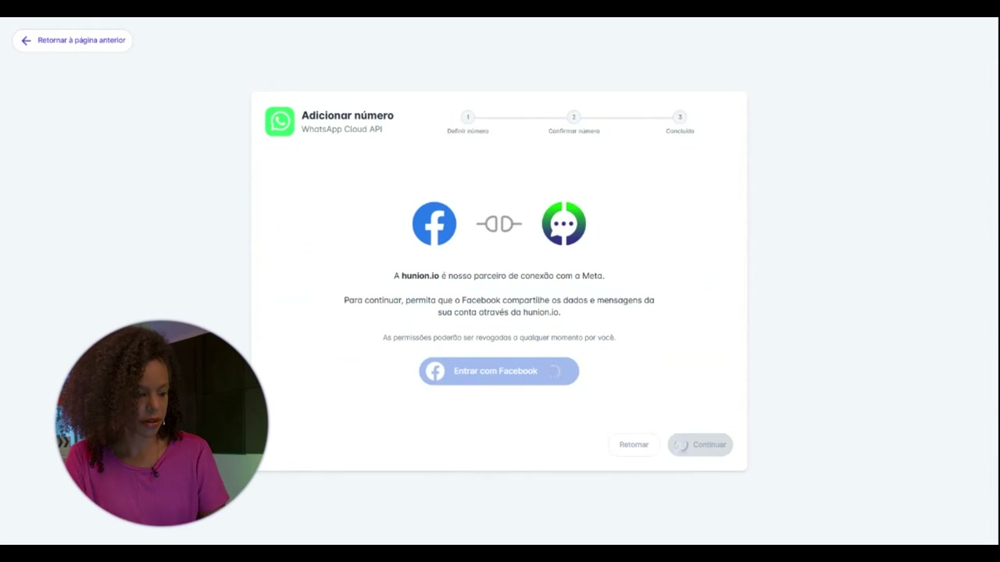
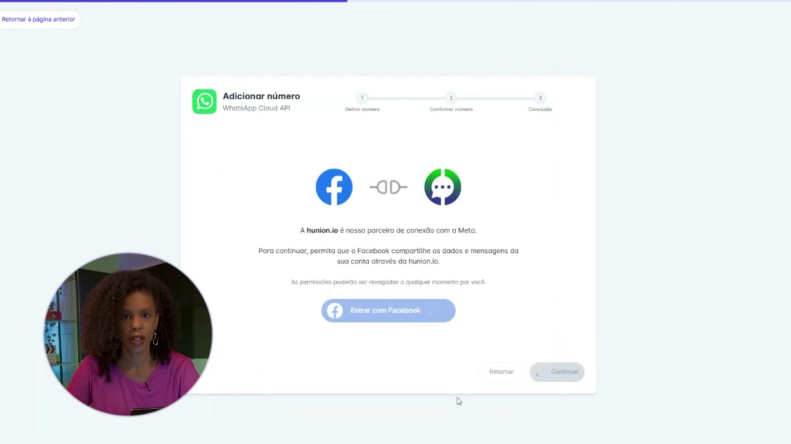
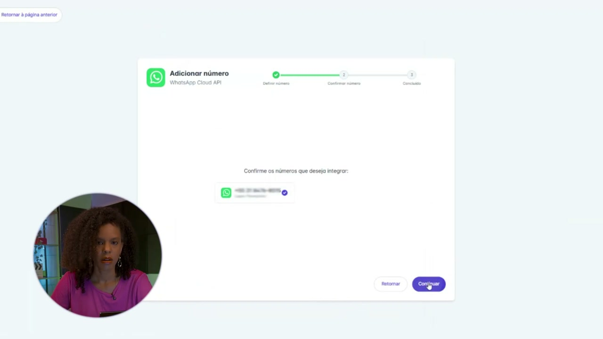
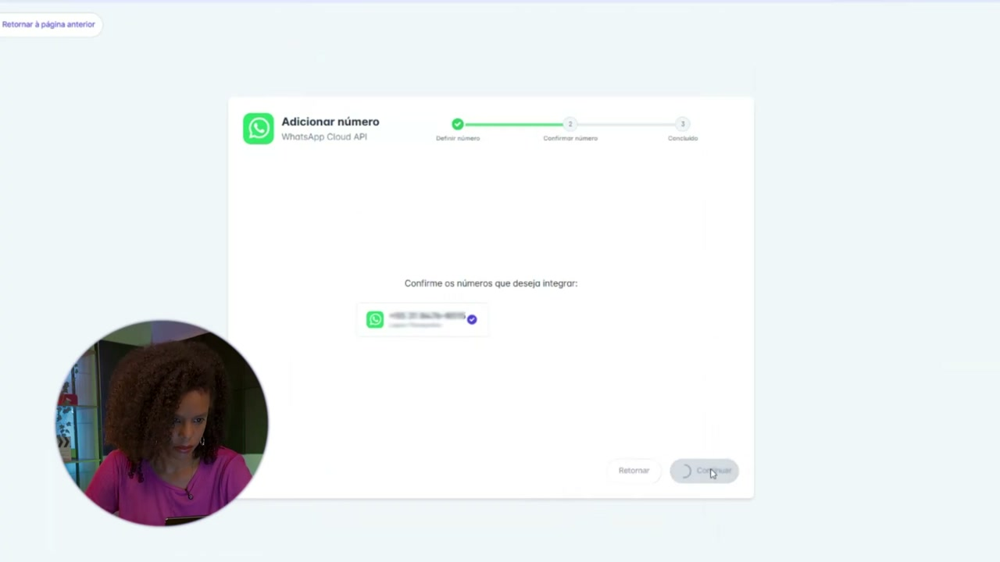
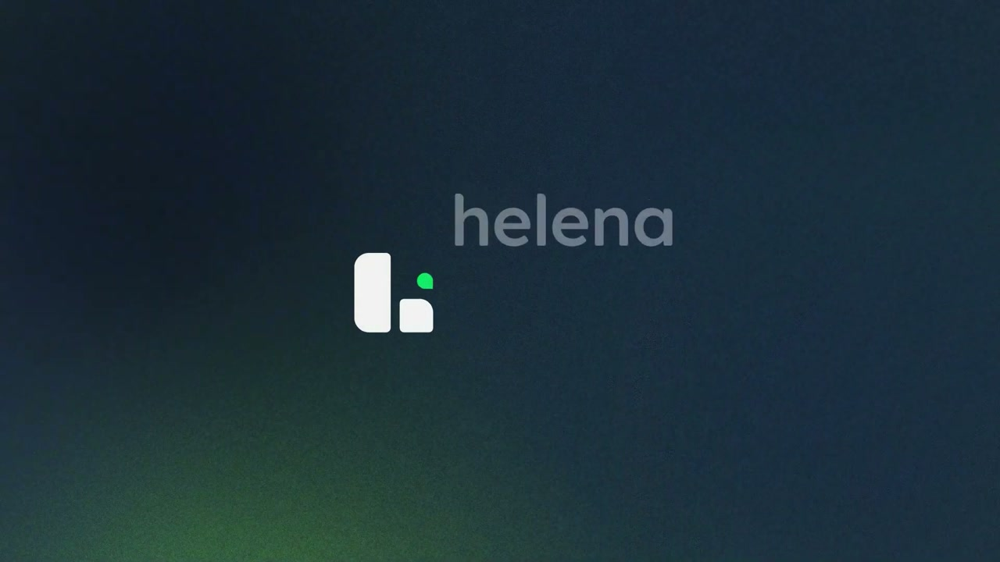

# Permissão de Acesso na plataforma helenaCRM

**URL:** https://www.youtube.com/watch?v=XWd-0Gj6R6E  
**Canal:** HelenaCRM  
**Data:** 2026-01-02  
**Objetivo:** Levantamento da plataforma Nexvy/DKW whitelabel para replicação de UI  
**Total de frames:** 12

---

## `00:00` — Título do vídeo

## `00:05` — Instrutora Larissa Lopes

## `01:07` — Acessando o menu de ajustes e selecionando "Conta"

## `01:12` — Selecionando "Canais de atendimento"

## `01:16` — Selecionando "Cloud Meta"

## `01:25` — Selecionando "Permitir acesso"

## `01:30` — Clicando em "Entrar com Facebook"

## `01:36` — Clicando em "Restabelecer ligação"

## `01:43` — Clicando na bolinha para selecionar o número

## `01:50` — Clicando em "Continuar"

## `01:53` — Clicando em "Finalizar"

## `02:15` — Logo da empresa

