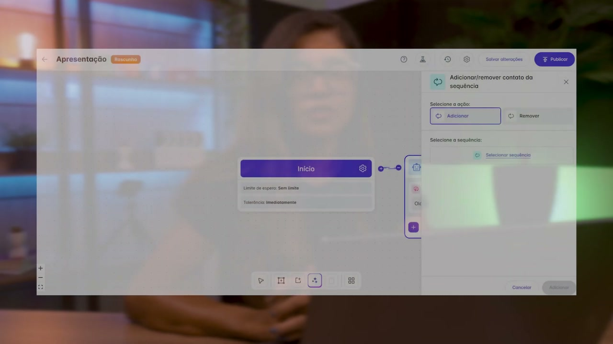
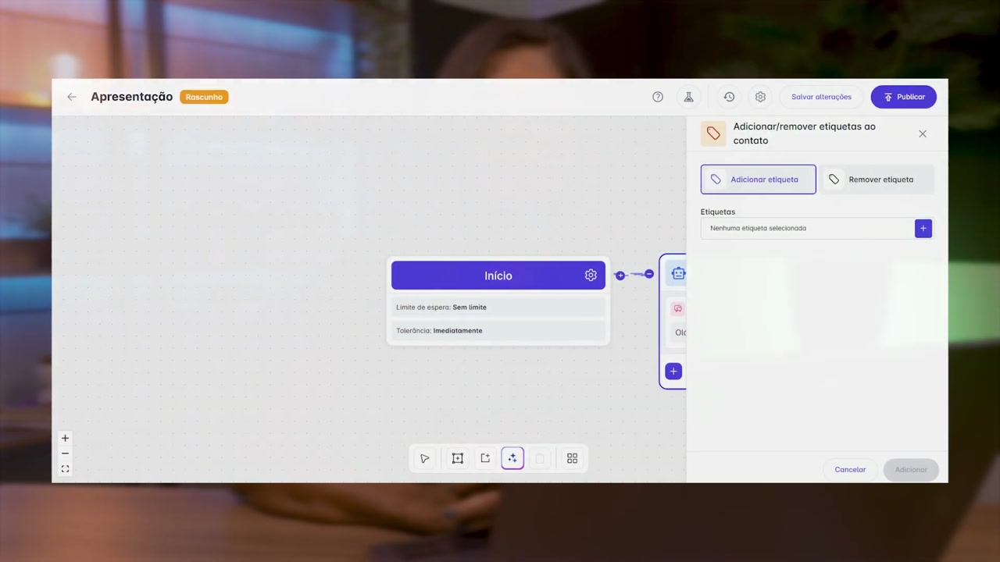

# Ações de Contato no Chatbot da plataforma helenaCRM

**URL:** https://www.youtube.com/watch?v=Xf6tFnM4va4  
**Canal:** HelenaCRM  
**Data:** 2026-01-02  
**Objetivo:** Levantamento da plataforma Nexvy/DKW whitelabel para replicação de UI  
**Total de frames:** 7

---

## `00:00` — Título do vídeo "Chatbot: Ações de Contato".

## `00:05` — Mulher de óculos e blusa preta, olhando para a câmera e falando.

## `00:37` — Na tela do computador, a tela do editor de fluxo. O menu de "Ações disponíveis" está aberto, e "Adicionar/remover da sequência" está destacado.

## `00:43` — Na tela do computador, a tela do editor de fluxo. O menu de "Adicionar/remover contato da sequência" está aberto, e as opções "Adicionar" e "Remover" estão destacadas.

## `01:03` — Na tela do computador, a tela do editor de fluxo. O menu de "Ações disponíveis" está aberto, e "Adicionar/remover etiquetas do contato" está destacado.

## `01:09` — Na tela do computador, a tela do editor de fluxo. O menu de "Adicionar/remover etiquetas do contato" está aberto, e as opções "Adicionar etiqueta" e "Remover etiqueta" estão destacadas.

## `01:26` — Logo da Helena Academia.

