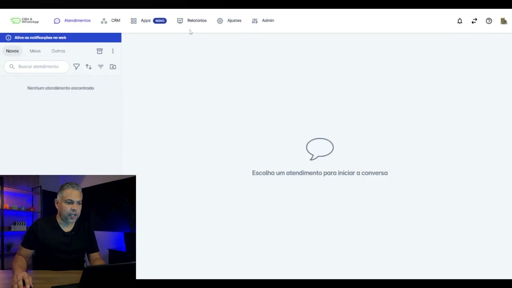
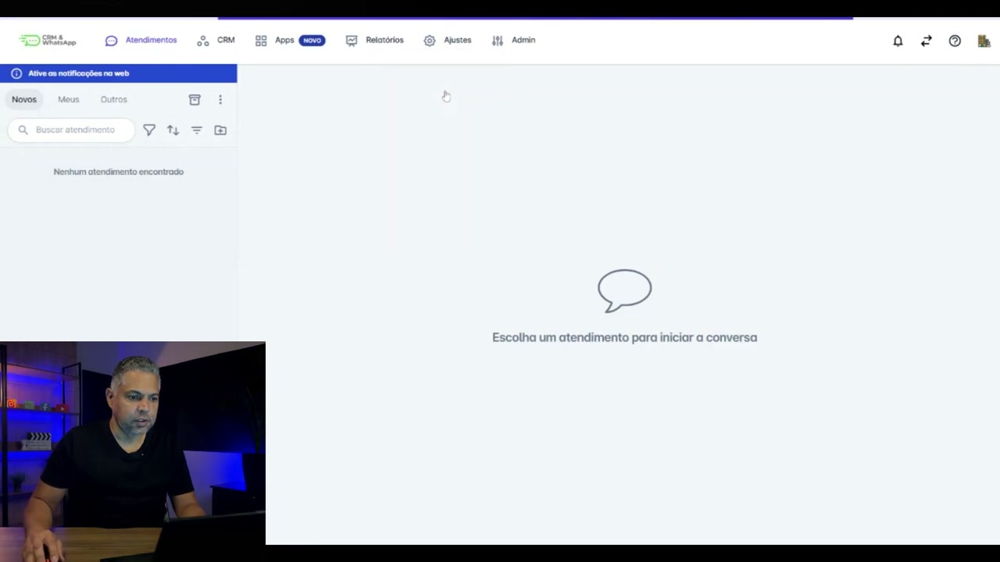
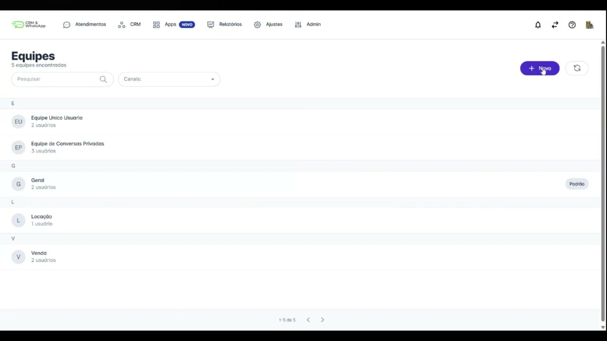
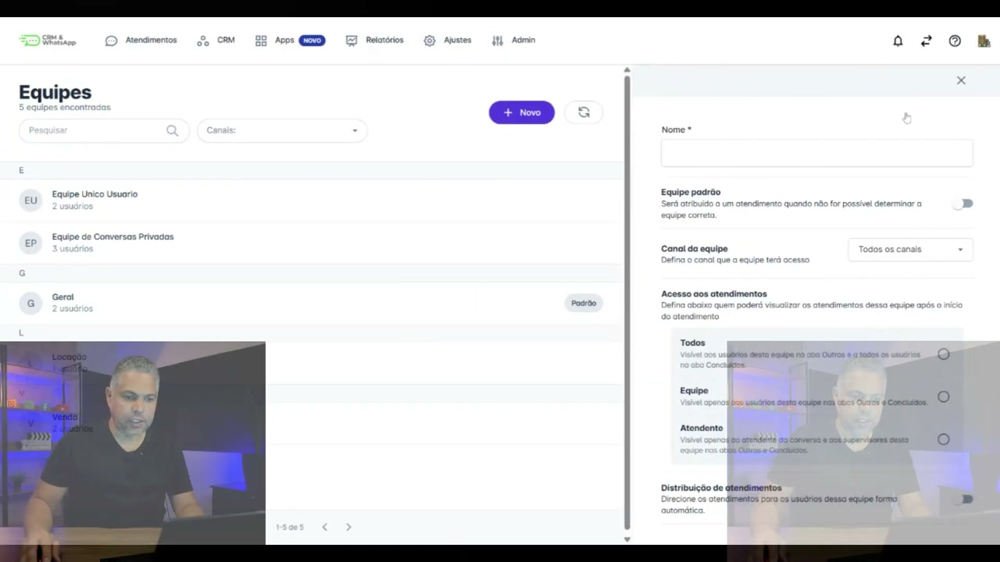
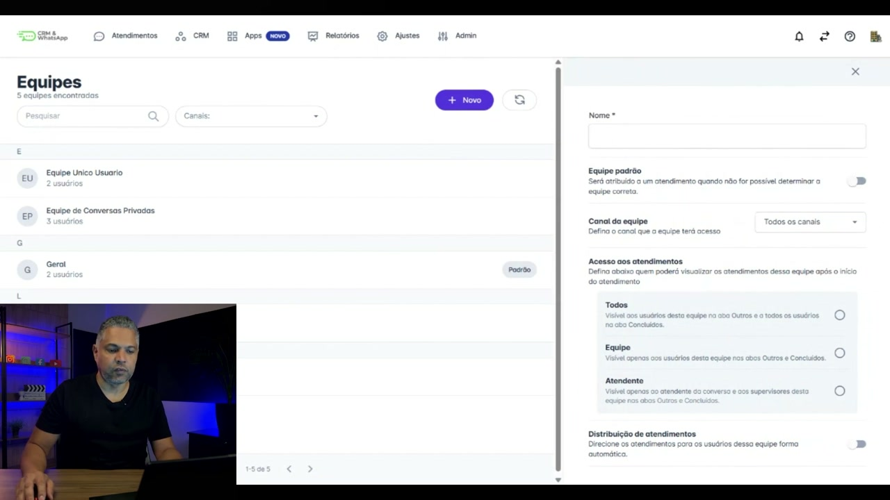
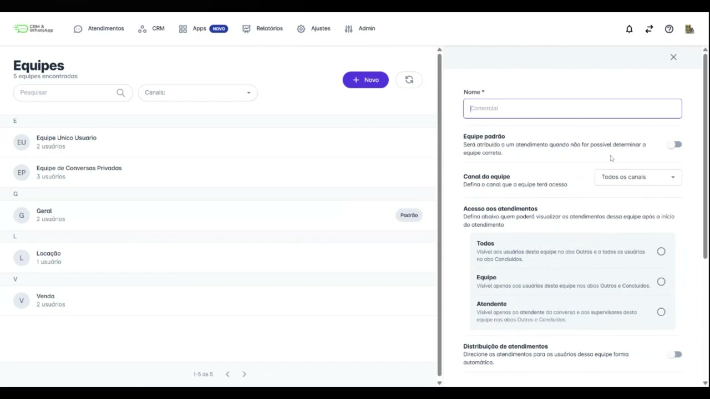
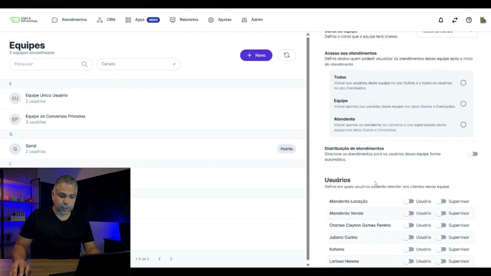
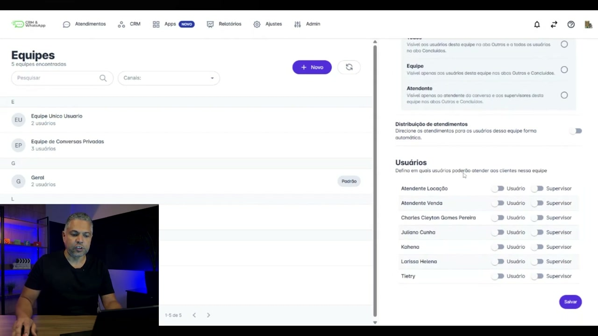
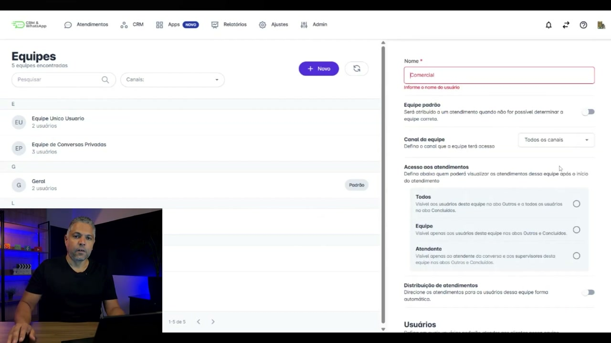

# Contexto e Prática de Equipes na plataforma helenaCRM

**URL:** https://www.youtube.com/watch?v=_KeeL_5wG5k  
**Canal:** HelenaCRM  
**Data:** 2025-11-05  
**Objetivo:** Levantamento da plataforma Nexvy/DKW whitelabel para replicação de UI  
**Total de frames:** 17

---

## `00:00` — Início do vídeo: tela de título com o tema "EQUIPES: Contexto e Prática".

## `00:05` — Charles Pereira, Analista de Sucesso do Cliente, iniciando o tutorial sobre cadastro de equipes.

## `00:39` — Navegação pela plataforma, indo para "Ajustes".

## `00:41` — No menu "Ajustes", clicando em "Equipes".

## `00:44` — Tela de "Equipes" com equipes predefinidas.

## `00:51` — Clicando no botão "+ Novo" para criar uma nova equipe.

## `00:54` — Tela de criação de nova equipe com campos como "Nome", "Equipe Padrão", "Canal da Equipe".

## `00:56` — Detalhes dos campos de criação da equipe.

## `01:05` — Exemplo de atribuição de uma equipe como "Padrão" e a mudança automática de outra equipe que era padrão.

## `01:17` — Opção de selecionar "Canal da equipe".

## `01:19` — Opções de "Acesso aos atendimentos": Todos, Equipe, Atendente.

## `01:48` — Opção de "Distribuição de atendimentos" e lista de "Usuários".

## `01:59` — Atribuindo usuários como "Usuário" ou "Supervisor".

## `02:24` — Retornando ao foco dos tipos de acesso: Todos, Equipe e Atendente.

## `02:40` — Charles Pereira retorna com dica para escolher o tipo de acesso.

## `02:54` — Conclusão do tutorial.

## `03:01` — Tela final com o logo da Helena Academia.

