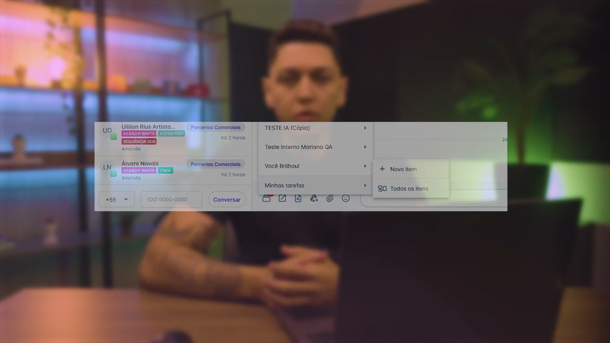
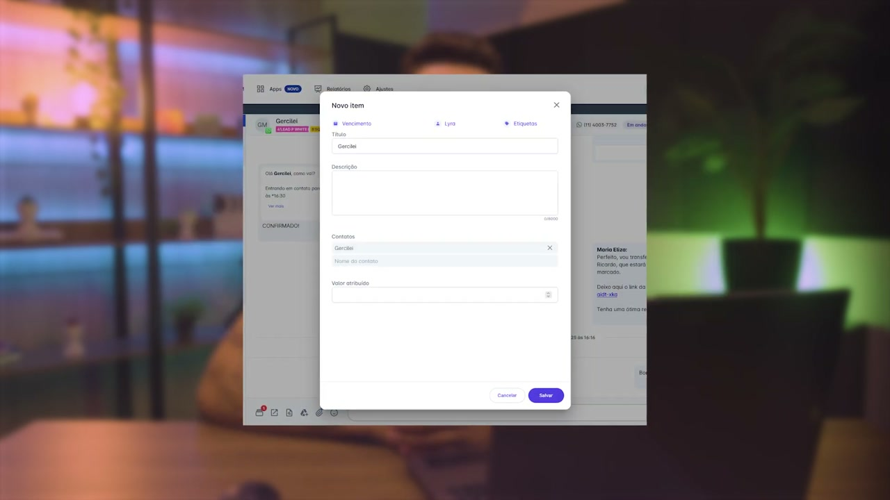
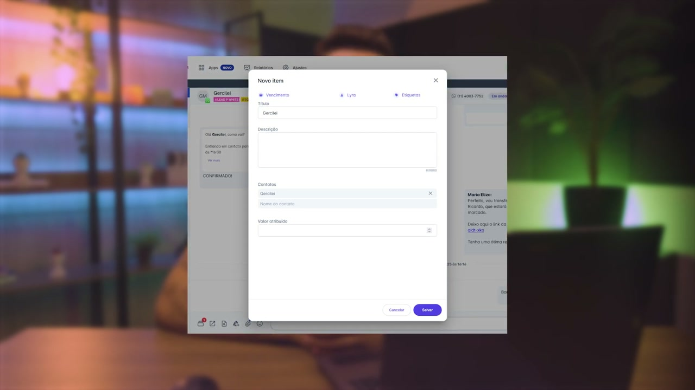
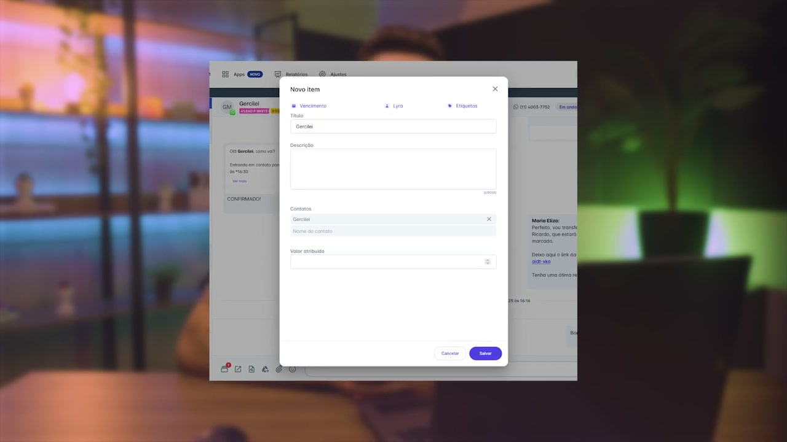
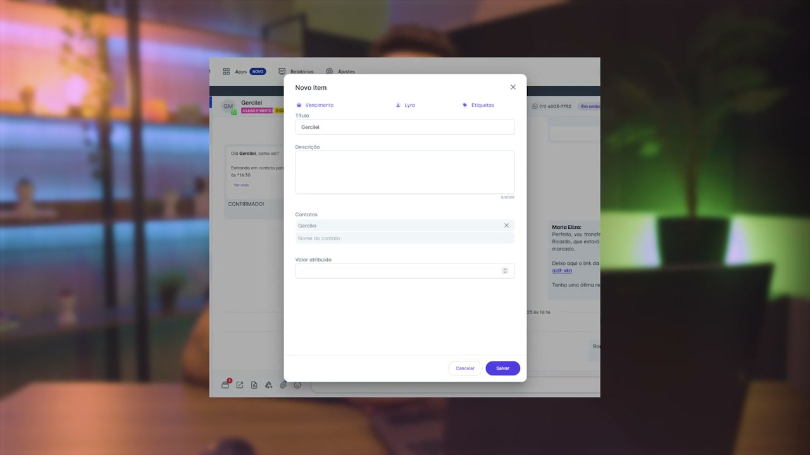
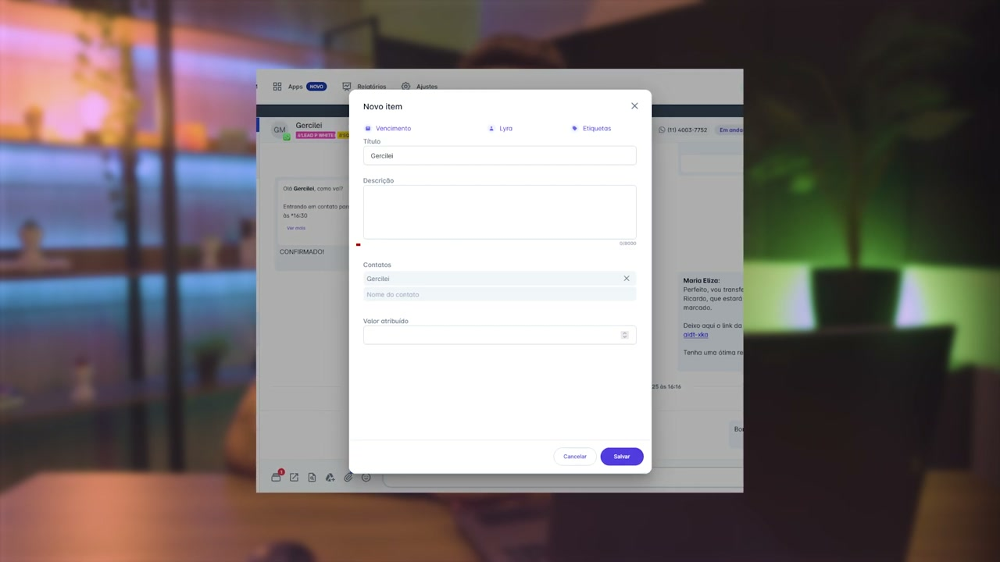
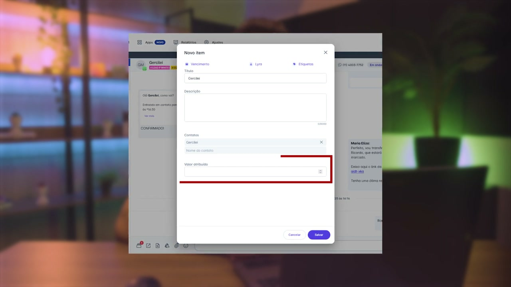
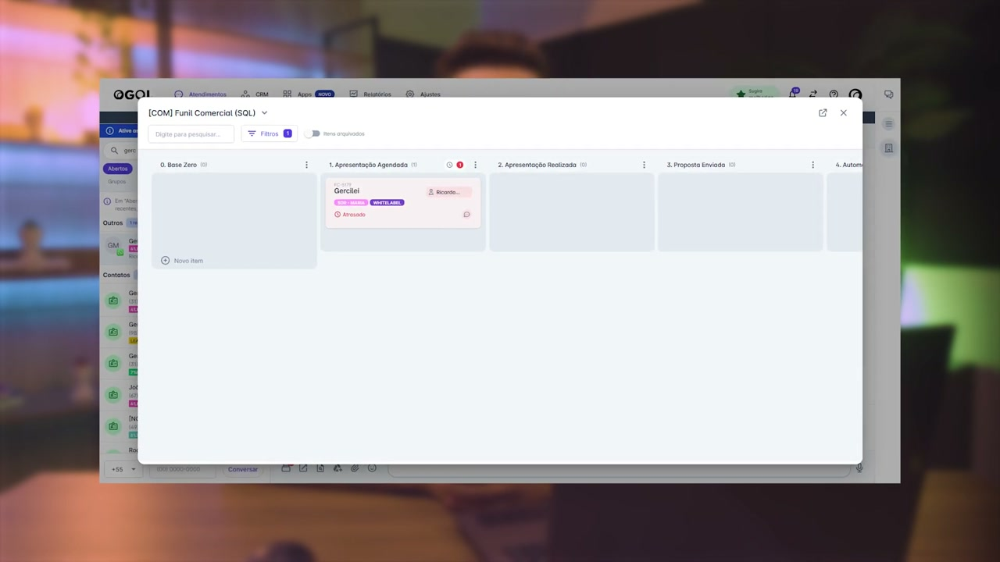
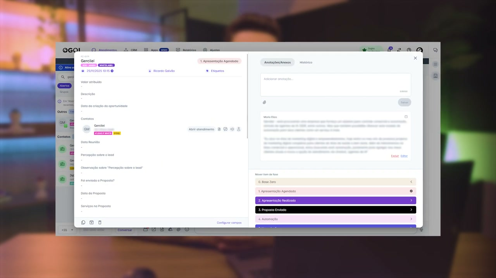
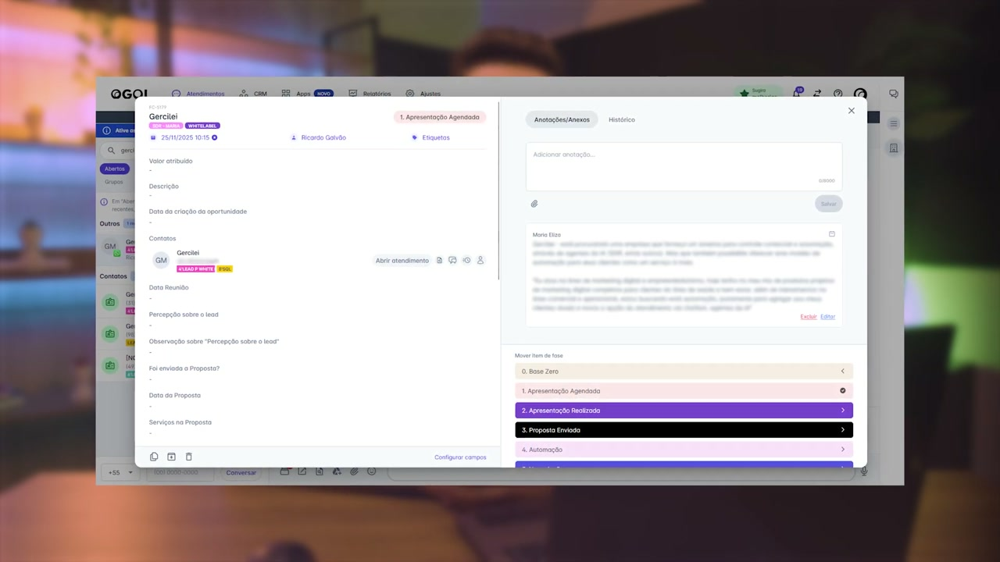

# Como acessar o CRM pelo atendimento na helenaCRM

**URL:** https://www.youtube.com/watch?v=_L92FINjcUI  
**Canal:** HelenaCRM  
**Data:** 2025-11-28  
**Objetivo:** Levantamento da plataforma Nexvy/DKW whitelabel para replicação de UI  
**Total de frames:** 20

---

## `00:00` — Início do vídeo, tela inicial com o título "CRM no Atendimento: Como acessar".

## `00:05` — O apresentador Higor Hermógenes se apresenta.

## `00:41` — Demonstração na plataforma, mostrando o ícone do CRM no canto inferior esquerdo.

## `00:46` — Clicando no ícone do CRM, é exibido o menu "Minhas tarefas" com opções de painéis e "Novo Item" e "Todos os Itens".

## `00:54` — Ao selecionar um painel, aparecem opções como "Novo Item" e "Todos os Itens".

## `00:58` — Tela de "Novo Item", onde se preenchem as informações do card.

## `01:00` — Destaque para o campo "Vencimento" para definir prazos.

## `01:04` — Destaque para o campo "Atribuição" para escolher o responsável pelo card.

## `01:09` — Destaque para o campo "Etiquetas" para categorizar a atividade.

## `01:14` — Destaque para o campo "Título" que é preenchido automaticamente com o nome do contato, mas pode ser alterado.

## `01:19` — Destaque para o campo "Descrição" para registrar observações.

## `01:22` — Destaque para o campo "Contatos" que já vem com o contato do atendimento, mas pode ser alterado.

## `01:28` — Destaque para o campo "Valor atribuído" para inserir um valor monetário.

## `01:32` — Botão "Salvar" no canto inferior direito para criar o card.

## `01:49` — Demonstração de como acessar um card existente, clicando no painel e depois em "Todos os Itens".

## `01:54` — Exibição do painel com o card criado, dividido em colunas.

## `01:58` — Destaque para o campo de filtros para visualizar os cards.

## `02:02` — Ao clicar em um card, são exibidas as opções de "Duplicar", "Arquivar" ou "Excluir" o card na parte inferior.

## `02:10` — Destaque para a opção "Configurar campos" para adicionar campos personalizados.

## `02:14` — O apresentador conclui o vídeo e incentiva a explorar outras funcionalidades.

