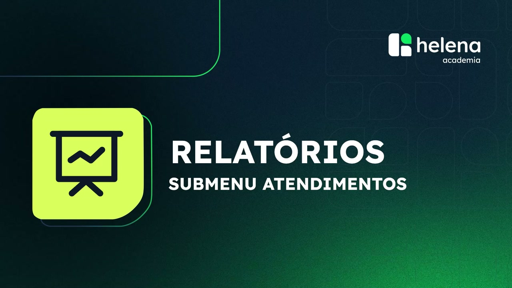
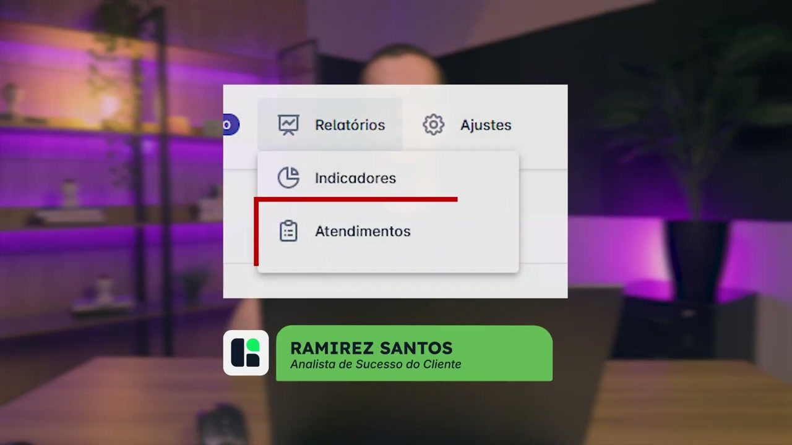
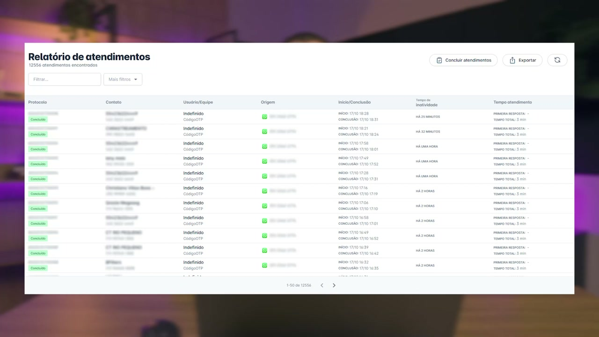

# Entendendo os relatórios de Atendimento da helenaCRM

**URL:** https://www.youtube.com/watch?v=dNaKezWr_LY  
**Canal:** HelenaCRM  
**Data:** 2025-10-21  
**Objetivo:** Levantamento da plataforma Nexvy/DKW whitelabel para replicação de UI  
**Total de frames:** 10

---

## `00:00` — Início da apresentação do tutorial

## `00:05` — O orador apresenta o primeiro passo do tutorial, mostrando o acesso aos relatórios na plataforma.

## `00:09` — O orador explica a função do menu de Relatórios de Atendimento.

## `00:15` — O orador mostra a tela do "Relatório de Atendimentos".

## `00:20` — O orador mostra como fazer filtros para analisar dados de atendimentos dentro da plataforma.

## `00:27` — O orador mostra como exportar dados do relatório para planilhas.

## `00:30` — O orador mostra como exportar mensagens que foram trocadas pelos contatos.

## `00:37` — O orador mostra como concluir atendimentos em massa.

## `00:48` — O orador conclui a demonstração.

## `00:52` — Encerramento do tutorial.

