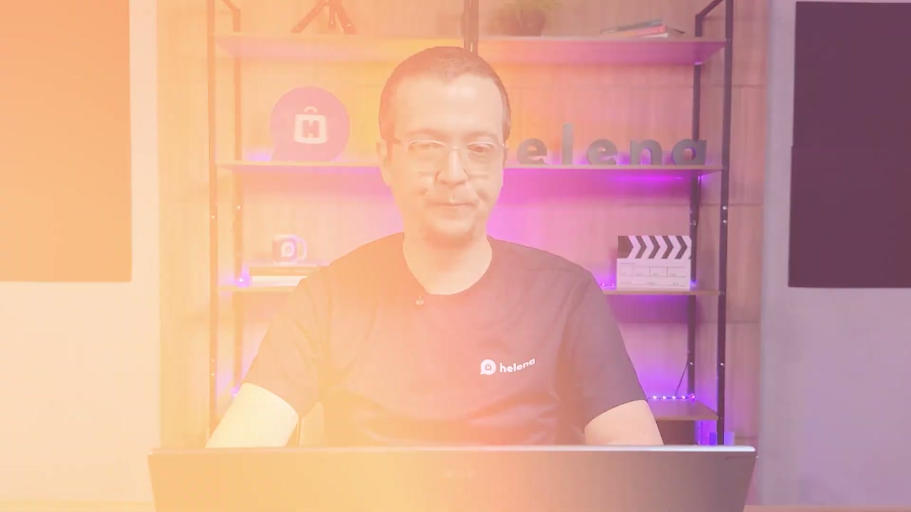
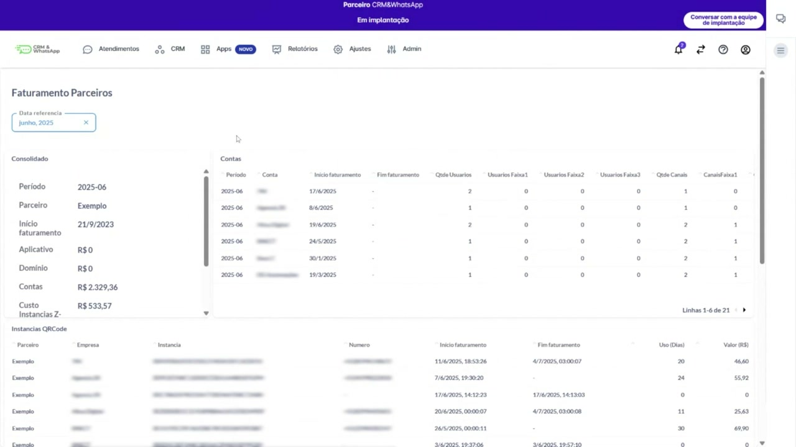
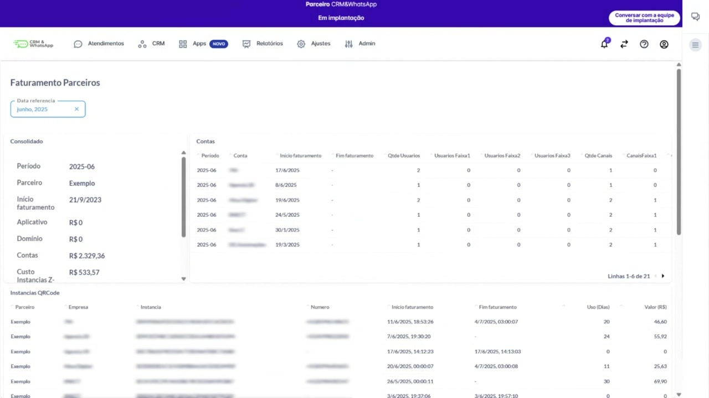
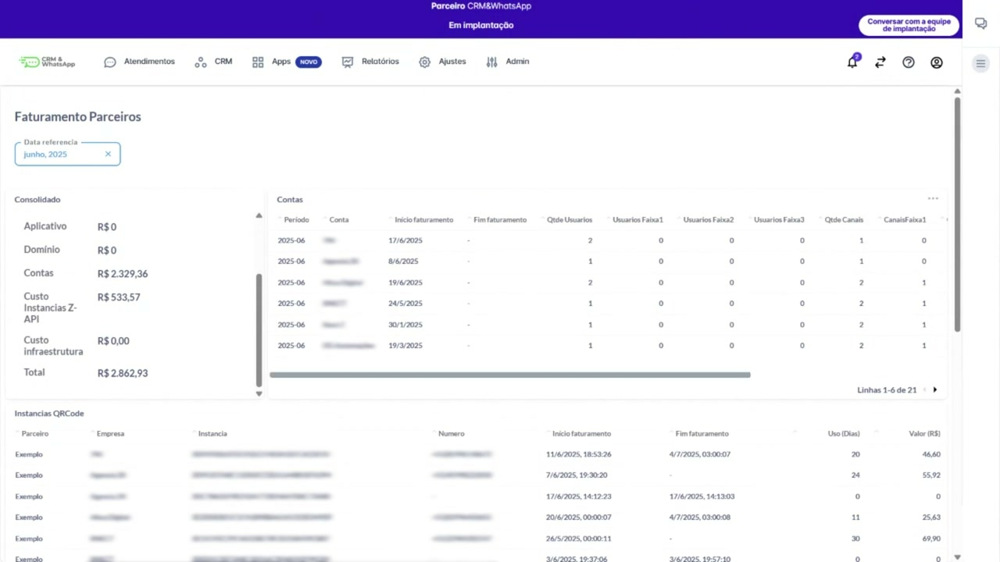
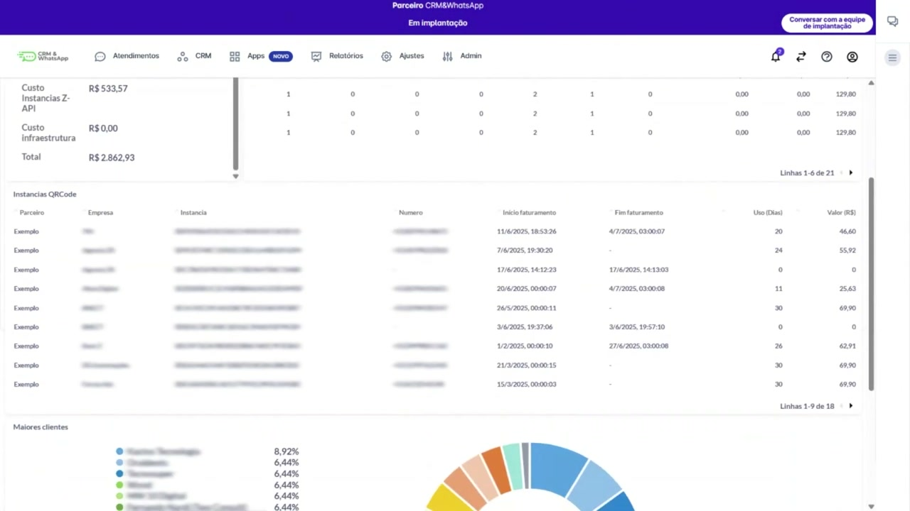
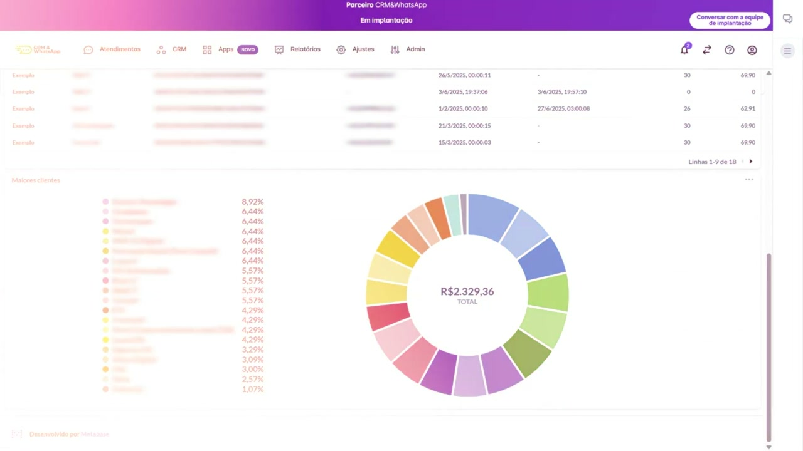
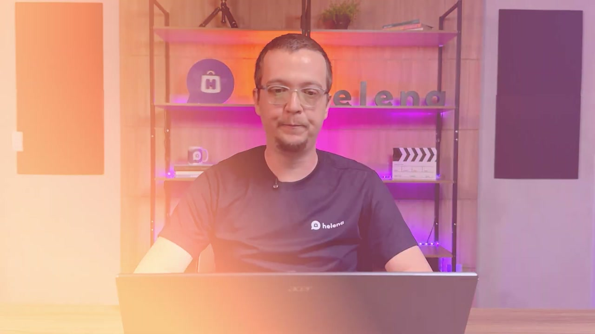
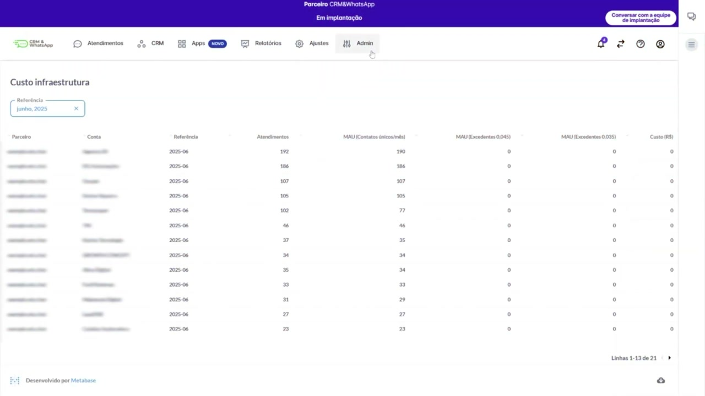
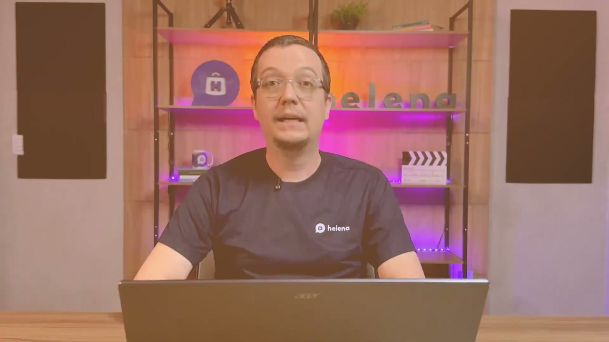

# [Parceiros] Como acessar relatórios de faturamento

**URL:** https://www.youtube.com/watch?v=db54n8_3_Sg  
**Canal:** HelenaCRM  
**Data:** 2025-09-24  
**Objetivo:** Levantamento da plataforma Nexvy/DKW whitelabel para replicação de UI  
**Total de frames:** 16

---

## `00:00` — Título do Vídeo: Relatório de Faturamento

## `00:04` — Apresentador

## `00:23` — Menu Superior: Atendimentos, CRM, Apps, Relatórios, Ajustes, Admin

## `00:23` — Tela de "Faturamento Parceiros", mostrando o período de referência (Junho, 2025)

## `00:27` — Box "Consolidado" com informações como Período, Parceiro, Início Faturamento, Aplicativo, Domínio, Contas, Custo Instâncias Z-API, Custo Infraestrutura e Total

## `00:29` — Seleção de data de referência

## `00:30` — Data de referência (Junho, 2025)

## `00:43` — Box "Consolidado"

## `01:03` — Box "Contas" com informações sobre Período, Conta, Início Faturamento, Fim Faturamento, Quantidade de Usuários (faixas 1, 2, 3), Quantidade de Canais (faixas 1, 2), App Transcrição Audio (R$) e App Assas (R$) e Total (R$)

## `01:34` — Box "Instâncias QRCode" com informações sobre Parceiro, Empresa, Instância, Número, Início Faturamento, Fim Faturamento, Uso (Dias) e Valor (R$)

## `01:52` — Box "Maiores Clientes" com porcentagem de contribuição para o faturamento total e um gráfico de pizza

## `02:02` — Apresentador

## `02:27` — Tela de "Custo Infraestrutura" com informações sobre Parceiro, Conta, Referência, Atendimentos, MAU (Contatos únicos/mês), MAU (Excedentes 0.04S), MAU (Excedentes 0.035) e Custo (R$)

## `02:30` — Menu superior mostrando caminho para acessar o relatório de custo de infraestrutura

## `02:53` — Apresentador

## `03:02` — Logo da "academia helena"

