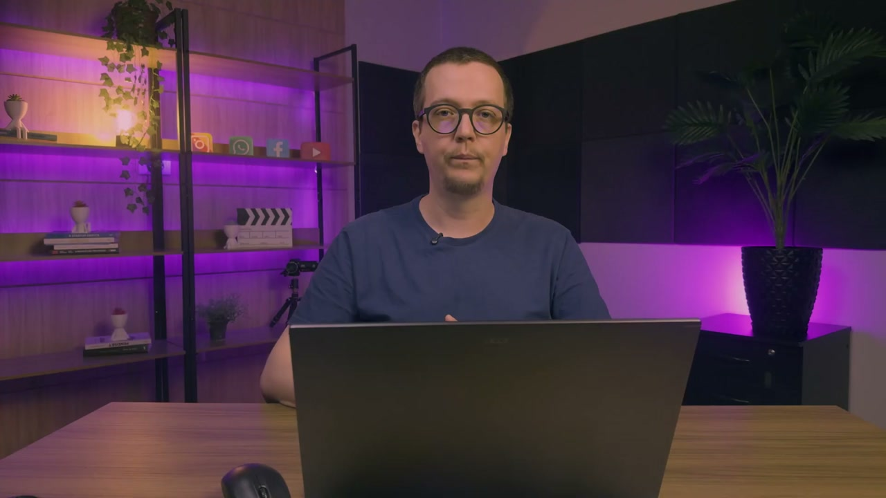
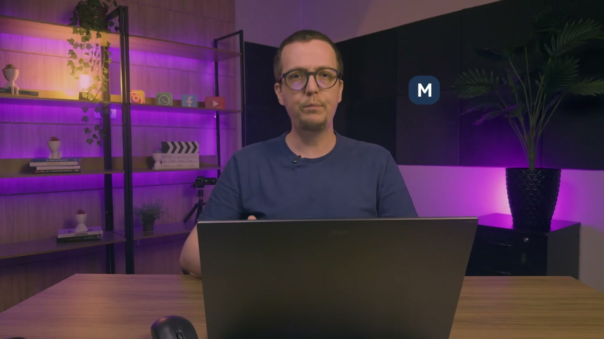

# Panorâma Geral de Relatórios da helenaCRM

**URL:** https://www.youtube.com/watch?v=iTuVYvn347I  
**Canal:** HelenaCRM  
**Data:** 2025-10-21  
**Objetivo:** Levantamento da plataforma Nexvy/DKW whitelabel para replicação de UI  
**Total de frames:** 15

---

## `00:00` — Título do vídeo "Relatórios: Contexto Geral"

## `00:05` — Ramiriz Santos, Analista de Sucesso do Cliente, inicia a explicação sobre relatórios.

## `00:15` — Exibição de um menu com as opções "Relatórios", "Ajustes", "Indicadores" e "Atendimentos".

## `00:26` — Explicação sobre a divisão do menu em "Indicadores" e "Atendimentos".

## `00:30` — Começa a explicação sobre os alinhamentos necessários antes de prosseguir.

## `00:38` — Exibição da palavra "Mediana" na tela.

## `00:43` — Explicação sobre a diferença entre média e mediana.

## `00:59` — Exibição da frase "Valor do meio" na tela.

## `01:05` — Continuação da explicação sobre o valor do meio na mediana.

## `01:12` — Segundo ponto importante: relatórios consideram cenários de diferentes segmentos.

## `01:32` — Exibição da frase "Menus e ações personalizados" na tela.

## `01:38` — Terceiro ponto importante: o relatório contabiliza atendimentos, não pessoas.

## `01:43` — Exibição da palavra "Atendimentos" na tela.

## `02:08` — Exibição da frase "3 atendimentos" na tela.

## `02:12` — Logotipo da empresa "Helena Academia".

