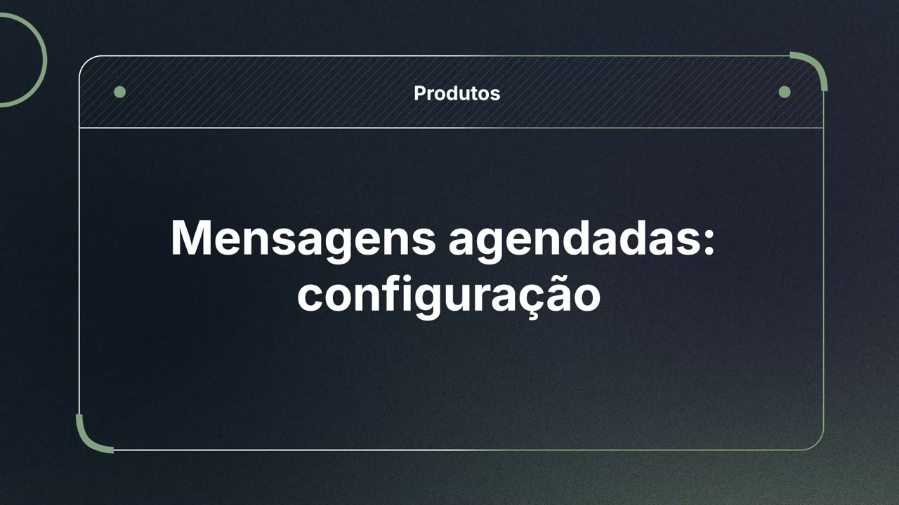
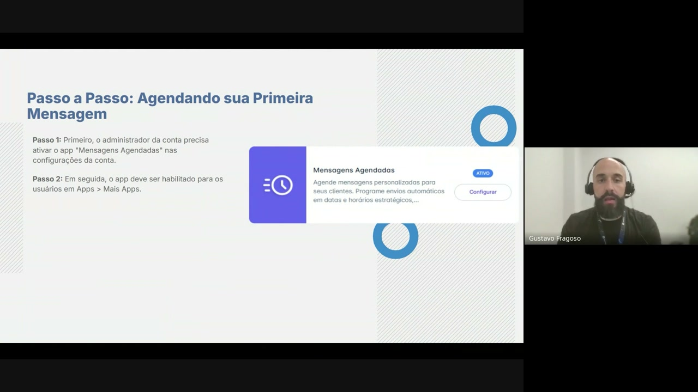
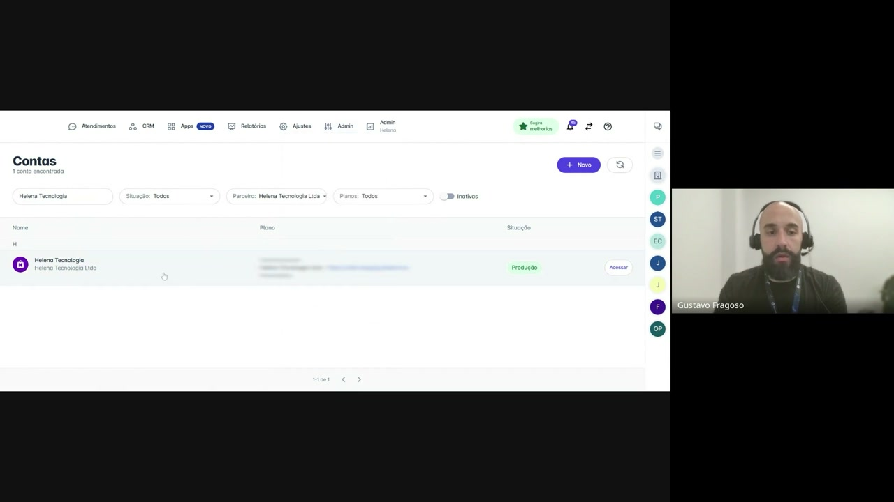
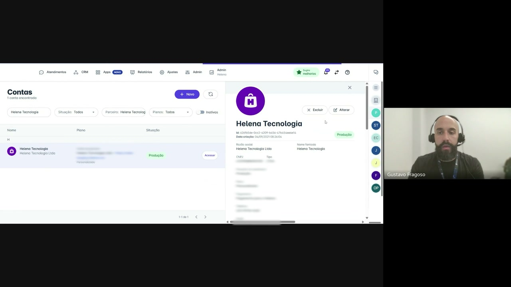
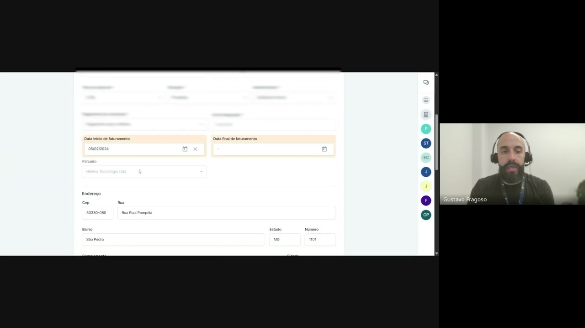
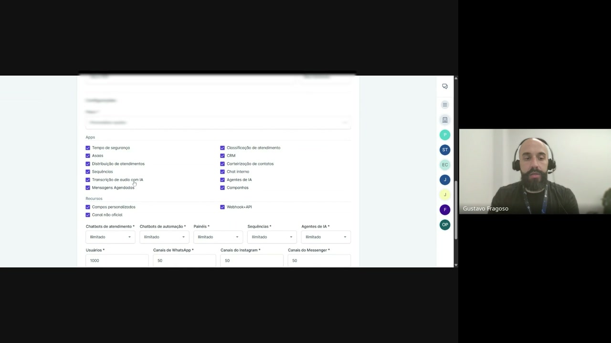
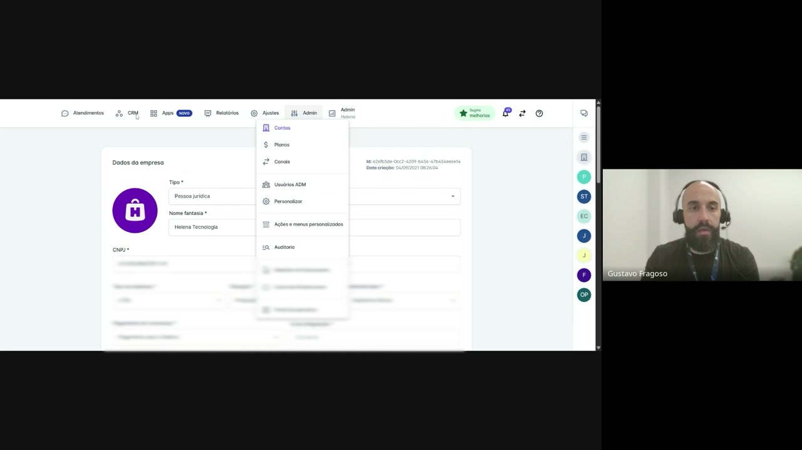
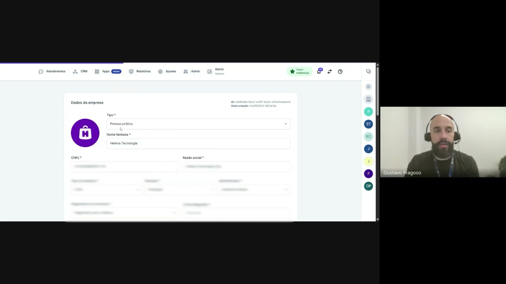
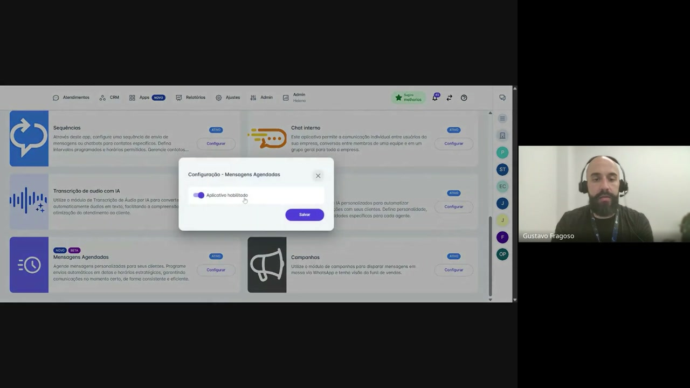
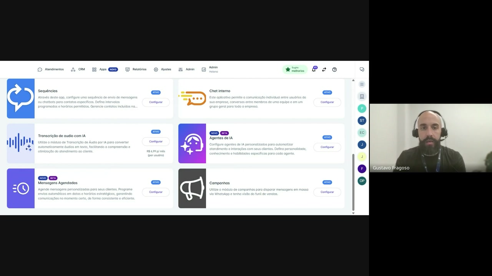

# Configuração do recurso de Mensagens Agendadas na helencaCRM

**URL:** https://www.youtube.com/watch?v=oOq8AVnwx7g  
**Canal:** HelenaCRM  
**Data:** 2025-09-30  
**Objetivo:** Levantamento da plataforma Nexvy/DKW whitelabel para replicação de UI  
**Total de frames:** 13

---

## `00:00` — Título da apresentação: Mensagens agendadas: configuração

## `00:05` — Slide de apresentação: Como Funciona na Prática?

## `00:08` — Slide de apresentação: Passo a Passo: Agendando sua Primeira Mensagem (Passo 1 e Passo 2)

## `00:18` — Navegando até a seção "Admin" e selecionando "Contas" no menu suspenso.

## `00:23` — Selecionando a conta "Helena Tecnologia".

## `00:25` — Clicando em "Alterar" para editar as configurações da conta.

## `00:28` — Rolando para baixo até a seção de "Configurações" e "Apps".

## `00:30` — Marcando a caixa de seleção "Mensagens Agendadas" para habilitar o aplicativo.

## `00:41` — Navegando de volta ao menu e selecionando "Apps" no menu principal.

## `00:44` — Clicando em "Mais Apps" no menu de aplicativos.

## `00:47` — Encontrando o aplicativo "Mensagens Agendadas" e clicando em "Configurar".

## `00:48` — Habilitando o aplicativo na janela de configuração e clicando em "Salvar".

## `01:03` — Slide de apresentação: Passo a Passo: Agendando sua Primeira Mensagem (recapitulação e próxima etapa).

