# Aprendendo sobre  Tempo de Segurança na prática na helenaCRM

**URL:** https://www.youtube.com/watch?v=oVifwnIL7jo  
**Canal:** HelenaCRM  
**Data:** 2025-11-05  
**Objetivo:** Levantamento da plataforma Nexvy/DKW whitelabel para replicação de UI  
**Total de frames:** 22

---

## `00:00` — Título do vídeo "Tempo de Segurança na Prática".

## `00:05` — A apresentadora se apresenta e começa a falar sobre o tempo de segurança de mensagens.

## `00:18` — A apresentadora mostra a tela do computador e explica o processo para habilitar o tempo de segurança de mensagens.

## `00:23` — A apresentadora clica em "Mais Apps".

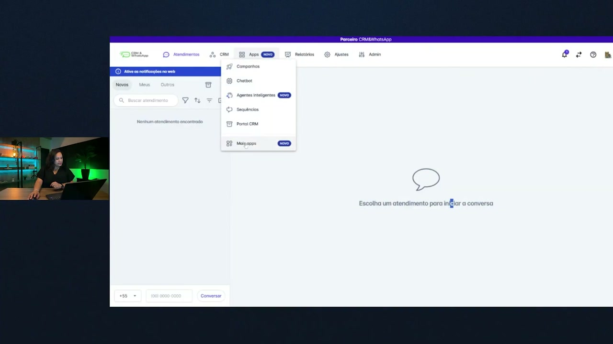

## `00:24` — A apresentadora mostra a lista de aplicativos integrados e destaca a opção "Tempo de segurança".

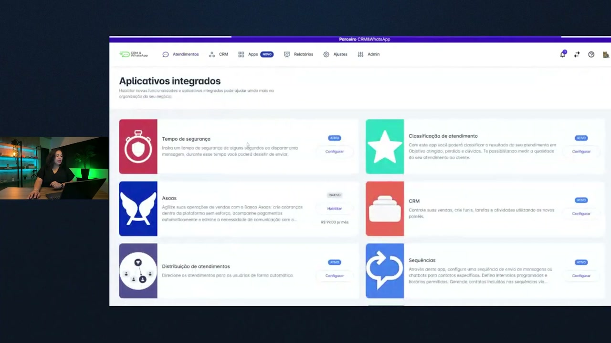

## `00:27` — A apresentadora clica em "Configurar" na opção "Tempo de segurança".

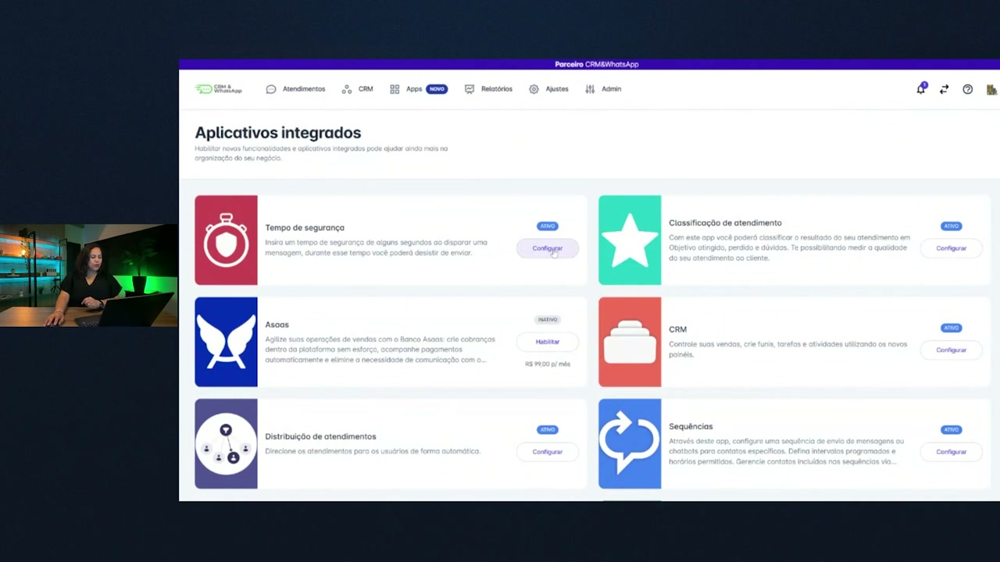

## `00:29` — A apresentadora mostra a tela de configuração do tempo de segurança.

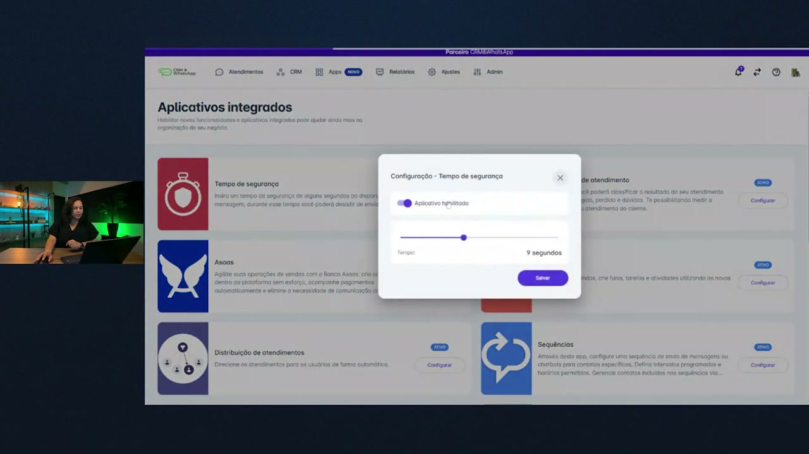

## `00:30` — A apresentadora clica para habilitar o aplicativo.

## `00:34` — A apresentadora mostra o controle deslizante para ajustar o tempo de segurança.

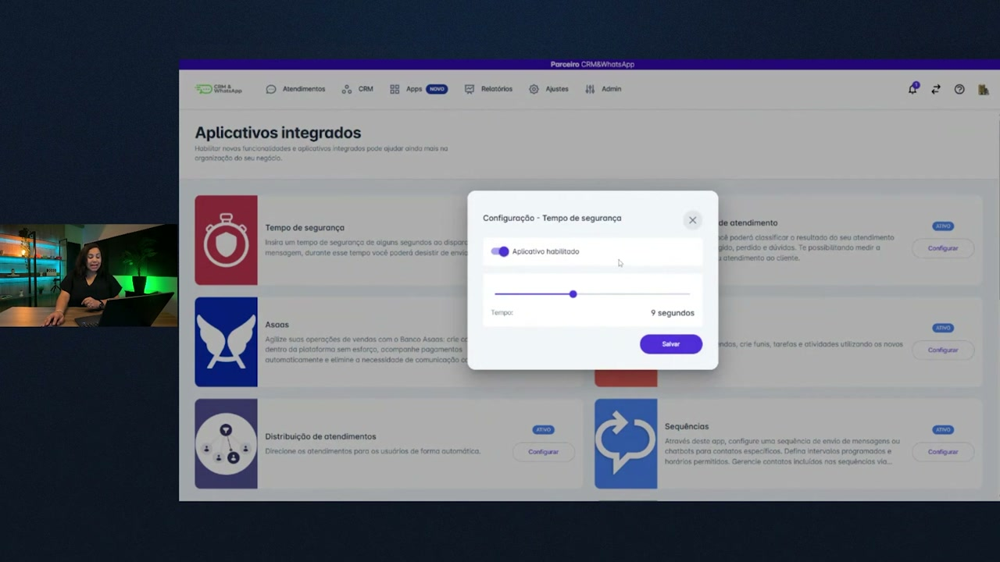

## `00:41` — A apresentadora ajusta o tempo para 10 segundos.

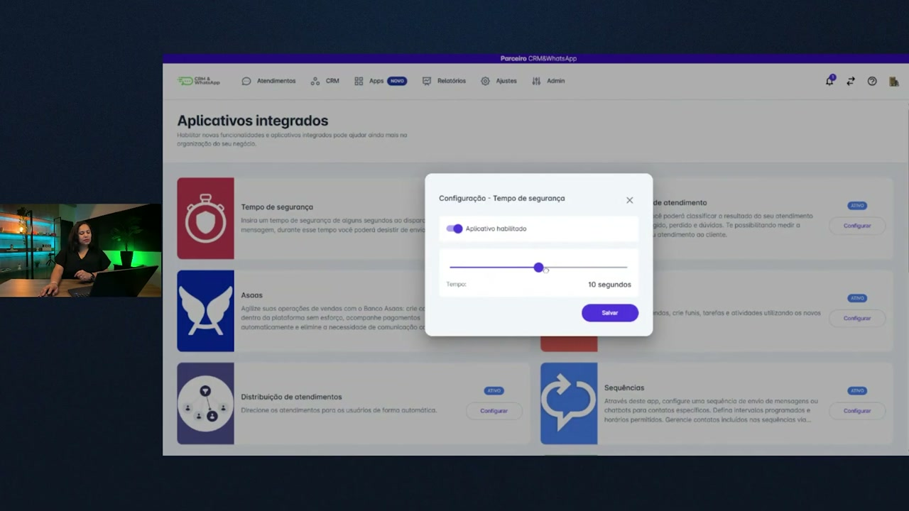

## `00:43` — A apresentadora clica em "Salvar".

## `00:45` — A apresentadora mostra que o tempo de segurança foi configurado e habilitado.

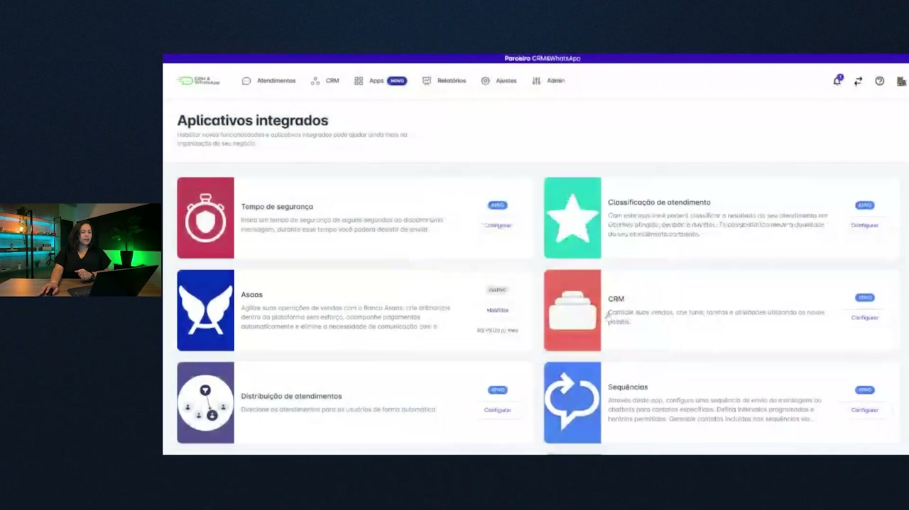

## `00:58` — A apresentadora simula o envio de uma mensagem com o tempo de segurança ativado.

## `01:05` — A apresentadora digita a mensagem "teste".

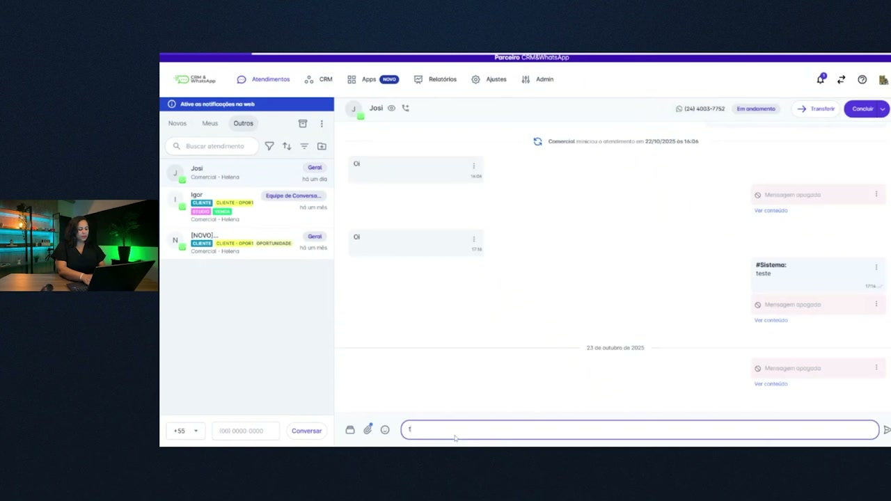

## `01:08` — A apresentadora clica em "Enviar". Uma caixa de diálogo aparece mostrando o tempo de espera.

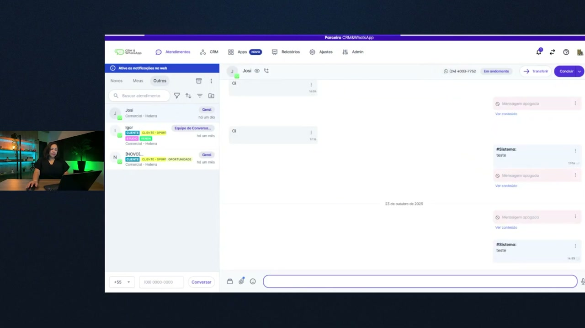

## `01:13` — A apresentadora mostra a contagem regressiva do tempo de segurança antes do envio da mensagem.

## `01:14` — A apresentadora clica em "Cancelar envio".

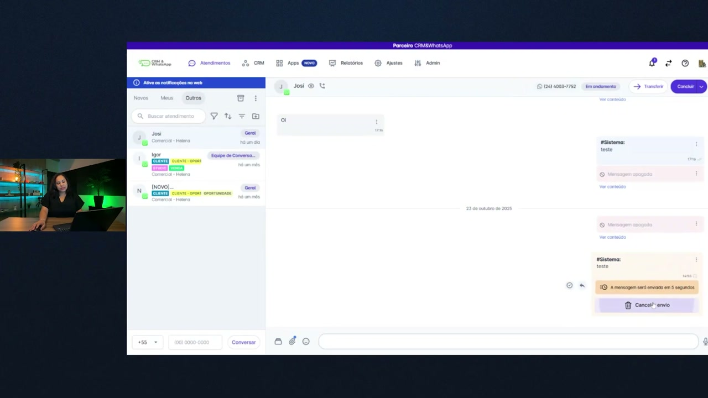

## `01:15` — A apresentadora mostra que a mensagem retornou à caixa de texto.

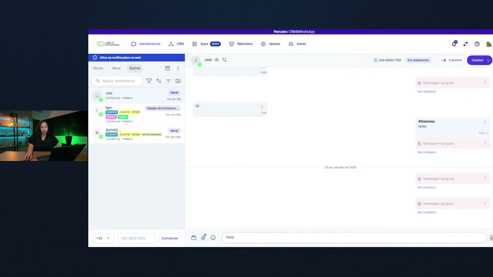

## `01:21` — A apresentadora discute observações importantes sobre o tempo de segurança, como mensagens apagadas e a regra da API oficial do Meta.

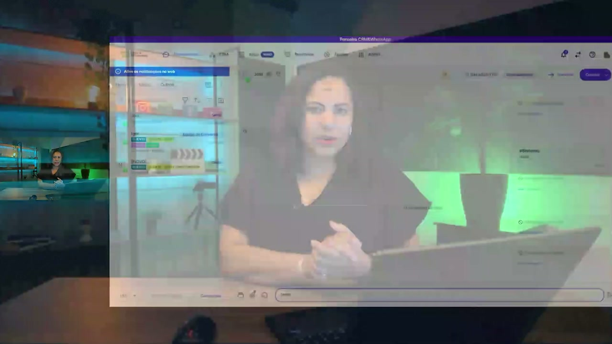

## `01:44` — A apresentadora explica que a sincronização incorreta do relógio do computador pode afetar diversas funcionalidades da plataforma.

## `02:16` — A apresentadora se despede.

## `02:18` — Logo da Helena Academia.

