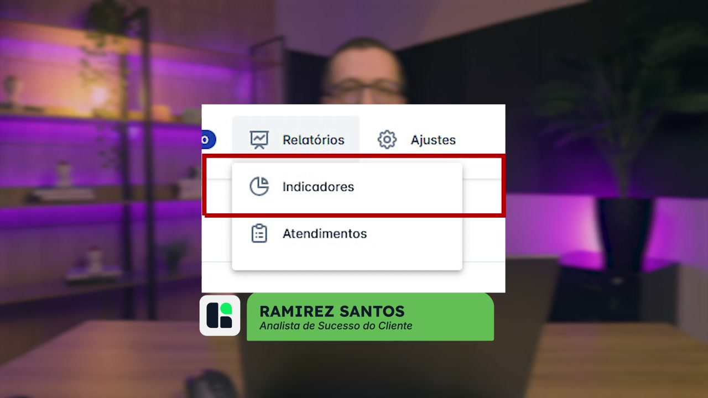
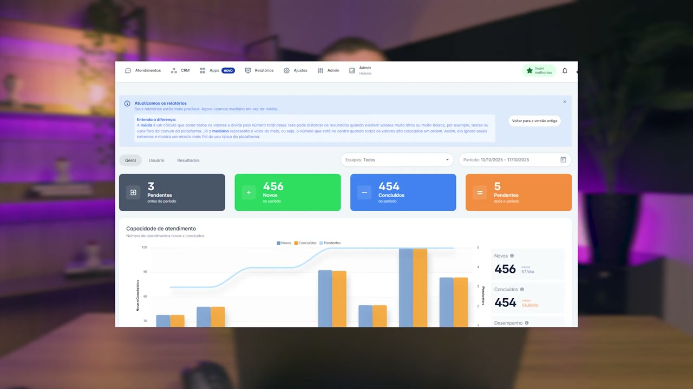
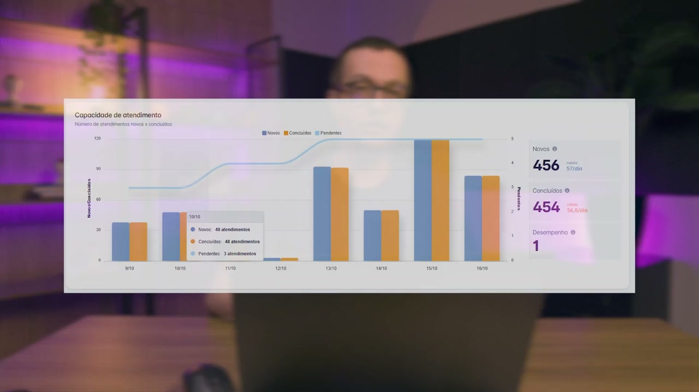
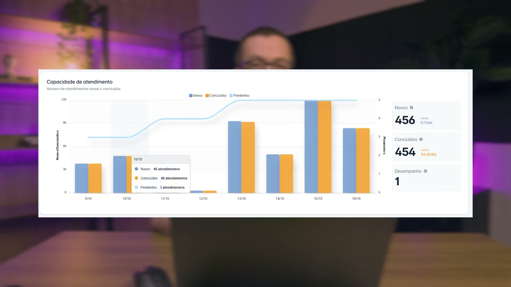
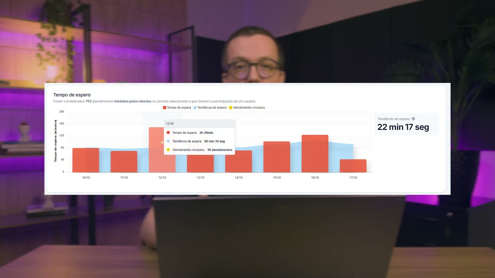
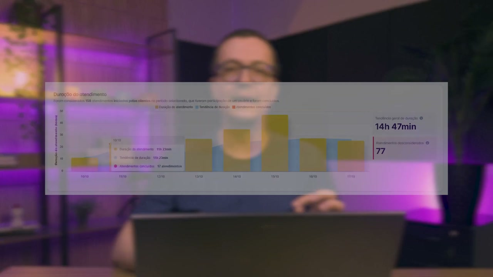
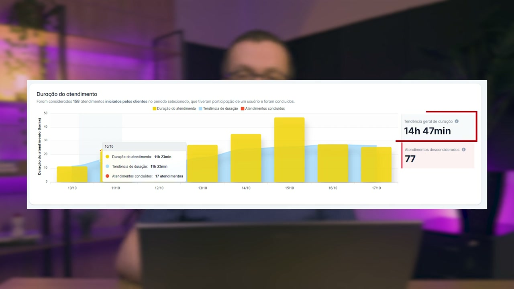
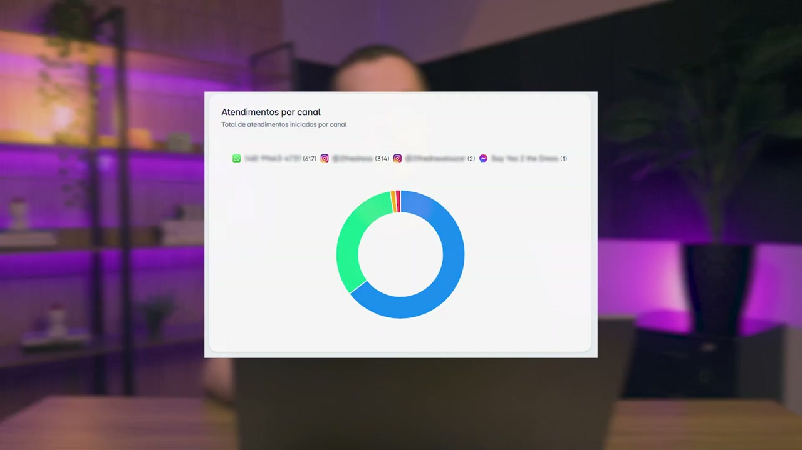
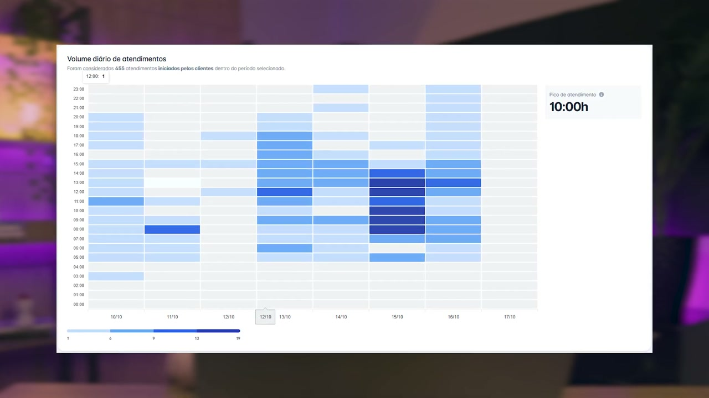

# Indicadores: Aba Geral

**URL:** https://www.youtube.com/watch?v=olMQTujz724  
**Canal:** HelenaCRM  
**Data:** 2025-10-21  
**Objetivo:** Levantamento da plataforma Nexvy/DKW whitelabel para replicação de UI  
**Total de frames:** 39

---

## `00:00` — Início do vídeo - Tela de título com o nome da aula "RELATÓRIOS INDICADORES: ABA GERAL".

## `00:05` — Instrutor aparece na tela.

## `00:07` — Menu superior "Relatórios" e "Indicadores" são selecionados.

## `00:10` — Página de Indicadores é exibida.

## `00:12` — Aba "Geral" é destacada.

## `00:16` — Título da seção "RESUMO DO PERÍODO" aparece na tela.

## `00:20` — Instrutor explica o resumo do período.

## `00:28` — Quadros de indicadores (Pendentes antes do período, Novos no período, Concluídos no período, Pendentes após o período) são destacados.

## `00:47` — Fórmula para "Pendentes após o Período" é exibida na tela.

## `01:09` — Título da seção "CAPACIDADE DE ATENDIMENTO" aparece na tela.

## `01:13` — Instrutor explica sobre a capacidade de atendimento.

## `01:19` — Gráfico "Capacidade de Atendimento" é exibido com detalhes sobre Novos, Concluídos e Pendentes.

## `01:21` — Números de atendimentos "Novos", "Concluídos" e "Pendentes" são destacados.

## `01:35` — Texto explicativo "novos vs. concluídos" aparece na tela.

## `01:42` — Texto explicativo "Maior que 1 Conclusão mais rápida" aparece na tela.

## `01:51` — Texto explicativo "Menor que 1 Menos conclusões" aparece na tela.

## `02:01` — Texto explicativo "Sobrecarga" aparece na tela.

## `02:13` — Texto explicativo "Importante!" aparece na tela.

## `02:45` — Título da seção "TEMPO DE ESPERA" aparece na tela.

## `02:49` — Instrutor explica sobre o tempo de espera.

## `02:51` — Gráfico "Tempo de espera" é exibido, mostrando o tempo de espera mediano e atendimentos iniciados.

## `03:27` — Texto explicativo "Tendência de espera" aparece na tela.

## `03:54` — Título da seção "DURAÇÃO DO ATENDIMENTO" aparece na tela.

## `03:58` — Instrutor explica sobre a duração do atendimento.

## `04:14` — Gráfico "Duração do atendimento" é exibido, mostrando a duração do atendimento e atendimentos concluídos.

## `04:34` — Texto explicativo "Tendência geral de duração" é destacado no gráfico.

## `05:16` — Título da seção "ATENDIMENTO POR CANAL" aparece na tela.

## `05:20` — Instrutor explica sobre o atendimento por canal.

## `05:29` — Gráfico de pizza "Atendimentos por canal" é exibido, mostrando a distribuição de atendimentos por canal.

## `05:41` — Título da seção "ETIQUETAS" aparece na tela.

## `05:45` — Instrutor explica sobre as etiquetas.

## `05:53` — Gráfico de barras "Etiquetas" é exibido, mostrando as 50 etiquetas mais usadas.

## `06:15` — Dica de ouro é mencionada para exportar contatos.

## `06:26` — Título da seção "VOLUME DIÁRIO DE ATENDIMENTOS" aparece na tela.

## `06:30` — Instrutor explica sobre o volume diário de atendimentos.

## `06:47` — Mapa de calor "Volume diário de atendimentos" é exibido, mostrando a distribuição dos atendimentos por dias e horários.

## `06:54` — "Pico de atendimento" é destacado no mapa de calor.

## `07:08` — Instrutor finaliza a aula sobre a aba geral de relatórios.

## `07:13` — Tela final com o logo "Helena Academia".

