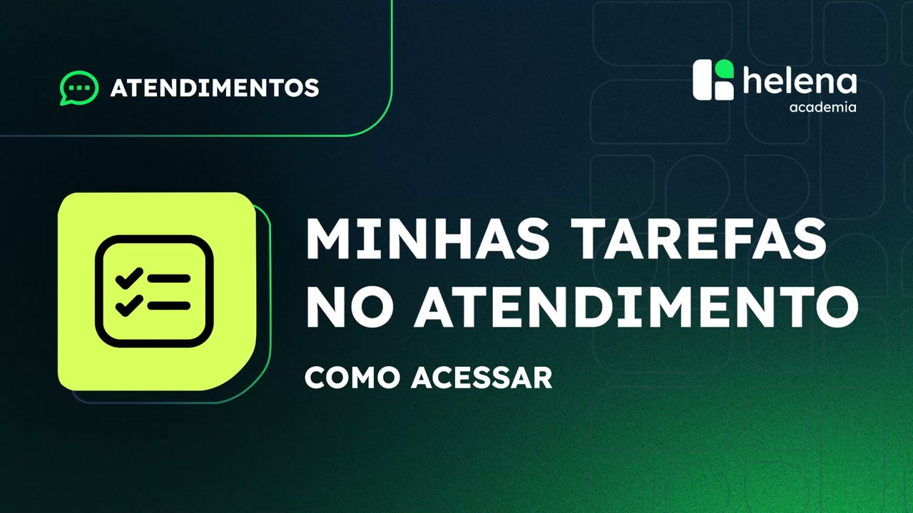
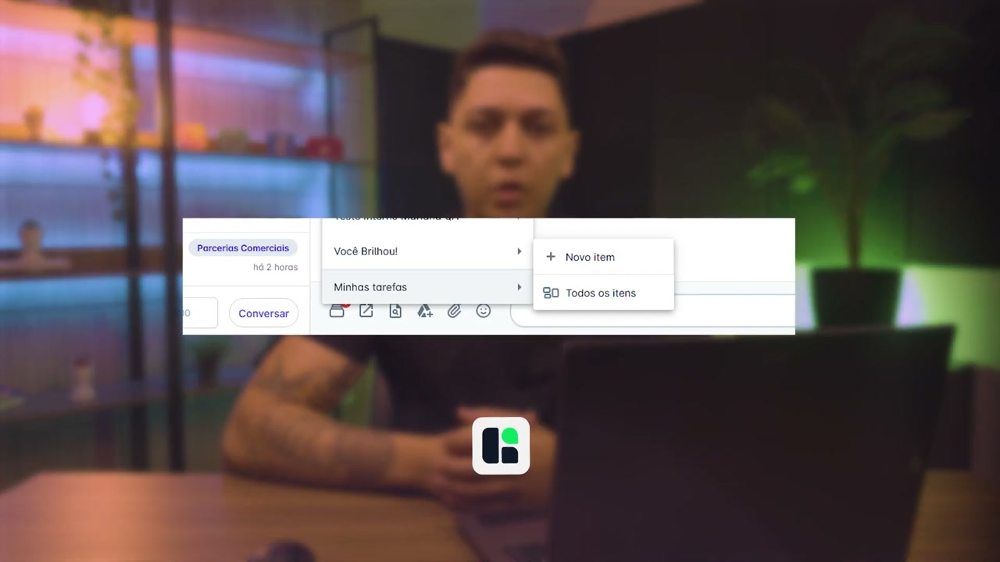
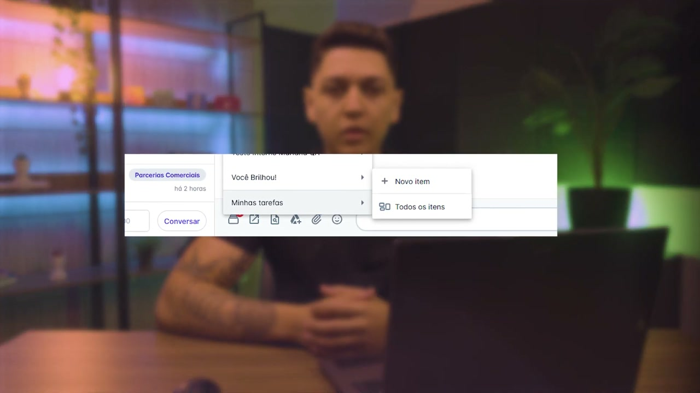
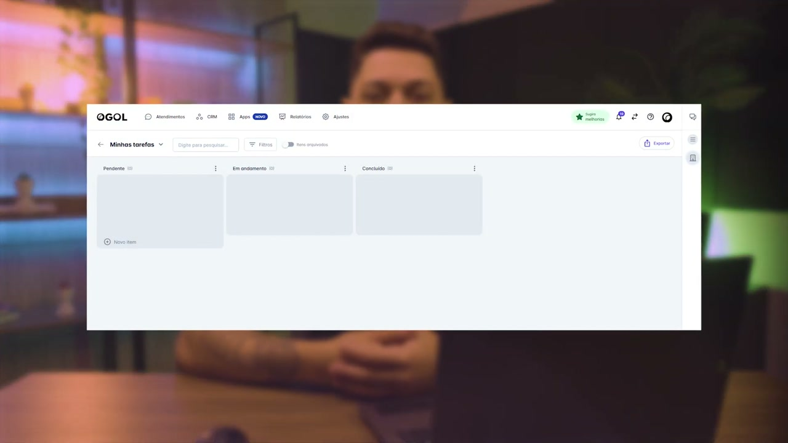
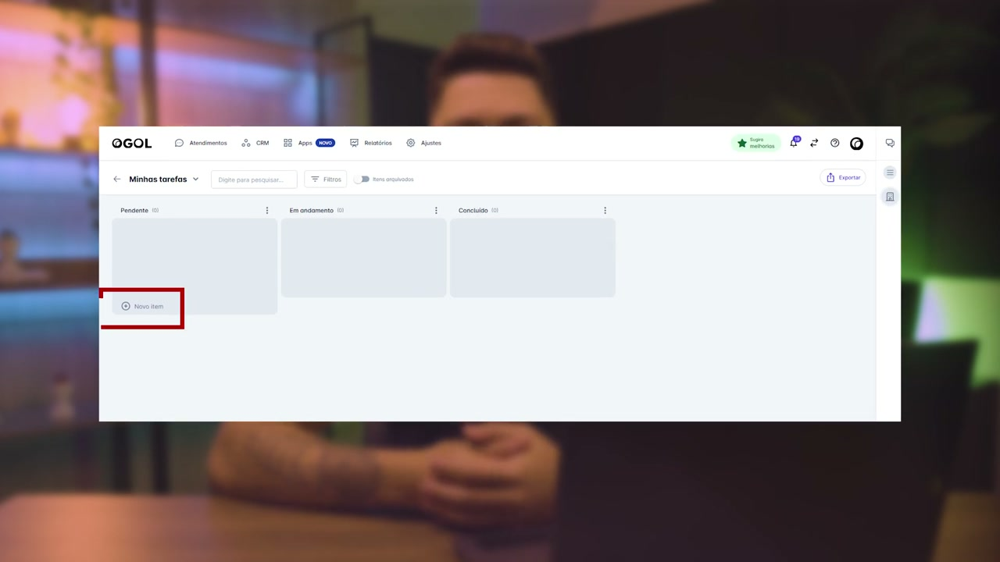
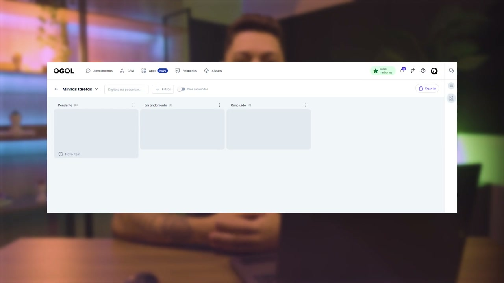

# Acesso e uso do recurso Minhas Tarefas na helenaCRM

**URL:** https://www.youtube.com/watch?v=q8-nq80aNxY  
**Canal:** HelenaCRM  
**Data:** 2025-11-28  
**Objetivo:** Levantamento da plataforma Nexvy/DKW whitelabel para replicação de UI  
**Total de frames:** 12

---

## `00:00` — Início do vídeo com a tela de abertura.

## `00:05` — O palestrante Higo Hermógenes é introduzido.

## `00:10` — Imagem de tela do sistema é mostrada.

## `00:11` — O botão "Minhas Tarefas" é clicado.

## `00:12` — "Todos os itens" é clicado.

## `00:22` — A tela "Minhas Tarefas" é apresentada.

## `00:24` — A seção "Filtros" é destacada.

## `00:32` — O botão "Novo item" é destacado.

## `00:36` — As colunas "Pendentes", "Em andamento" e "Concluídos" são destacadas.

## `00:40` — O palestrante dá dicas de como usar o recurso de tarefas.

## `01:07` — O palestrante conclui o vídeo e convida o espectador a continuar explorando outras funcionalidades.

## `01:15` — O vídeo termina com a tela de encerramento da Helena Academia.

