# Indicadores: Aba Usuários

**URL:** https://www.youtube.com/watch?v=t2bF8-5uui8  
**Canal:** HelenaCRM  
**Data:** 2025-10-21  
**Objetivo:** Levantamento da plataforma Nexvy/DKW whitelabel para replicação de UI  
**Total de frames:** 23

---

## `00:00` — Título do vídeo

## `00:05` — Instrutor iniciando o vídeo

## `00:06` — Título do tópico "Aba Usuários"

## `00:14` — Título do tópico "Qualidade do atendimento por equipe"

## `00:18` — Tela do sistema Helena

## `00:27` — Destacando "Atendimentos Concluídos"

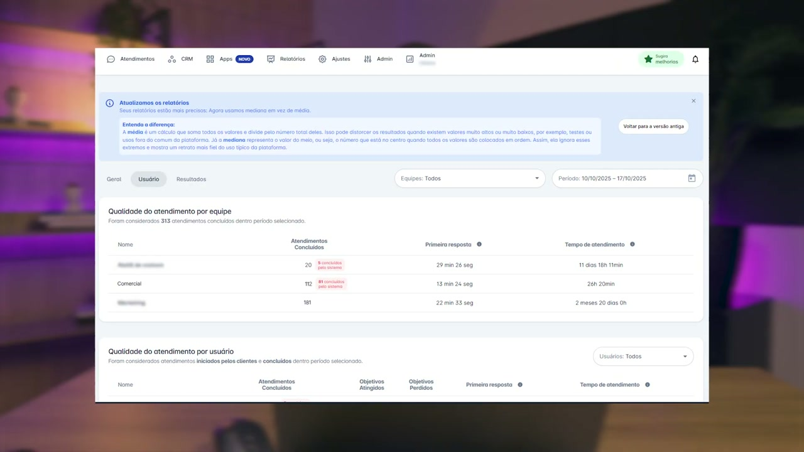

## `00:30` — Detalhando os atendimentos concluídos manualmente

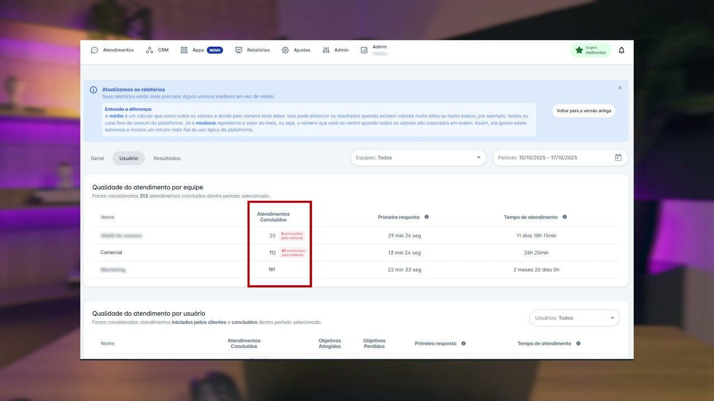

## `00:34` — Detalhando os atendimentos concluídos automaticamente

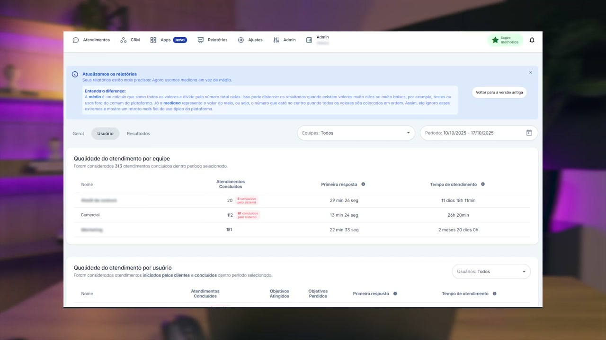

## `00:50` — Destacando todas as métricas

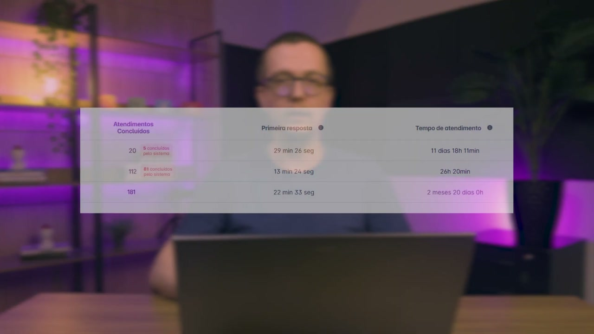

## `00:54` — Detalhando "Atendimentos Concluídos"

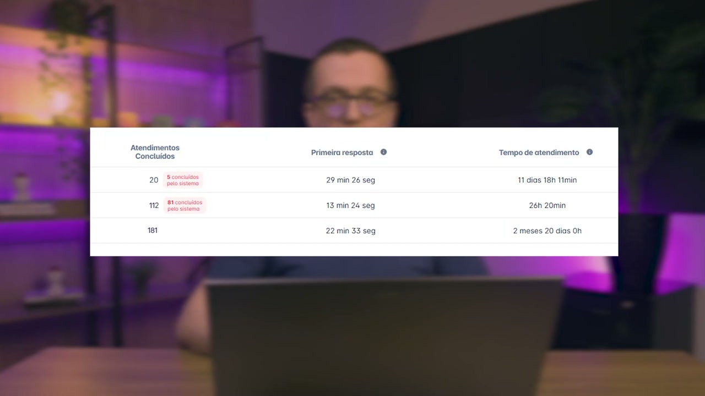

## `00:58` — Detalhando "Primeira resposta"

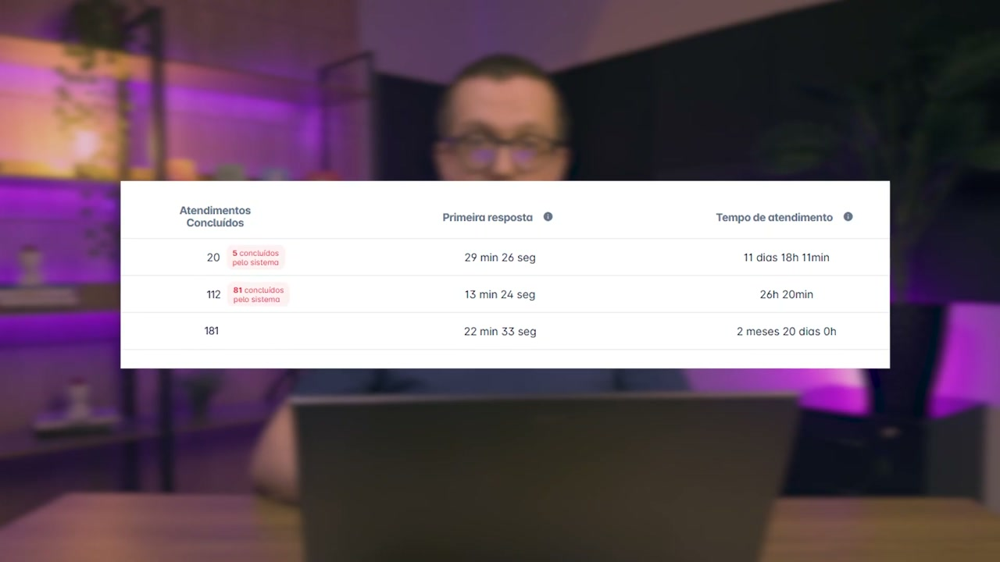

## `01:04` — Detalhando "Tempo de atendimento"

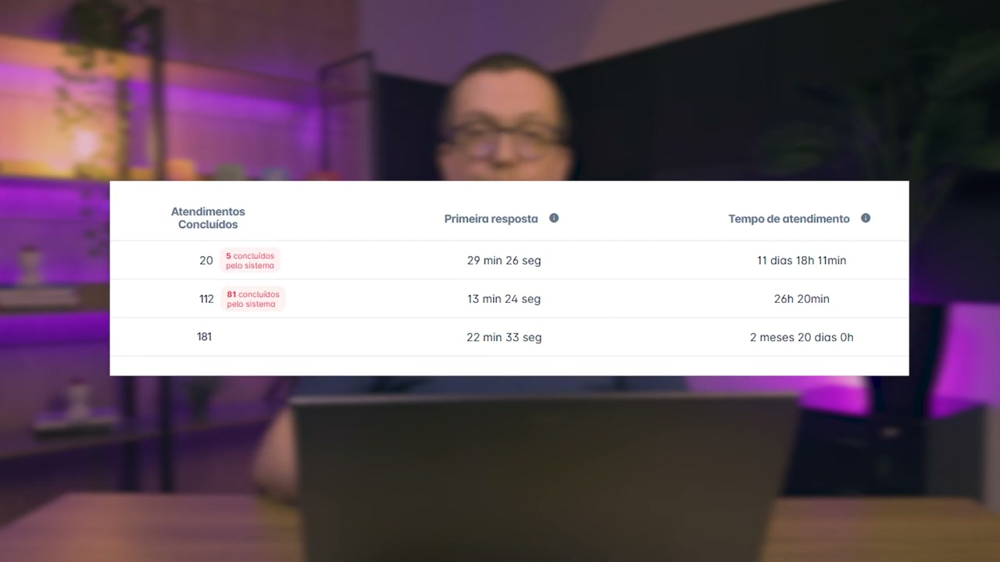

## `01:12` — Caixa de texto "Importante!"

## `01:32` — Título do tópico "Qualidade do atendimento por usuário"

## `01:38` — Tela do sistema Helena

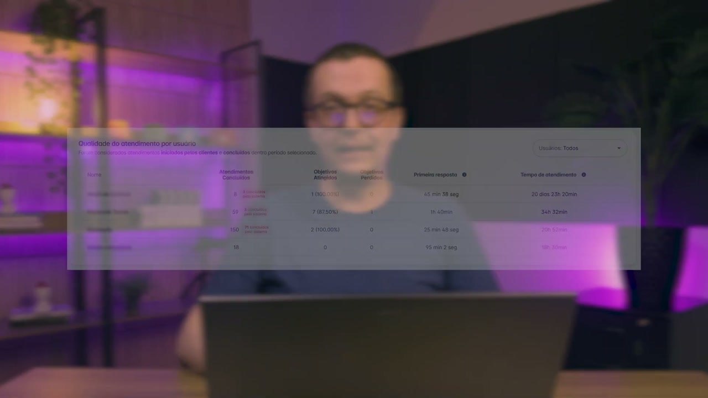

## `01:41` — Destacando "Atendimentos Concluídos"

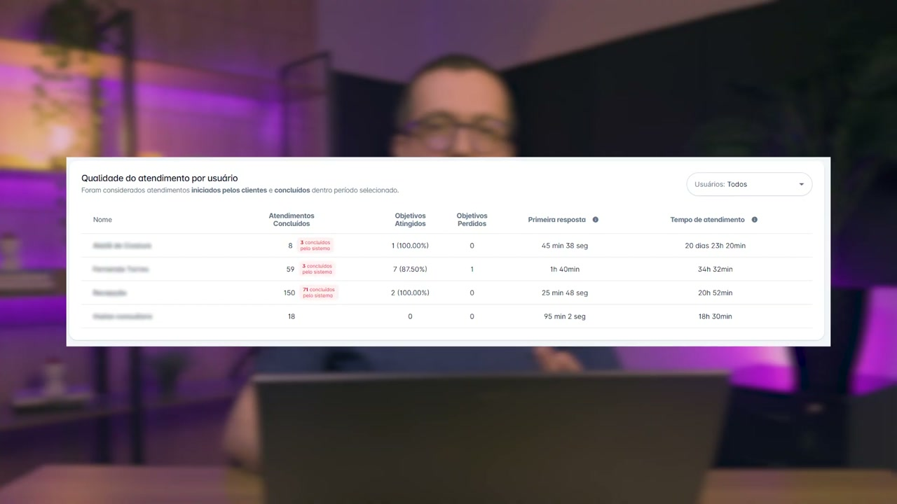

## `01:52` — Caixa de texto "Importante!"

## `02:09` — Destacando "Atendimentos Concluídos"

## `02:16` — Destacando "Objetivos"

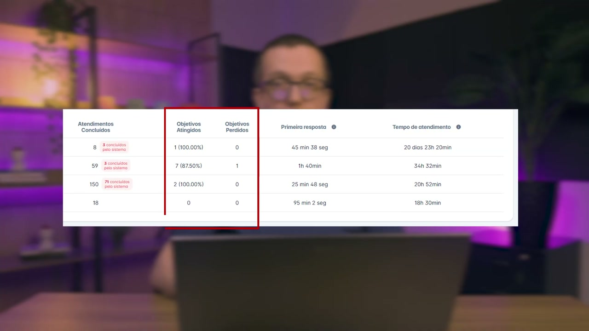

## `02:26` — Destacando "Primeira resposta"

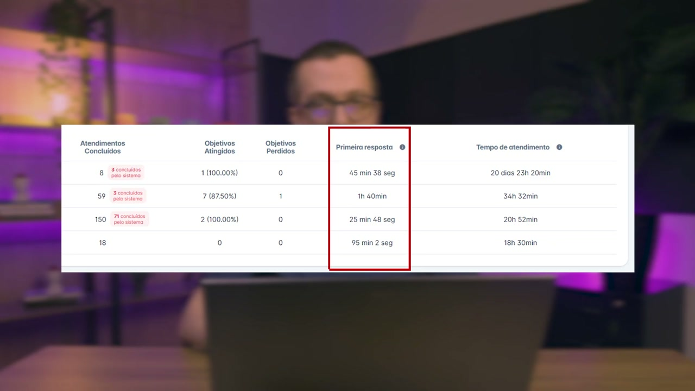

## `02:33` — Destacando "Tempo de atendimento"

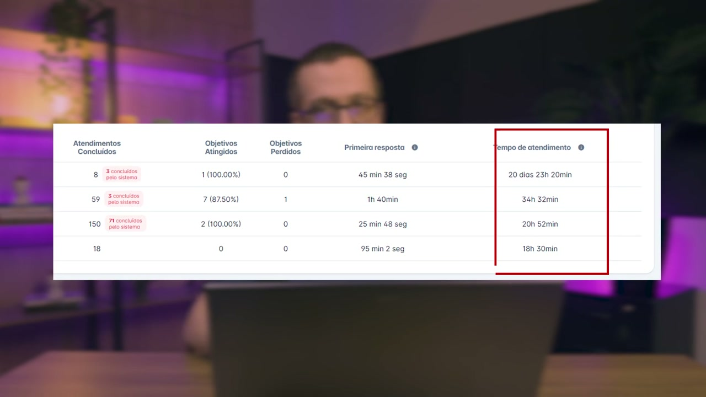

## `02:50` — Instrutor finalizando o vídeo

## `02:54` — Tela final

