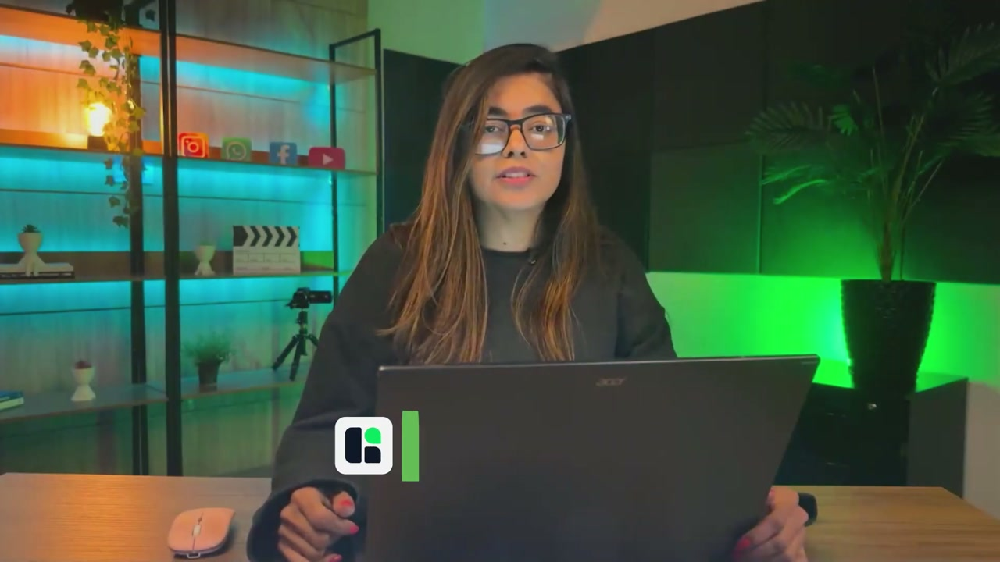
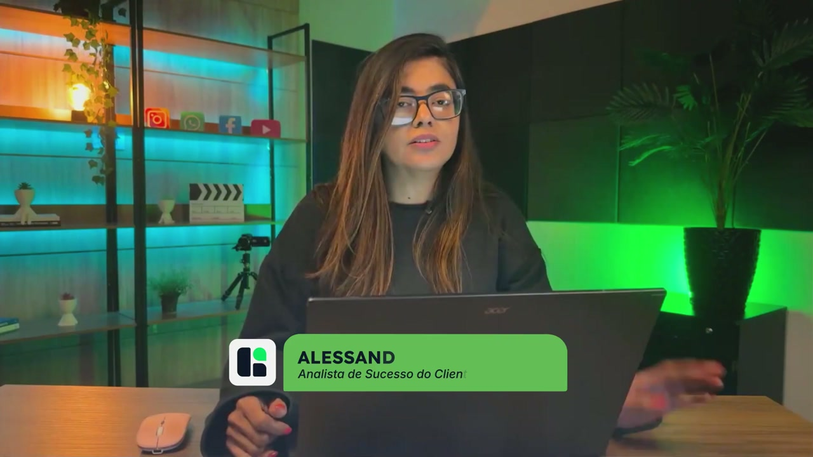
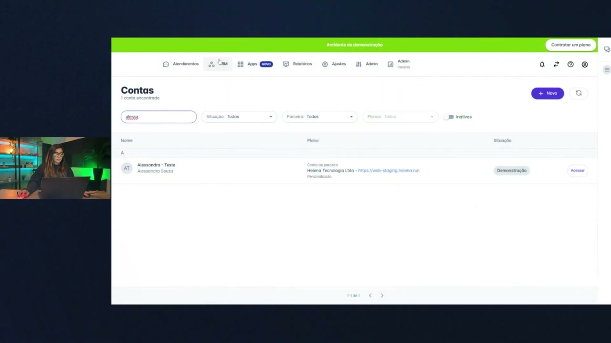
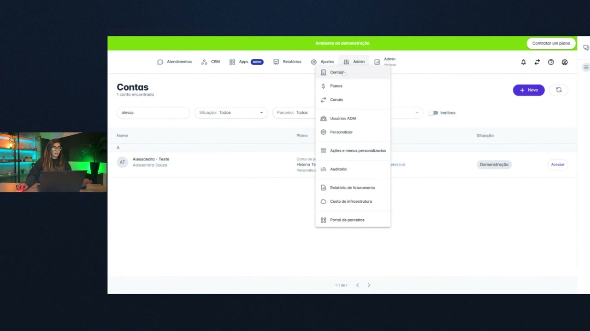
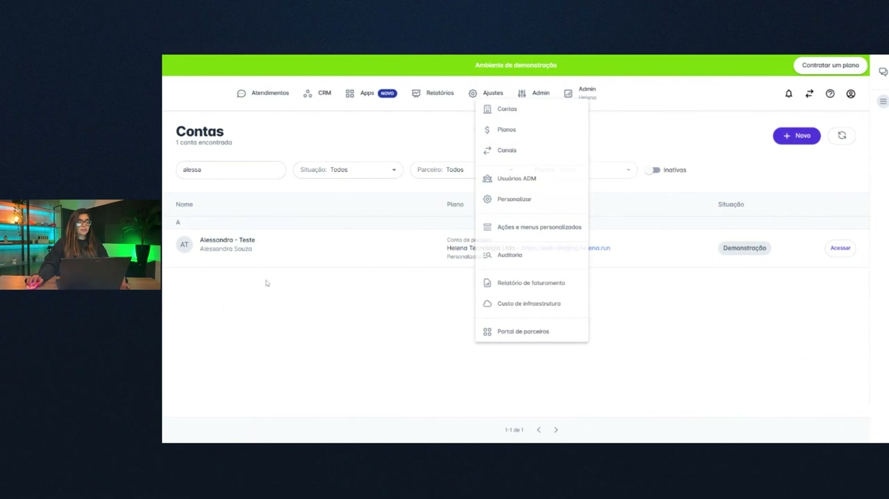
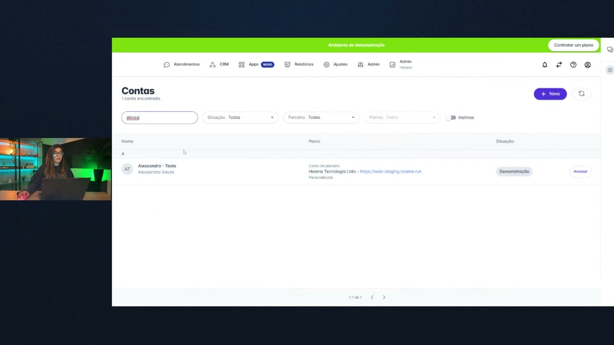
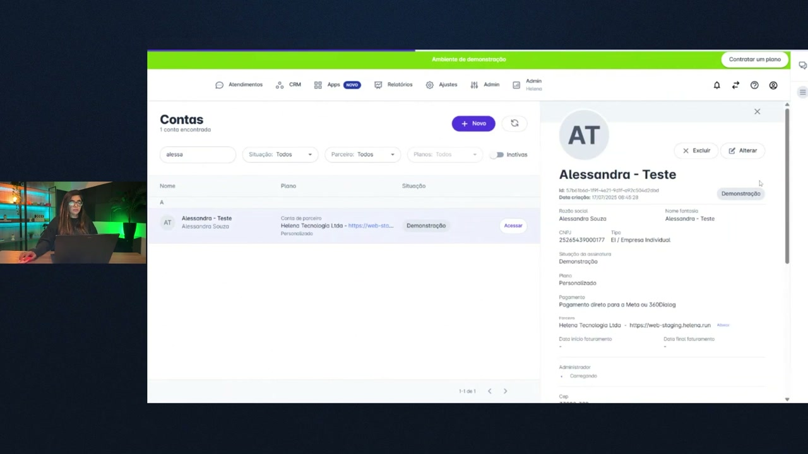
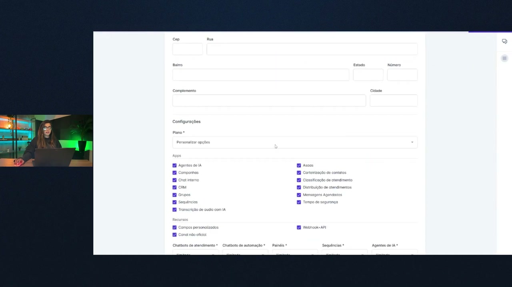
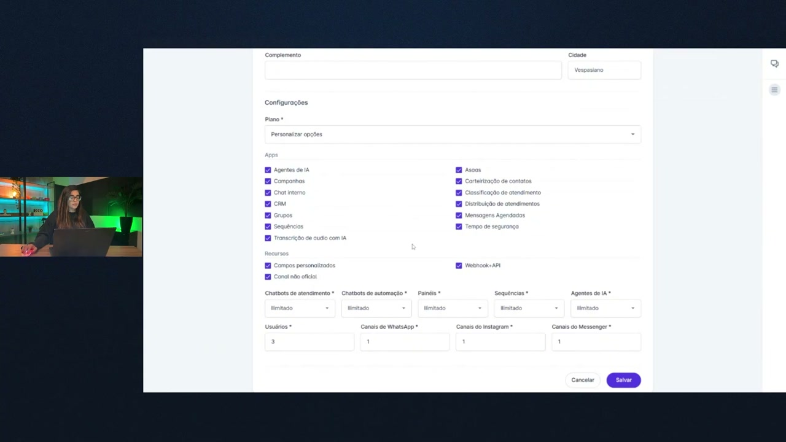
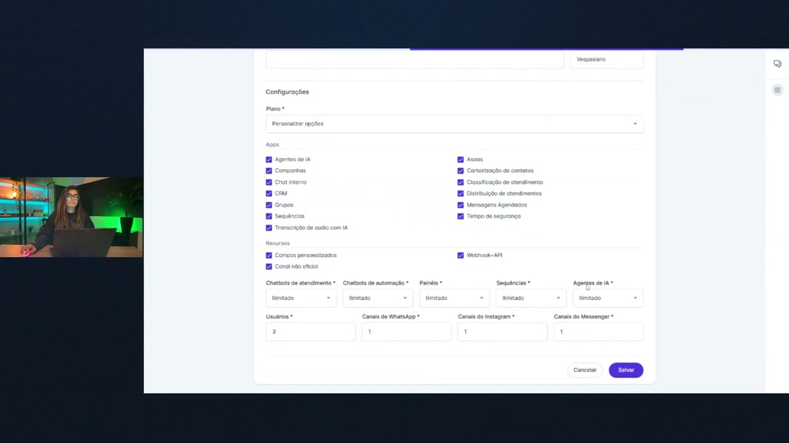

# Contexto e configuração de Grupos na helenaCRM

**URL:** https://www.youtube.com/watch?v=wgsaW6I9KIM  
**Canal:** HelenaCRM  
**Data:** 2025-11-05  
**Objetivo:** Levantamento da plataforma Nexvy/DKW whitelabel para replicação de UI  
**Total de frames:** 27

---

## `00:00` — Início do vídeo, título na tela "GRUPOS CONTEXTO E CONFIGURAÇÃO"

## `00:05` — Mulher jovem sentada à mesa com um laptop à frente, apresentando a funcionalidade de criar e gerenciar grupos na plataforma.

## `00:07` — Nome da apresentadora na tela: "ALESSANDRA SOUZA Analista de Sucesso do Cliente".

## `00:10` — Descrição das funcionalidades de gerenciamento de grupos.

## `00:15` — Menção sobre controle de acesso avançado.

## `00:20` — Permissões de moderação em grupos.

## `00:25` — Configuração de regras de interação para membros do grupo no WhatsApp.

## `00:30` — Centralização de conversas e segmentação de clientes para comunicações exclusivas.

## `00:35` — Criação de espaços de colaboração para projetos.

## `00:40` — Segurança e organização do ambiente.

## `00:45` — Conclusão da introdução e demonstração da liberação da funcionalidade.

## `00:50` — Importância de ativar o recurso antes de usar os grupos.

## `00:55` — A liberação acontece nas configurações da conta.

## `01:00` — Acesso à funcionalidade dos grupos dentro da área de apps.

## `01:05` — Demonstração prática na plataforma.

## `01:07` — Navegação para o menu "Admin" > "Contas".

## `01:10` — Explicação sobre como habilitar para contas novas e existentes.

## `01:25` — Busca por uma conta específica (Alessandra - Teste).

## `01:30` — Clique no nome do cliente para abrir os detalhes.

## `01:35` — Clique na opção "Alterar".

## `01:38` — Localização e marcação da opção "Grupos" na seção "Apps".

## `01:42` — Clique no botão "Salvar".

## `01:45` — Confirmação de que o recurso foi liberado para o cliente.

## `01:47` — Apresentadora confirma a liberação do recurso.

## `01:50` — Lembrete importante sobre a etapa de liberação.

## `01:54` — Agradecimento e encerramento do vídeo.

## `01:57` — Logo "Helena Academia".

