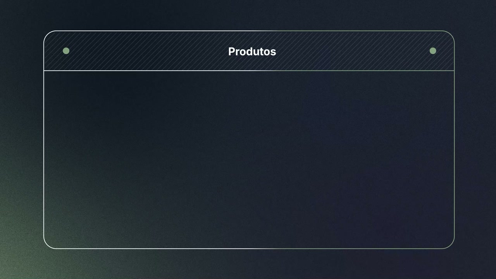
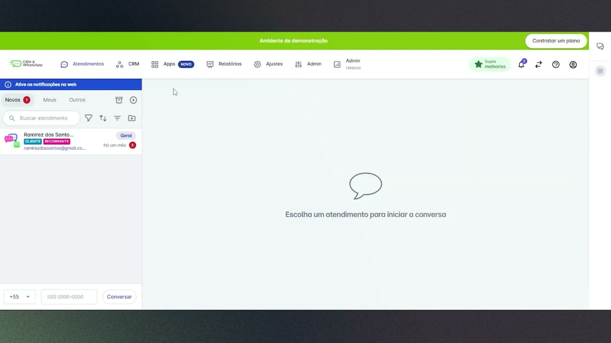
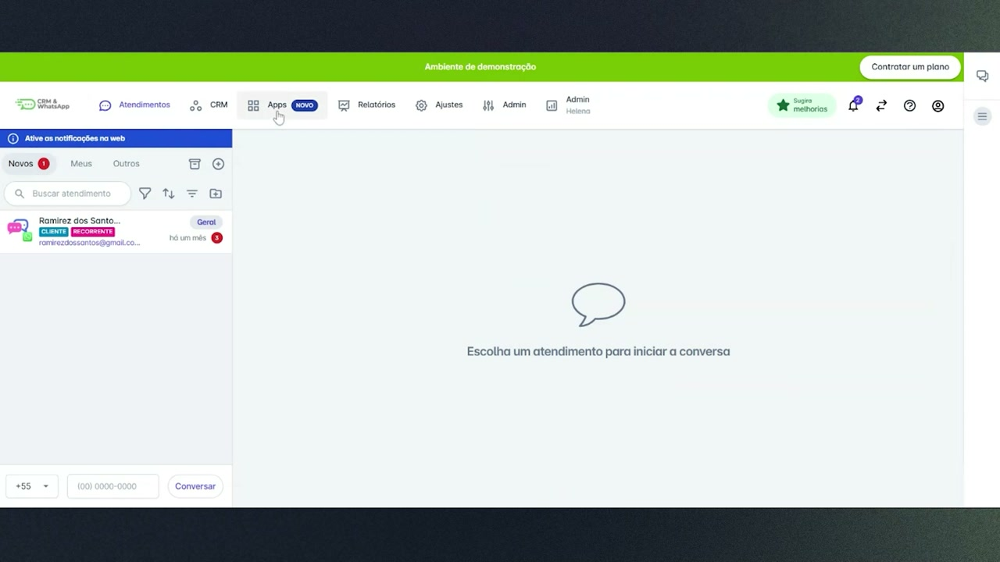
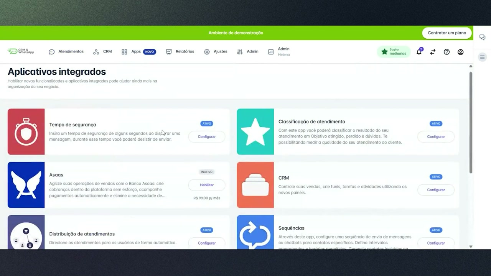
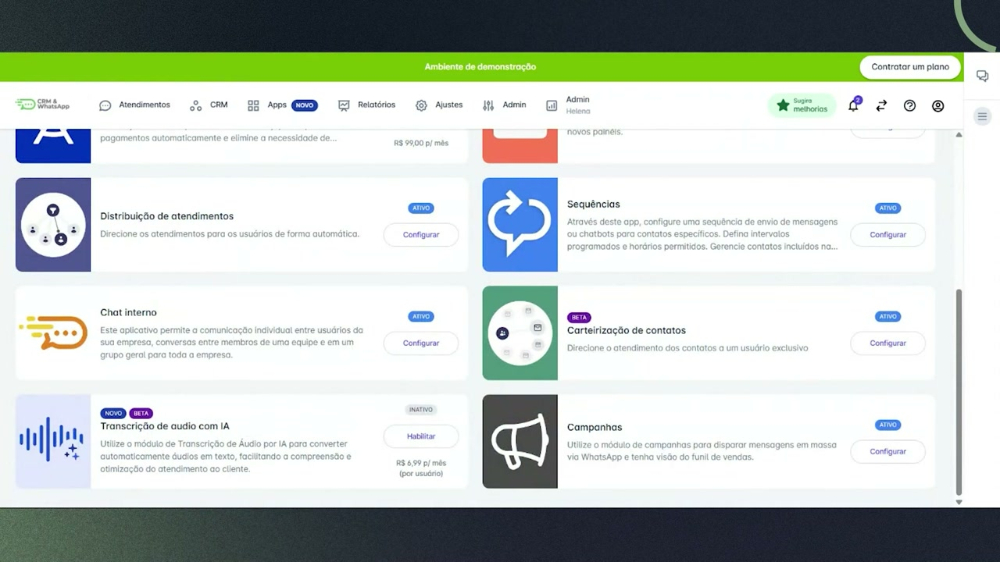
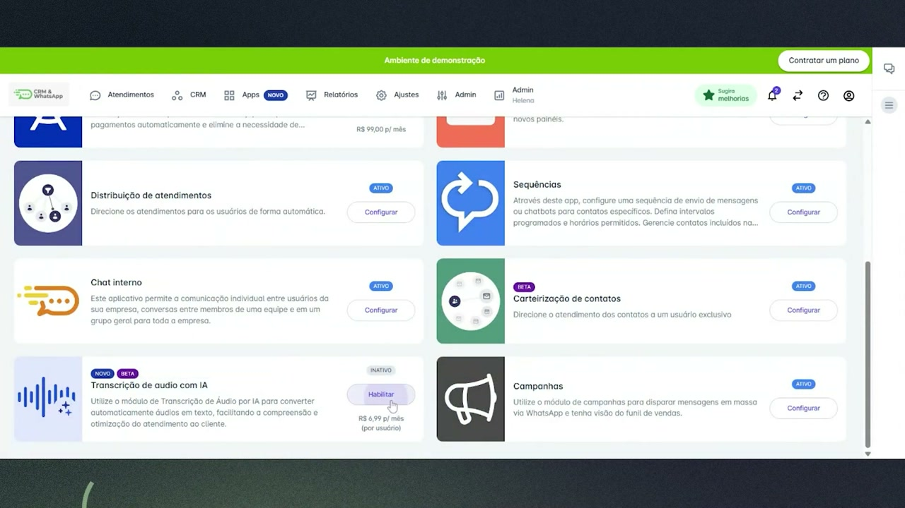
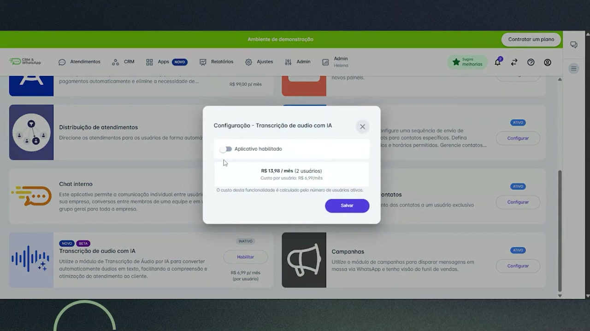
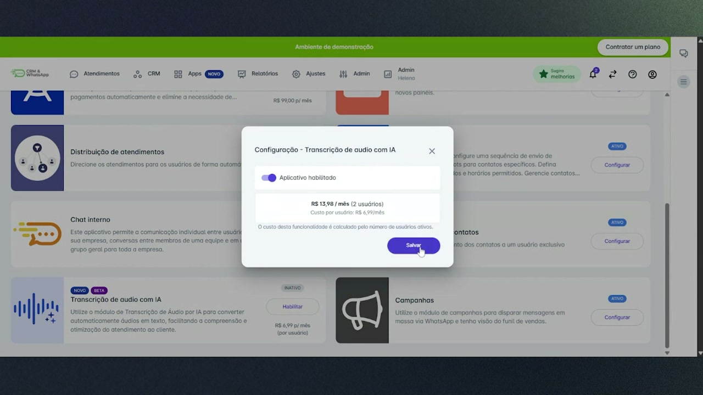
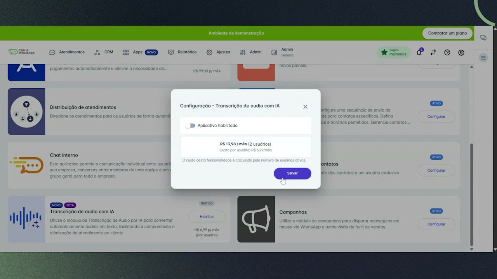

# Transcrição de Áudio com IA na helenaCRM

**URL:** https://www.youtube.com/watch?v=yH5ysNLTAXE  
**Canal:** HelenaCRM  
**Data:** 2025-09-24  
**Objetivo:** Levantamento da plataforma Nexvy/DKW whitelabel para replicação de UI  
**Total de frames:** 16

---

## `00:00` — Título do vídeo "Transcrição de áudio por IA".

## `00:05` — O palestrante, Ramirez Santos, Analista de Sucesso do Cliente, inicia o vídeo.

## `00:26` — A funcionalidade principal é otimizar a rotina de atendimento.

## `00:35` — O time pode ler as informações mencionadas.

## `00:45` — O time pode copiar informações.

## `01:07` — Escutar o áudio é importante para entender o humor do cliente.

## `01:47` — O palestrante mostra a tela de aplicativos da plataforma.

## `01:51` — Clicou em "Apps" e depois em "Mais Apps".

## `01:54` — A tela mostra a lista de aplicativos integrados.

## `01:56` — Ele mostra a opção "Transcrição de áudio com IA".

## `01:58` — Clicou em "Habilitar" e aparece um pop-up de configuração.

## `01:59` — Ele liga a chave "Aplicativo habilitado".

## `02:02` — Ele desliga a chave "Aplicativo habilitado".

## `02:06` — Clicou em "Salvar".

## `02:22` — O palestrante se despede.

## `02:29` — Logo da empresa "Academia Helena".

